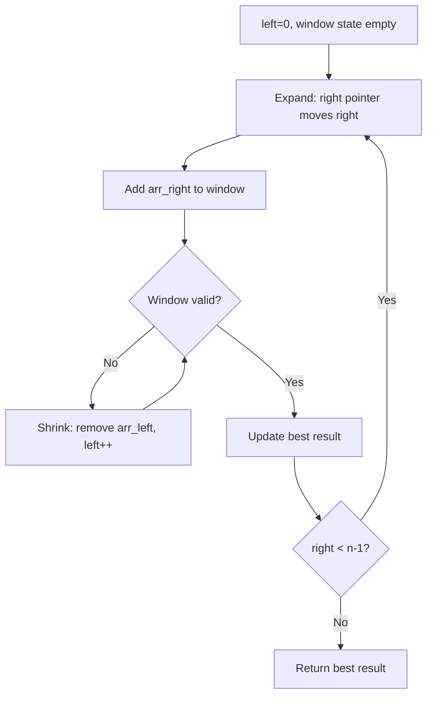
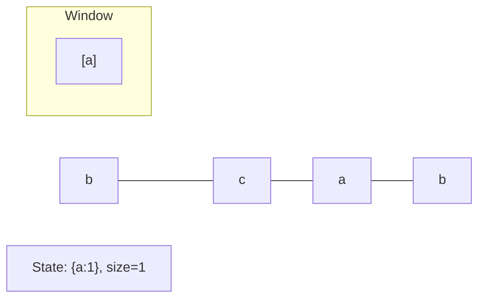
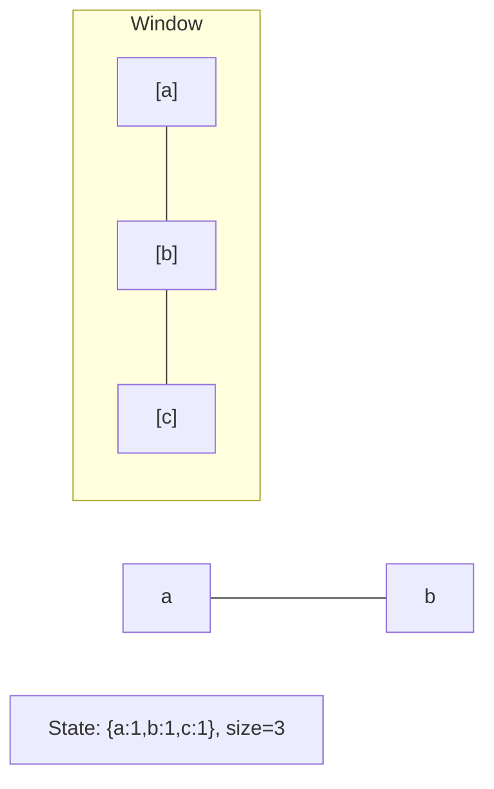
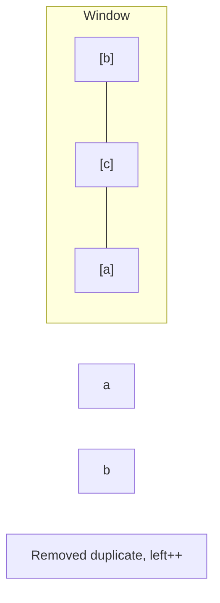
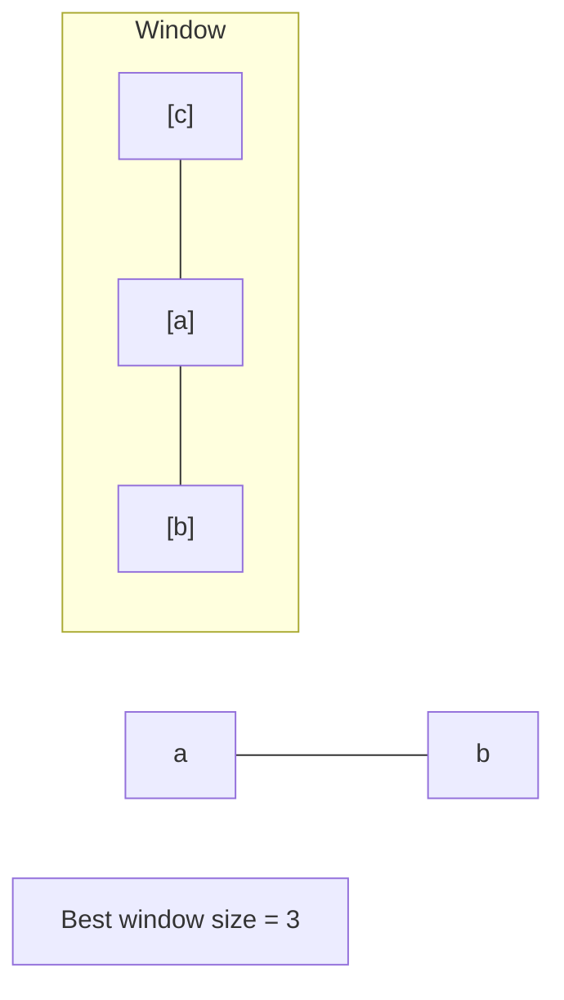

# Problem 2106: Maximum Fruits Harvested After at Most K Steps

**Difficulty:** Hard  
**Tags:** Array, Binary Search, Sliding Window, Prefix Sum  
**Pattern:** Sliding Window  
**Link:** [leetcode.com/problems/maximum-fruits-harvested-after-at-most-k-steps](https://leetcode.com/problems/maximum-fruits-harvested-after-at-most-k-steps/)

## Description

Fruits are available at some positions on an infinite x-axis. You are given a 2D integer array `fruits` where `fruits[i] = [positioni, amounti]` depicts `amounti` fruits at the position `positioni`. `fruits` is already **sorted** by `positioni` in **ascending order**, and each `positioni` is **unique**.

You are also given an integer `startPos` and an integer `k`. Initially, you are at the position `startPos`. From any position, you can either walk to the **left or right**. It takes **one step** to move **one unit** on the x-axis, and you can walk **at most** `k` steps in total. For every position you reach, you harvest all the fruits at that position, and the fruits will disappear from that position.

Return *the **maximum total number** of fruits you can harvest*.

 

Example 1:

```

**Input:** fruits = [[2,8],[6,3],[8,6]], startPos = 5, k = 4
**Output:** 9
**Explanation:** 
The optimal way is to:
- Move right to position 6 and harvest 3 fruits
- Move right to position 8 and harvest 6 fruits
You moved 3 steps and harvested 3 + 6 = 9 fruits in total.

```

Example 2:

```

**Input:** fruits = [[0,9],[4,1],[5,7],[6,2],[7,4],[10,9]], startPos = 5, k = 4
**Output:** 14
**Explanation:** 
You can move at most k = 4 steps, so you cannot reach position 0 nor 10.
The optimal way is to:
- Harvest the 7 fruits at the starting position 5
- Move left to position 4 and harvest 1 fruit
- Move right to position 6 and harvest 2 fruits
- Move right to position 7 and harvest 4 fruits
You moved 1 + 3 = 4 steps and harvested 7 + 1 + 2 + 4 = 14 fruits in total.

```

Example 3:

```

**Input:** fruits = [[0,3],[6,4],[8,5]], startPos = 3, k = 2
**Output:** 0
**Explanation:**
You can move at most k = 2 steps and cannot reach any position with fruits.

```

 

**Constraints:**

	- `1 <= fruits.length <= 10^5`
	- `fruits[i].length == 2`
	- `0 <= startPos, positioni <= 2 * 10^5`
	- `positioni-1 < positioni` for any `i > 0` (**0-indexed**)
	- `1 <= amounti <= 10^4`
	- `0 <= k <= 2 * 10^5`

## Approach: Sliding Window

Maintain a window over the data using two pointers. Expand the right boundary to include new elements, and shrink the left boundary when the window constraint is violated. Track the optimal window.

## Pseudocode

```
1. Initialize left = 0, result = initial_value
2. For right in range(n):
   a. Add element at right to window state
   b. While window is invalid:
      - Remove element at left from window state
      - left++
   c. Update result = best of (result, window size/value)
3. Return result
```

## Algorithm Flow



## Visual State Transitions

**Sliding Window Step-by-Step:**

**Frame 1: Initial window (left=0, right=0)**


**Frame 2: Expand right (right=2)**


**Frame 3: Violation - shrink left**


**Frame 4: Continue expanding**



## Complexity Analysis

- **Time:** O(n)
- **Space:** O(k)

## Solution (Python3)

```python
class Solution:
    def maxTotalFruits(self, fruits: List[List[int]], startPos: int, k: int) -> int:
        # Sliding window approach - O(n) time, O(k) space
        from collections import defaultdict
        window = defaultdict(int)
        left = 0
        result = 0
        for right in range(len(fruits)):
            window[fruits[right]] += 1
            while len(window) > (startPos if isinstance(startPos, int) else len(fruits)):
                window[fruits[left]] -= 1
                if window[fruits[left]] == 0:
                    del window[fruits[left]]
                left += 1
            result = max(result, right - left + 1)
        return result
```

## Solution (C++)

```cpp
#include <algorithm>
#include <string>
#include <unordered_map>
#include <vector>
using namespace std;

class Solution {
public:
    int maxTotalFruits(vector<vector<int>>& fruits, int startPos, int k) {
        // Sliding window approach - O(n) time, O(k) space
        unordered_map<char, int> window;
        int left = 0, result = 0;
        for (int right = 0; right < fruits.size(); right++) {
            window[fruits[right]]++;
            while ((int)window.size() > startPos) {
                window[fruits[left]]--;
                if (window[fruits[left]] == 0)
                    window.erase(fruits[left]);
                left++;
            }
            result = max(result, right - left + 1);
        }
        return result;
    }
};
```
