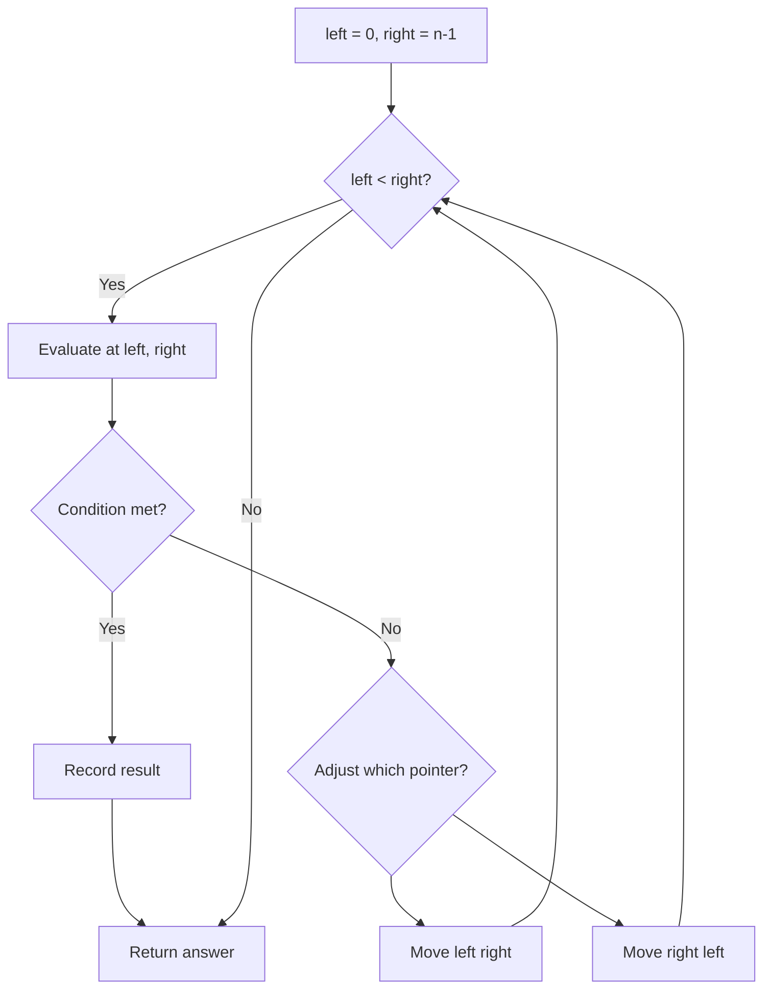
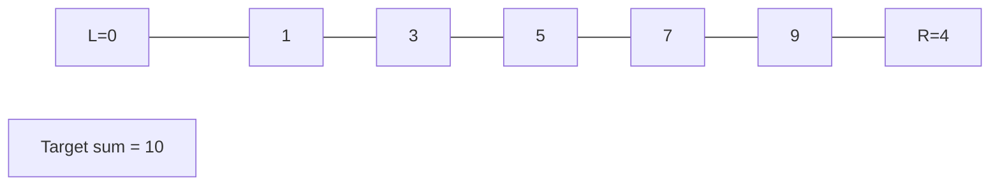
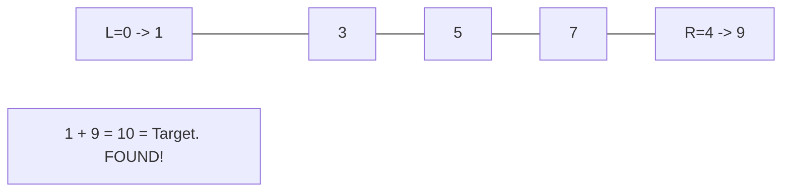

# Problem 2108: Find First Palindromic String in the Array

**Difficulty:** Easy  
**Tags:** Array, Two Pointers, String  
**Pattern:** Two Pointers  
**Link:** [leetcode.com/problems/find-first-palindromic-string-in-the-array](https://leetcode.com/problems/find-first-palindromic-string-in-the-array/)

## Description

Given an array of strings `words`, return *the first **palindromic** string in the array*. If there is no such string, return *an **empty string** *`""`.

A string is **palindromic** if it reads the same forward and backward.

 

Example 1:

```

**Input:** words = ["abc","car","ada","racecar","cool"]
**Output:** "ada"
**Explanation:** The first string that is palindromic is "ada".
Note that "racecar" is also palindromic, but it is not the first.

```

Example 2:

```

**Input:** words = ["notapalindrome","racecar"]
**Output:** "racecar"
**Explanation:** The first and only string that is palindromic is "racecar".

```

Example 3:

```

**Input:** words = ["def","ghi"]
**Output:** ""
**Explanation:** There are no palindromic strings, so the empty string is returned.

```

 

**Constraints:**

	- `1 <= words.length <= 100`
	- `1 <= words[i].length <= 100`
	- `words[i]` consists only of lowercase English letters.

## Approach: Two Pointers

Use two pointers moving through the data structure. Depending on the problem, pointers may move toward each other (converging), in the same direction (fast/slow), or independently.

## Pseudocode

```
1. Initialize left = 0, right = n-1 (or two independent pointers)
2. While pointers haven't crossed:
   a. Evaluate condition at pointer positions
   b. Move left pointer right or right pointer left
3. Return result
```

## Algorithm Flow



## Visual State Transitions

**Two Pointer Convergence:**

**Frame 1: Initialize pointers**


**Frame 2: Sum = 1+9 = 10, found!**



## Complexity Analysis

- **Time:** O(n)
- **Space:** O(1)

## Solution (Python3)

```python
class Solution:
    def firstPalindrome(self, words: List[str]) -> str:
        # Two pointer approach - O(n) time, O(1) space
        left, right = 0, len(words) - 1
        while left < right:
            curr = words[left] + words[right]
            if curr == words:
                return [left, right]
            elif curr < words:
                left += 1
            else:
                right -= 1
        return ""
```

## Solution (C++)

```cpp
#include <string>
#include <vector>
using namespace std;

class Solution {
public:
    string firstPalindrome(vector<string>& words) {
        // Two pointer approach - O(n) time, O(1) space
        int left = 0, right = words.size() - 1;
        while (left < right) {
            int curr = words[left] + words[right];
            if (curr == words) {
                return {left, right};
            } else if (curr < words) {
                left++;
            } else {
                right--;
            }
        }
        return "";
    }
};
```
