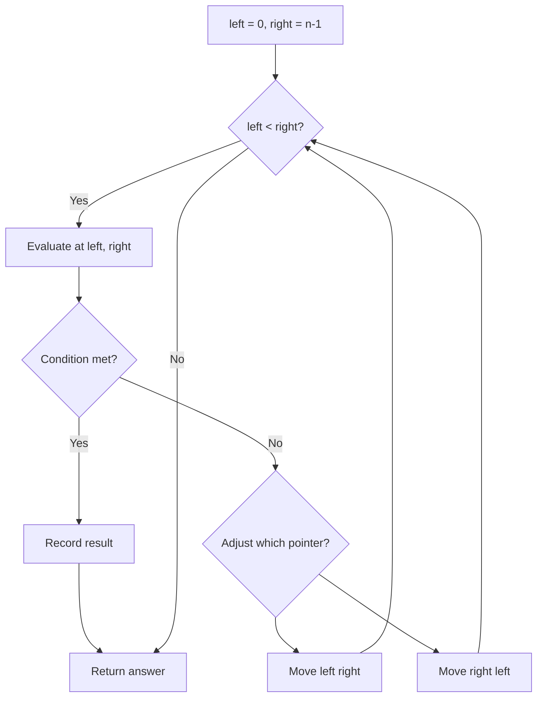
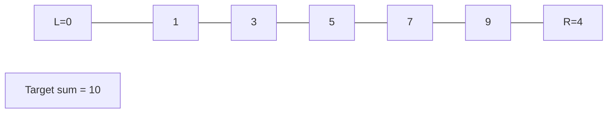
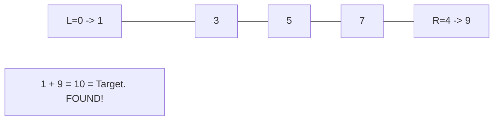

# Problem 2109: Adding Spaces to a String

**Difficulty:** Medium  
**Tags:** Array, Two Pointers, String, Simulation  
**Pattern:** Two Pointers  
**Link:** [leetcode.com/problems/adding-spaces-to-a-string](https://leetcode.com/problems/adding-spaces-to-a-string/)

## Description

You are given a **0-indexed** string `s` and a **0-indexed** integer array `spaces` that describes the indices in the original string where spaces will be added. Each space should be inserted **before** the character at the given index.

	- For example, given `s = "EnjoyYourCoffee"` and `spaces = [5, 9]`, we place spaces before `'Y'` and `'C'`, which are at indices `5` and `9` respectively. Thus, we obtain `"Enjoy **Y**our **C**offee"`.

Return** ***the modified string **after** the spaces have been added.*

 

Example 1:

```

**Input:** s = "LeetcodeHelpsMeLearn", spaces = [8,13,15]
**Output:** "Leetcode Helps Me Learn"
**Explanation:** 
The indices 8, 13, and 15 correspond to the underlined characters in "Leetcode**H**elps**M**e**L**earn".
We then place spaces before those characters.

```

Example 2:

```

**Input:** s = "icodeinpython", spaces = [1,5,7,9]
**Output:** "i code in py thon"
**Explanation:**
The indices 1, 5, 7, and 9 correspond to the underlined characters in "i**c**ode**i**n**p**y**t**hon".
We then place spaces before those characters.

```

Example 3:

```

**Input:** s = "spacing", spaces = [0,1,2,3,4,5,6]
**Output:** " s p a c i n g"
**Explanation:**
We are also able to place spaces before the first character of the string.

```

 

**Constraints:**

	- `1 <= s.length <= 3 * 10^5`
	- `s` consists only of lowercase and uppercase English letters.
	- `1 <= spaces.length <= 3 * 10^5`
	- `0 <= spaces[i] <= s.length - 1`
	- All the values of `spaces` are **strictly increasing**.

## Approach: Two Pointers

Use two pointers moving through the data structure. Depending on the problem, pointers may move toward each other (converging), in the same direction (fast/slow), or independently.

## Pseudocode

```
1. Initialize left = 0, right = n-1 (or two independent pointers)
2. While pointers haven't crossed:
   a. Evaluate condition at pointer positions
   b. Move left pointer right or right pointer left
3. Return result
```

## Algorithm Flow



## Visual State Transitions

**Two Pointer Convergence:**

**Frame 1: Initialize pointers**


**Frame 2: Sum = 1+9 = 10, found!**



## Complexity Analysis

- **Time:** O(n)
- **Space:** O(1)

## Solution (Python3)

```python
class Solution:
    def addSpaces(self, s: str, spaces: List[int]) -> str:
        # Two pointer approach - O(n) time, O(1) space
        left, right = 0, len(s) - 1
        while left < right:
            curr = s[left] + s[right]
            if curr == spaces:
                return [left, right]
            elif curr < spaces:
                left += 1
            else:
                right -= 1
        return ""
```

## Solution (C++)

```cpp
#include <string>
#include <vector>
using namespace std;

class Solution {
public:
    string addSpaces(string& s, vector<int>& spaces) {
        // Two pointer approach - O(n) time, O(1) space
        int left = 0, right = s.size() - 1;
        while (left < right) {
            int curr = s[left] + s[right];
            if (curr == spaces) {
                return {left, right};
            } else if (curr < spaces) {
                left++;
            } else {
                right--;
            }
        }
        return "";
    }
};
```
