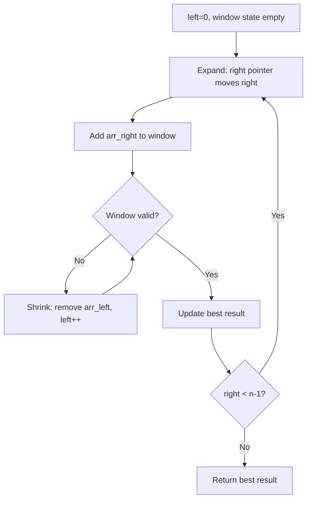
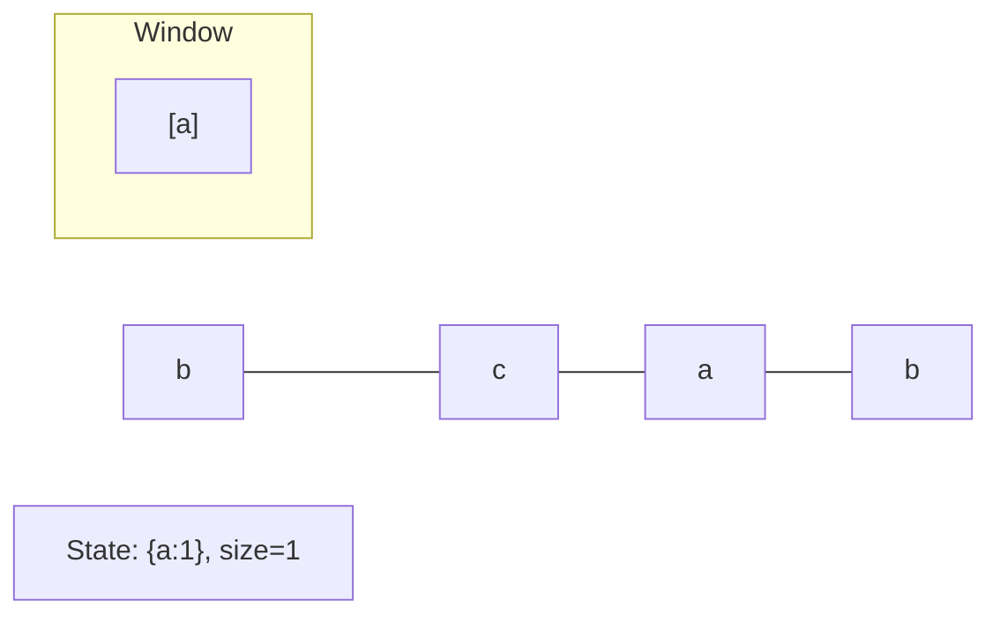
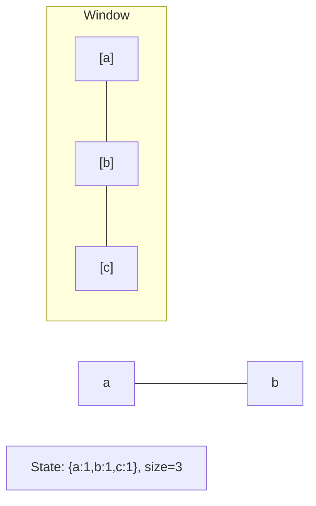
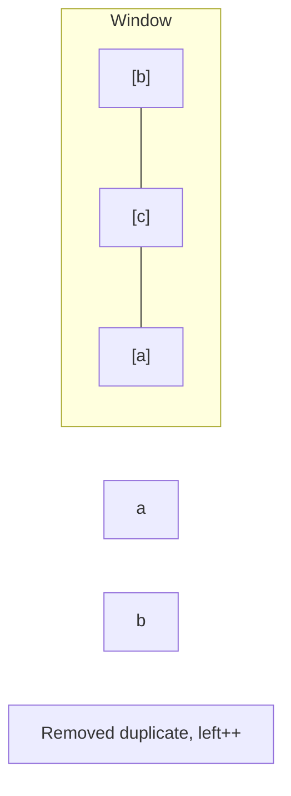
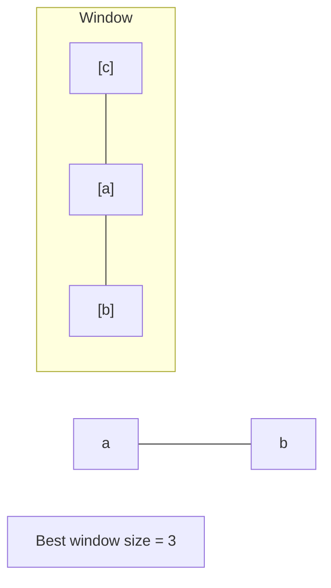

# Problem 2110: Number of Smooth Descent Periods of a Stock

**Difficulty:** Medium  
**Tags:** Array, Math, Two Pointers, Dynamic Programming, Sliding Window  
**Pattern:** Sliding Window  
**Link:** [leetcode.com/problems/number-of-smooth-descent-periods-of-a-stock](https://leetcode.com/problems/number-of-smooth-descent-periods-of-a-stock/)

## Description

You are given an integer array `prices` representing the daily price history of a stock, where `prices[i]` is the stock price on the `i^th` day.

A **smooth descent period** of a stock consists of **one or more contiguous** days such that the price on each day is **lower** than the price on the **preceding day** by **exactly** `1`. The first day of the period is exempted from this rule.

Return *the number of **smooth descent periods***.

 

Example 1:

```

**Input:** prices = [3,2,1,4]
**Output:** 7
**Explanation:** There are 7 smooth descent periods:
[3], [2], [1], [4], [3,2], [2,1], and [3,2,1]
Note that a period with one day is a smooth descent period by the definition.

```

Example 2:

```

**Input:** prices = [8,6,7,7]
**Output:** 4
**Explanation:** There are 4 smooth descent periods: [8], [6], [7], and [7]
Note that [8,6] is not a smooth descent period as 8 - 6 ≠ 1.

```

Example 3:

```

**Input:** prices = [1]
**Output:** 1
**Explanation:** There is 1 smooth descent period: [1]

```

 

**Constraints:**

	- `1 <= prices.length <= 10^5`
	- `1 <= prices[i] <= 10^5`

## Approach: Sliding Window

Maintain a window over the data using two pointers. Expand the right boundary to include new elements, and shrink the left boundary when the window constraint is violated. Track the optimal window.

## Pseudocode

```
1. Initialize left = 0, result = initial_value
2. For right in range(n):
   a. Add element at right to window state
   b. While window is invalid:
      - Remove element at left from window state
      - left++
   c. Update result = best of (result, window size/value)
3. Return result
```

## Algorithm Flow



## Visual State Transitions

**Sliding Window Step-by-Step:**

**Frame 1: Initial window (left=0, right=0)**


**Frame 2: Expand right (right=2)**


**Frame 3: Violation - shrink left**


**Frame 4: Continue expanding**



## Complexity Analysis

- **Time:** O(n)
- **Space:** O(k)

## Solution (Python3)

```python
class Solution:
    def getDescentPeriods(self, prices: List[int]) -> int:
        # Sliding window approach - O(n) time, O(k) space
        from collections import defaultdict
        window = defaultdict(int)
        left = 0
        result = 0
        for right in range(len(prices)):
            window[prices[right]] += 1
            while len(window) > (prices if isinstance(prices, int) else len(prices)):
                window[prices[left]] -= 1
                if window[prices[left]] == 0:
                    del window[prices[left]]
                left += 1
            result = max(result, right - left + 1)
        return result
```

## Solution (C++)

```cpp
#include <algorithm>
#include <string>
#include <unordered_map>
#include <vector>
using namespace std;

class Solution {
public:
    int getDescentPeriods(vector<int>& prices) {
        // Sliding window approach - O(n) time, O(k) space
        unordered_map<char, int> window;
        int left = 0, result = 0;
        for (int right = 0; right < prices.size(); right++) {
            window[prices[right]]++;
            while ((int)window.size() > prices) {
                window[prices[left]]--;
                if (window[prices[left]] == 0)
                    window.erase(prices[left]);
                left++;
            }
            result = max(result, right - left + 1);
        }
        return result;
    }
};
```
