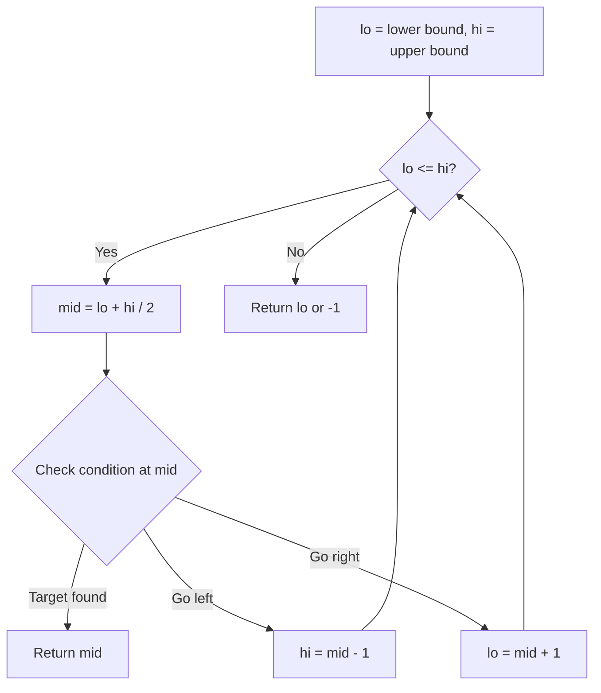
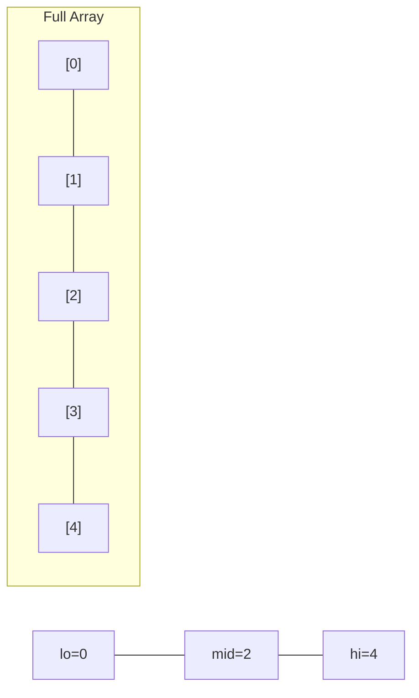
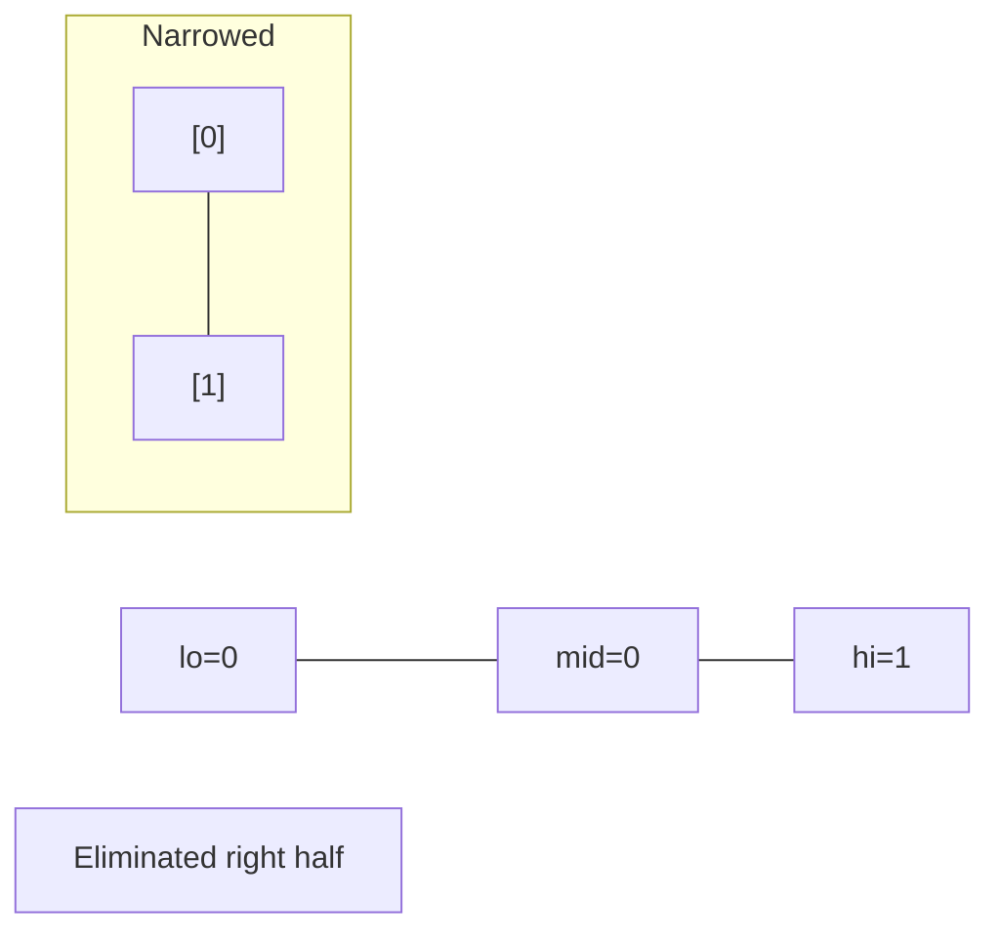
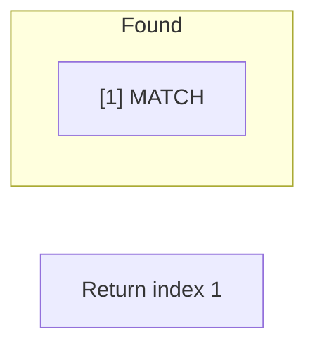

# Problem 2111: Minimum Operations to Make the Array K-Increasing

**Difficulty:** Hard  
**Tags:** Array, Binary Search  
**Pattern:** Binary Search  
**Link:** [leetcode.com/problems/minimum-operations-to-make-the-array-k-increasing](https://leetcode.com/problems/minimum-operations-to-make-the-array-k-increasing/)

## Description

You are given a **0-indexed** array `arr` consisting of `n` positive integers, and a positive integer `k`.

The array `arr` is called **K-increasing** if `arr[i-k] <= arr[i]` holds for every index `i`, where `k <= i <= n-1`.

	- For example, `arr = [4, 1, 5, 2, 6, 2]` is K-increasing for `k = 2` because:

	
		`arr[0] <= arr[2] (4 <= 5)`
		- `arr[1] <= arr[3] (1 <= 2)`
		- `arr[2] <= arr[4] (5 <= 6)`
		- `arr[3] <= arr[5] (2 <= 2)`
	
	
	- However, the same `arr` is not K-increasing for `k = 1` (because `arr[0] > arr[1]`) or `k = 3` (because `arr[0] > arr[3]`).

In one **operation**, you can choose an index `i` and **change** `arr[i]` into **any** positive integer.

Return *the **minimum number of operations** required to make the array K-increasing for the given *`k`.

 

Example 1:

```

**Input:** arr = [5,4,3,2,1], k = 1
**Output:** 4
Explanation:
For k = 1, the resultant array has to be non-decreasing.
Some of the K-increasing arrays that can be formed are [5,**6**,**7**,**8**,**9**], [**1**,**1**,**1**,**1**,1], [**2**,**2**,3,**4**,**4**]. All of them require 4 operations.
It is suboptimal to change the array to, for example, [**6**,**7**,**8**,**9**,**10**] because it would take 5 operations.
It can be shown that we cannot make the array K-increasing in less than 4 operations.

```

Example 2:

```

**Input:** arr = [4,1,5,2,6,2], k = 2
**Output:** 0
**Explanation:**
This is the same example as the one in the problem description.
Here, for every index i where 2 <= i <= 5, arr[i-2] <=** **arr[i].
Since the given array is already K-increasing, we do not need to perform any operations.
```

Example 3:

```

**Input:** arr = [4,1,5,2,6,2], k = 3
**Output:** 2
**Explanation:**
Indices 3 and 5 are the only ones not satisfying arr[i-3] <= arr[i] for 3 <= i <= 5.
One of the ways we can make the array K-increasing is by changing arr[3] to 4 and arr[5] to 5.
The array will now be [4,1,5,**4**,6,**5**].
Note that there can be other ways to make the array K-increasing, but none of them require less than 2 operations.

```

 

**Constraints:**

	- `1 <= arr.length <= 10^5`
	- `1 <= arr[i], k <= arr.length`

## Approach: Binary Search

Use binary search to halve the search space each iteration. Define the search range [lo, hi], compute mid, and decide which half to keep based on the problem's monotonic condition.

## Pseudocode

```
1. lo = lower_bound, hi = upper_bound
2. While lo <= hi (or lo < hi):
   a. mid = (lo + hi) // 2
   b. If condition(mid) is satisfied: record answer, search left half
   c. Else: search right half
3. Return answer
```

## Algorithm Flow



## Visual State Transitions

**Binary Search Step-by-Step:**

**Frame 1: Initial search space**


**Frame 2: Compare mid, narrow search**


**Frame 3: Found target**



## Complexity Analysis

- **Time:** O(log n)
- **Space:** O(1)

## Solution (Python3)

```python
class Solution:
    def kIncreasing(self, arr: List[int], k: int) -> int:
        # Binary search - O(log n) time, O(1) space
        lo, hi = 0, len(arr) - 1
        while lo <= hi:
            mid = lo + (hi - lo) // 2
            if arr[mid] == k:
                return mid
            elif arr[mid] < k:
                lo = mid + 1
            else:
                hi = mid - 1
        return 0
```

## Solution (C++)

```cpp
#include <string>
#include <vector>
using namespace std;

class Solution {
public:
    int kIncreasing(vector<int>& arr, int k) {
        // Binary search - O(log n) time, O(1) space
        int lo = 0, hi = arr.size() - 1;
        while (lo <= hi) {
            int mid = lo + (hi - lo) / 2;
            if (arr[mid] == k) {
                return mid;
            } else if (arr[mid] < k) {
                lo = mid + 1;
            } else {
                hi = mid - 1;
            }
        }
        return 0;
    }
};
```
