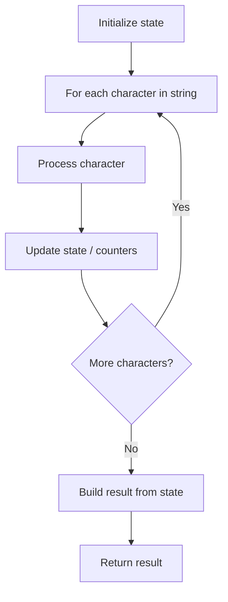

# Problem 2114: Maximum Number of Words Found in Sentences

**Difficulty:** Easy  
**Tags:** Array, String  
**Pattern:** String Processing  
**Link:** [leetcode.com/problems/maximum-number-of-words-found-in-sentences](https://leetcode.com/problems/maximum-number-of-words-found-in-sentences/)

## Description

A **sentence** is a list of **words** that are separated by a single space with no leading or trailing spaces.

You are given an array of strings `sentences`, where each `sentences[i]` represents a single **sentence**.

Return *the **maximum number of words** that appear in a single sentence*.

 

Example 1:

```

**Input:** sentences = ["alice and bob love leetcode", "i think so too", "this is great thanks very much"]
**Output:** 6
**Explanation:** 
- The first sentence, "alice and bob love leetcode", has 5 words in total.
- The second sentence, "i think so too", has 4 words in total.
- The third sentence, "this is great thanks very much", has 6 words in total.
Thus, the maximum number of words in a single sentence comes from the third sentence, which has 6 words.

```

Example 2:

```

**Input:** sentences = ["please wait", "continue to fight", "continue to win"]
**Output:** 3
**Explanation:** It is possible that multiple sentences contain the same number of words. 
In this example, the second and third sentences (underlined) have the same number of words.

```

 

**Constraints:**

	- `1 <= sentences.length <= 100`
	- `1 <= sentences[i].length <= 100`
	- `sentences[i]` consists only of lowercase English letters and `' '` only.
	- `sentences[i]` does not have leading or trailing spaces.
	- All the words in `sentences[i]` are separated by a single space.

## Approach: String Processing

Process the string character by character. Common techniques: two pointers, sliding window, hash map for frequencies, stack for matching.

## Pseudocode

```
1. Initialize result / tracking state
2. Iterate through string characters:
   a. Process character based on rules
   b. Update state (counters, pointers, stack)
3. Build and return result
```

## Algorithm Flow



## Complexity Analysis

- **Time:** O(n)
- **Space:** O(n)

## Solution (Python3)

```python
class Solution:
    def mostWordsFound(self, sentences: List[str]) -> int:
        # String processing approach - O(n) time
        result = []
        for ch in sentences:
            if ch.isalnum():
                result.append(ch.lower())
        # Check palindrome or process
        processed = ''.join(result)
        return processed == processed[::-1] if isinstance(0, bool) else processed
```

## Solution (C++)

```cpp
#include <algorithm>
#include <cctype>
#include <string>
#include <vector>
using namespace std;

class Solution {
public:
    int mostWordsFound(vector<string>& sentences) {
        // String processing approach - O(n) time
        string processed;
        for (char ch : sentences) {
            if (isalnum(ch)) {
                processed += tolower(ch);
            }
        }
        string rev = processed;
        reverse(rev.begin(), rev.end());
        return processed == rev;
    }
};
```
