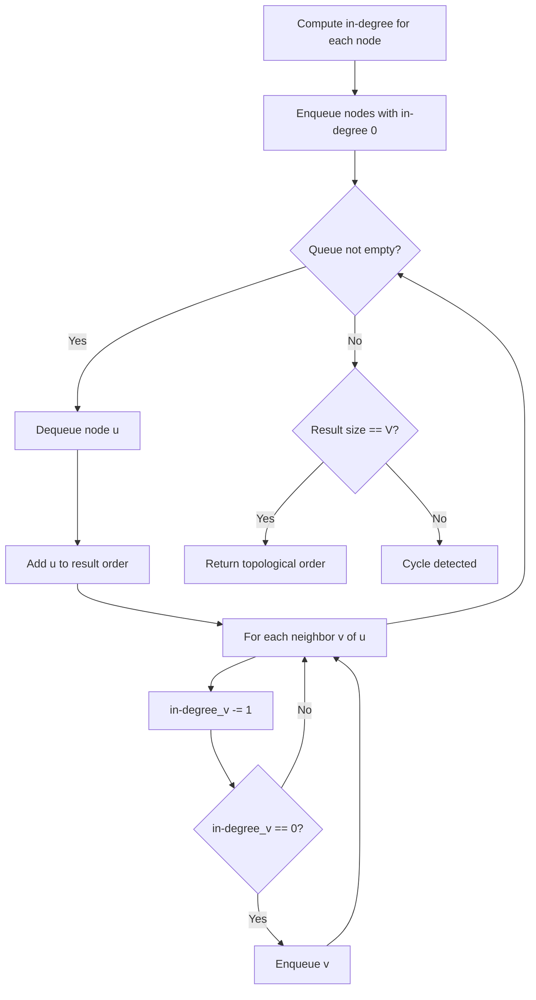
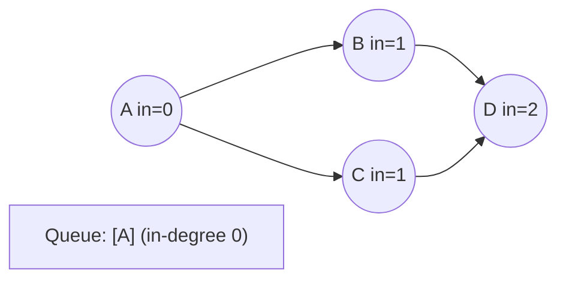
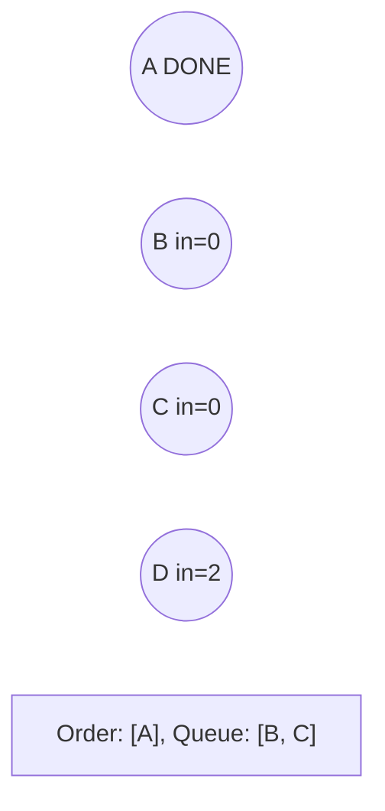
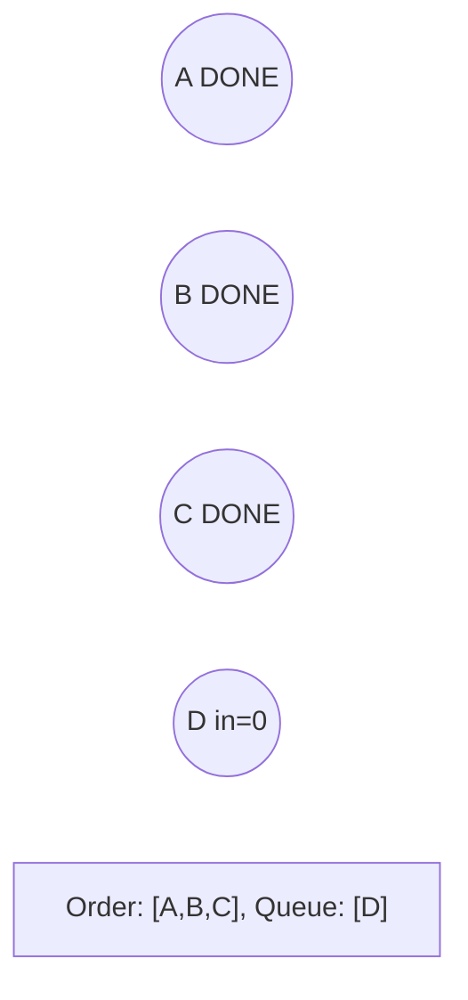
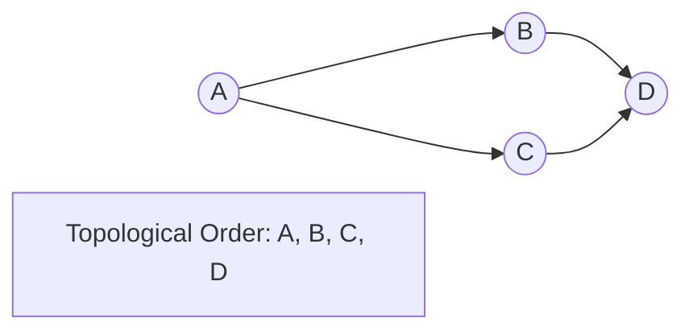

# Problem 2115: Find All Possible Recipes from Given Supplies

**Difficulty:** Medium  
**Tags:** Array, Hash Table, String, Graph Theory, Topological Sort  
**Pattern:** Topological Sort  
**Link:** [leetcode.com/problems/find-all-possible-recipes-from-given-supplies](https://leetcode.com/problems/find-all-possible-recipes-from-given-supplies/)

## Description

You have information about `n` different recipes. You are given a string array `recipes` and a 2D string array `ingredients`. The `i^th` recipe has the name `recipes[i]`, and you can **create** it if you have **all** the needed ingredients from `ingredients[i]`. A recipe can also be an ingredient for **other **recipes, i.e., `ingredients[i]` may contain a string that is in `recipes`.

You are also given a string array `supplies` containing all the ingredients that you initially have, and you have an infinite supply of all of them.

Return *a list of all the recipes that you can create. *You may return the answer in **any order**.

Note that two recipes may contain each other in their ingredients.

 

Example 1:

```

**Input:** recipes = ["bread"], ingredients = [["yeast","flour"]], supplies = ["yeast","flour","corn"]
**Output:** ["bread"]
**Explanation:**
We can create "bread" since we have the ingredients "yeast" and "flour".

```

Example 2:

```

**Input:** recipes = ["bread","sandwich"], ingredients = [["yeast","flour"],["bread","meat"]], supplies = ["yeast","flour","meat"]
**Output:** ["bread","sandwich"]
**Explanation:**
We can create "bread" since we have the ingredients "yeast" and "flour".
We can create "sandwich" since we have the ingredient "meat" and can create the ingredient "bread".

```

Example 3:

```

**Input:** recipes = ["bread","sandwich","burger"], ingredients = [["yeast","flour"],["bread","meat"],["sandwich","meat","bread"]], supplies = ["yeast","flour","meat"]
**Output:** ["bread","sandwich","burger"]
**Explanation:**
We can create "bread" since we have the ingredients "yeast" and "flour".
We can create "sandwich" since we have the ingredient "meat" and can create the ingredient "bread".
We can create "burger" since we have the ingredient "meat" and can create the ingredients "bread" and "sandwich".

```

 

**Constraints:**

	- `n == recipes.length == ingredients.length`
	- `1 <= n <= 100`
	- `1 <= ingredients[i].length, supplies.length <= 100`
	- `1 <= recipes[i].length, ingredients[i][j].length, supplies[k].length <= 10`
	- `recipes[i], ingredients[i][j]`, and `supplies[k]` consist only of lowercase English letters.
	- All the values of `recipes` and `supplies` combined are unique.
	- Each `ingredients[i]` does not contain any duplicate values.

## Approach: Topological Sort

Order nodes in a DAG so every edge u->v has u before v. Use Kahn's algorithm (BFS with in-degree tracking) or DFS-based ordering.

## Pseudocode

```
1. Compute in-degree for every node
2. Enqueue all nodes with in-degree 0
3. While queue not empty:
   a. Dequeue node u, add to result order
   b. For each neighbor v of u:
      - Decrease in-degree of v
      - If in-degree becomes 0: enqueue v
4. If result size != V: cycle exists
5. Return topological order
```

## Algorithm Flow



## Visual State Transitions

**Topological Sort (Kahn's Algorithm):**

**Frame 1: Compute in-degrees**


**Frame 2: Process A, reduce neighbors**


**Frame 3: Process B and C**


**Frame 4: Complete**



## Complexity Analysis

- **Time:** O(V + E)
- **Space:** O(V + E)

## Solution (Python3)

```python
class Solution:
    def findAllRecipes(self, recipes: List[str], ingredients: List[List[str]], supplies: List[str]) -> List[str]:
        # Topological sort (Kahn's algorithm) - O(V+E)
        from collections import deque, defaultdict
        graph = defaultdict(list)
        n = recipes if isinstance(recipes, int) else len(recipes)
        indegree = [0] * n
        # Build graph from prerequisites
        prereqs = ingredients if isinstance(ingredients, list) else recipes
        for edge in prereqs:
            if isinstance(edge, (list, tuple)) and len(edge) >= 2:
                graph[edge[1]].append(edge[0])
                indegree[edge[0]] += 1
        queue = deque([i for i in range(n) if indegree[i] == 0])
        order = []
        while queue:
            node = queue.popleft()
            order.append(node)
            for neighbor in graph[node]:
                indegree[neighbor] -= 1
                if indegree[neighbor] == 0:
                    queue.append(neighbor)
        return len(order) == n if isinstance([], bool) else order
```

## Solution (C++)

```cpp
#include <queue>
#include <string>
#include <vector>
using namespace std;

class Solution {
public:
    vector<string> findAllRecipes(vector<string>& recipes, vector<vector<string>>& ingredients, vector<string>& supplies) {
        // Topological sort (Kahn's) - O(V+E)
        int n = recipes;
        vector<vector<int>> graph(n);
        vector<int> indegree(n, 0);
        for (auto& edge : ingredients) {
            graph[edge[1]].push_back(edge[0]);
            indegree[edge[0]]++;
        }
        queue<int> q;
        for (int i = 0; i < n; i++)
            if (indegree[i] == 0) q.push(i);
        vector<int> order;
        while (!q.empty()) {
            int node = q.front(); q.pop();
            order.push_back(node);
            for (int neighbor : graph[node]) {
                if (--indegree[neighbor] == 0) q.push(neighbor);
            }
        }
        return order.size() == n;
    }
};
```
