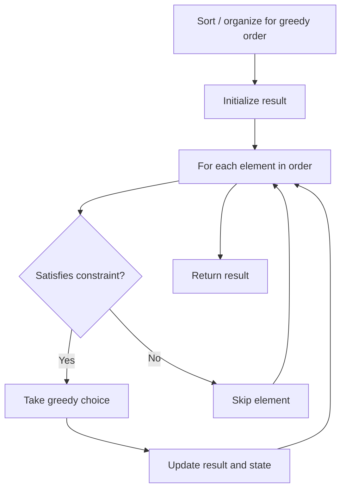

# Problem 2116: Check if a Parentheses String Can Be Valid

**Difficulty:** Medium  
**Tags:** String, Stack, Greedy  
**Pattern:** Greedy  
**Link:** [leetcode.com/problems/check-if-a-parentheses-string-can-be-valid](https://leetcode.com/problems/check-if-a-parentheses-string-can-be-valid/)

## Description

A parentheses string is a **non-empty** string consisting only of `'('` and `')'`. It is valid if **any** of the following conditions is **true**:

	- It is `()`.
	- It can be written as `AB` (`A` concatenated with `B`), where `A` and `B` are valid parentheses strings.
	- It can be written as `(A)`, where `A` is a valid parentheses string.

You are given a parentheses string `s` and a string `locked`, both of length `n`. `locked` is a binary string consisting only of `'0'`s and `'1'`s. For **each** index `i` of `locked`,

	- If `locked[i]` is `'1'`, you **cannot** change `s[i]`.
	- But if `locked[i]` is `'0'`, you **can** change `s[i]` to either `'('` or `')'`.

Return `true` *if you can make `s` a valid parentheses string*. Otherwise, return `false`.

 

Example 1:

```

**Input:** s = "))()))", locked = "010100"
**Output:** true
**Explanation:** locked[1] == '1' and locked[3] == '1', so we cannot change s[1] or s[3].
We change s[0] and s[4] to '(' while leaving s[2] and s[5] unchanged to make s valid.
```

Example 2:

```

**Input:** s = "()()", locked = "0000"
**Output:** true
**Explanation:** We do not need to make any changes because s is already valid.

```

Example 3:

```

**Input:** s = ")", locked = "0"
**Output:** false
**Explanation:** locked permits us to change s[0]. 
Changing s[0] to either '(' or ')' will not make s valid.

```

Example 4:

```

**Input:** s = "(((())(((())", locked = "111111010111"
**Output:** true
**Explanation:** locked permits us to change s[6] and s[8]. 
We change s[6] and s[8] to ')' to make s valid.

```

 

**Constraints:**

	- `n == s.length == locked.length`
	- `1 <= n <= 10^5`
	- `s[i]` is either `'('` or `')'`.
	- `locked[i]` is either `'0'` or `'1'`.

## Approach: Greedy

Make the locally optimal choice at each step, trusting it leads to a global optimum. Greedy works when the problem has the greedy-choice property and optimal substructure.

## Pseudocode

```
1. Sort or organize data for greedy ordering
2. Initialize result
3. For each element in greedy order:
   a. If element satisfies constraint:
      - Take the greedy choice
      - Update result and state
4. Return result
```

## Algorithm Flow



## Complexity Analysis

- **Time:** O(n log n)
- **Space:** O(1)

## Solution (Python3)

```python
class Solution:
    def canBeValid(self, s: str, locked: str) -> bool:
        # Greedy approach - O(n) time
        result = 0
        curr_max = 0
        for i in range(len(s)):
            if isinstance(s[i], int):
                curr_max = max(curr_max, s[i])
                result = max(result, curr_max)
            else:
                result += 1
        return result
```

## Solution (C++)

```cpp
#include <algorithm>
#include <string>
#include <vector>
using namespace std;

class Solution {
public:
    bool canBeValid(string& s, string& locked) {
        // Greedy approach - O(n) time
        int result = 0, curr_max = 0;
        for (int i = 0; i < (int)s.size(); i++) {
            curr_max = max(curr_max, s[i]);
            result = max(result, curr_max);
        }
        return result;
    }
};
```
