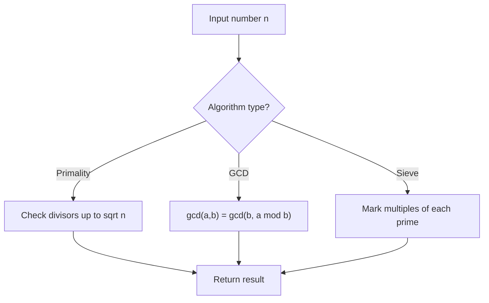

# Problem 2117: Abbreviating the Product of a Range

**Difficulty:** Hard  
**Tags:** Math, Number Theory  
**Pattern:** Number Theory  
**Link:** [leetcode.com/problems/abbreviating-the-product-of-a-range](https://leetcode.com/problems/abbreviating-the-product-of-a-range/)

## Description

You are given two positive integers `left` and `right` with `left <= right`. Calculate the **product** of all integers in the **inclusive** range `[left, right]`.

Since the product may be very large, you will **abbreviate** it following these steps:

	- Count all **trailing** zeros in the product and **remove** them. Let us denote this count as `C`.

	
		For example, there are `3` trailing zeros in `1000`, and there are `0` trailing zeros in `546`.
	
	
	- Denote the remaining number of digits in the product as `d`. If `d > 10`, then express the product as `<pre>...<suf>` where `<pre>` denotes the **first** `5` digits of the product, and `<suf>` denotes the **last** `5` digits of the product **after** removing all trailing zeros. If `d <= 10`, we keep it unchanged.
	
		For example, we express `1234567654321` as `12345...54321`, but `1234567` is represented as `1234567`.
	
	
	- Finally, represent the product as a **string** `"<pre>...<suf>eC"`.
	
		For example, `12345678987600000` will be represented as `"12345...89876e5"`.
	
	

Return *a string denoting the **abbreviated product** of all integers in the **inclusive** range* `[left, right]`.

 

Example 1:

```

**Input:** left = 1, right = 4
**Output:** "24e0"
**Explanation:** The product is 1 × 2 × 3 × 4 = 24.
There are no trailing zeros, so 24 remains the same. The abbreviation will end with "e0".
Since the number of digits is 2, which is less than 10, we do not have to abbreviate it further.
Thus, the final representation is "24e0".

```

Example 2:

```

**Input:** left = 2, right = 11
**Output:** "399168e2"
**Explanation:** The product is 39916800.
There are 2 trailing zeros, which we remove to get 399168. The abbreviation will end with "e2".
The number of digits after removing the trailing zeros is 6, so we do not abbreviate it further.
Hence, the abbreviated product is "399168e2".

```

Example 3:

```

**Input:** left = 371, right = 375
**Output:** "7219856259e3"
**Explanation:** The product is 7219856259000.

```

 

**Constraints:**

	- `1 <= left <= right <= 10^4`

## Approach: Number Theory

Apply number theory: prime checking, factorization, GCD, modular exponentiation, sieve of Eratosthenes, or Euler's totient.

## Pseudocode

```
1. Apply number-theoretic algorithm:
   - Sieve for primes up to n
   - GCD via Euclidean algorithm
   - Modular exponentiation
2. Process results
3. Return answer
```

## Algorithm Flow



## Complexity Analysis

- **Time:** O(sqrt(n)) or O(n log log n)
- **Space:** O(n)

## Solution (Python3)

```python
class Solution:
    def abbreviateProduct(self, left: int, right: int) -> str:
        # Number theory approach
        def gcd(a, b):
            while b:
                a, b = b, a % b
            return a
        
        result = left[0] if isinstance(left, list) else left
        if isinstance(left, list):
            for val in left[1:]:
                result = gcd(result, val)
        return result
```

## Solution (C++)

```cpp
#include <string>
#include <vector>
using namespace std;

class Solution {
public:
    string abbreviateProduct(int left, int right) {
        // Number theory approach
        auto gcd_func = [](int a, int b) -> int {
            while (b) { int t = b; b = a % b; a = t; }
            return a;
        };
        int result = left[0];
        for (int i = 1; i < (int)left.size(); i++) {
            result = gcd_func(result, left[i]);
        }
        return result;
    }
};
```
