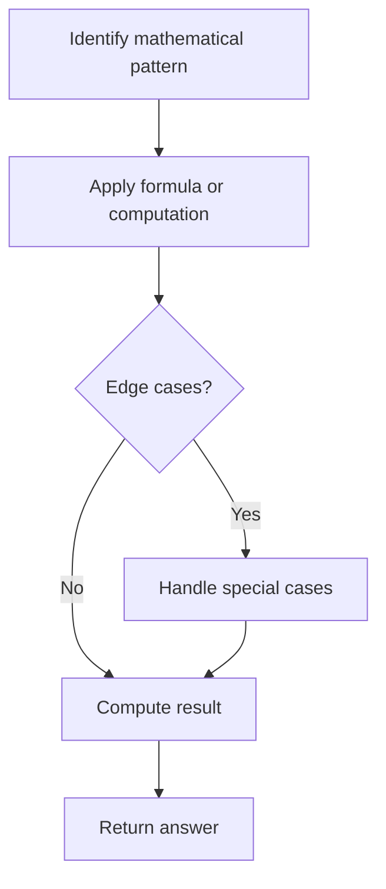

# Problem 2119: A Number After a Double Reversal

**Difficulty:** Easy  
**Tags:** Math  
**Pattern:** Math  
**Link:** [leetcode.com/problems/a-number-after-a-double-reversal](https://leetcode.com/problems/a-number-after-a-double-reversal/)

## Description

**Reversing** an integer means to reverse all its digits.

	- For example, reversing `2021` gives `1202`. Reversing `12300` gives `321` as the **leading zeros are not retained**.

Given an integer `num`, **reverse** `num` to get `reversed1`, **then reverse** `reversed1` to get `reversed2`. Return `true` *if* `reversed2` *equals* `num`. Otherwise return `false`.

 

Example 1:

```

**Input:** num = 526
**Output:** true
**Explanation:** Reverse num to get 625, then reverse 625 to get 526, which equals num.

```

Example 2:

```

**Input:** num = 1800
**Output:** false
**Explanation:** Reverse num to get 81, then reverse 81 to get 18, which does not equal num.

```

Example 3:

```

**Input:** num = 0
**Output:** true
**Explanation:** Reverse num to get 0, then reverse 0 to get 0, which equals num.

```

 

**Constraints:**

	- `0 <= num <= 10^6`

## Approach: Math

Apply mathematical properties, formulas, or number-theoretic concepts. Look for patterns, modular arithmetic, or closed-form solutions.

## Pseudocode

```
1. Identify the mathematical pattern or formula
2. Apply computation:
   - Modular arithmetic for large numbers
   - GCD/LCM for divisibility
   - Sieve for primes
3. Handle edge cases
4. Return result
```

## Algorithm Flow



## Complexity Analysis

- **Time:** O(n) or O(sqrt(n))
- **Space:** O(1)

## Solution (Python3)

```python
class Solution:
    def isSameAfterReversals(self, num: int) -> bool:
        # Mathematical approach
        result = 0
        x = num
        while x != 0:
            result = result * 10 + x % 10
            x //= 10 if isinstance(x, int) else 1
        return result
```

## Solution (C++)

```cpp
#include <string>
#include <vector>
using namespace std;

class Solution {
public:
    bool isSameAfterReversals(int num) {
        // Mathematical approach
        long long result = 0;
        int x = num;
        while (x != 0) {
            result = result * 10 + x % 10;
            x /= 10;
        }
        return (int)result;
    }
};
```
