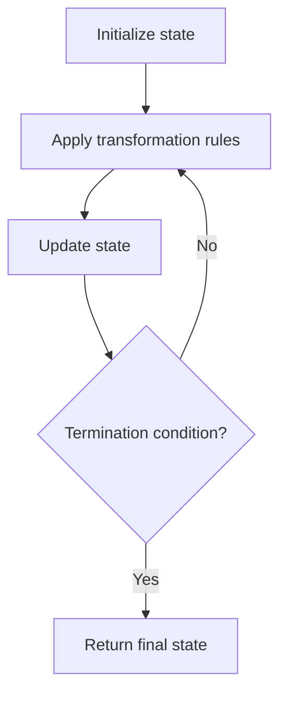

# Problem 2120: Execution of All Suffix Instructions Staying in a Grid

**Difficulty:** Medium  
**Tags:** String, Simulation  
**Pattern:** Simulation  
**Link:** [leetcode.com/problems/execution-of-all-suffix-instructions-staying-in-a-grid](https://leetcode.com/problems/execution-of-all-suffix-instructions-staying-in-a-grid/)

## Description

There is an `n x n` grid, with the top-left cell at `(0, 0)` and the bottom-right cell at `(n - 1, n - 1)`. You are given the integer `n` and an integer array `startPos` where `startPos = [startrow, startcol]` indicates that a robot is initially at cell `(startrow, startcol)`.

You are also given a **0-indexed** string `s` of length `m` where `s[i]` is the `i^th` instruction for the robot: `'L'` (move left), `'R'` (move right), `'U'` (move up), and `'D'` (move down).

The robot can begin executing from any `i^th` instruction in `s`. It executes the instructions one by one towards the end of `s` but it stops if either of these conditions is met:

	- The next instruction will move the robot off the grid.
	- There are no more instructions left to execute.

Return *an array* `answer` *of length* `m` *where* `answer[i]` *is **the number of instructions** the robot can execute if the robot **begins executing from** the* `i^th` *instruction in* `s`.

 

Example 1:

```

**Input:** n = 3, startPos = [0,1], s = "RRDDLU"
**Output:** [1,5,4,3,1,0]
**Explanation:** Starting from startPos and beginning execution from the ith instruction:
- 0th: "**R**RDDLU". Only one instruction "R" can be executed before it moves off the grid.
- 1st:  "**RDDLU**". All five instructions can be executed while it stays in the grid and ends at (1, 1).
- 2nd:   "**DDLU**". All four instructions can be executed while it stays in the grid and ends at (1, 0).
- 3rd:    "**DLU**". All three instructions can be executed while it stays in the grid and ends at (0, 0).
- 4th:     "**L**U". Only one instruction "L" can be executed before it moves off the grid.
- 5th:      "U". If moving up, it would move off the grid.

```

Example 2:

```

**Input:** n = 2, startPos = [1,1], s = "LURD"
**Output:** [4,1,0,0]
**Explanation:**
- 0th: "**LURD**".
- 1st:  "**U**RD".
- 2nd:   "RD".
- 3rd:    "D".

```

Example 3:

```

**Input:** n = 1, startPos = [0,0], s = "LRUD"
**Output:** [0,0,0,0]
**Explanation:** No matter which instruction the robot begins execution from, it would move off the grid.

```

 

**Constraints:**

	- `m == s.length`
	- `1 <= n, m <= 500`
	- `startPos.length == 2`
	- `0 <= startrow, startcol < n`
	- `s` consists of `'L'`, `'R'`, `'U'`, and `'D'`.

## Approach: Simulation

Simulate the process described in the problem step by step. Follow the rules exactly, tracking state at each step.

## Pseudocode

```
1. Initialize state (grid, pointers, counters)
2. For each step / iteration:
   a. Apply the transformation rules
   b. Update state
   c. Check termination condition
3. Return final state or result
```

## Algorithm Flow



## Complexity Analysis

- **Time:** O(n) or O(n * k)
- **Space:** O(n)

## Solution (Python3)

```python
class Solution:
    def executeInstructions(self, n: int, startPos: List[int], s: str) -> List[int]:
        # Simulation approach - follow the rules step by step
        result = []
        for i in range(len(n) if isinstance(n, list) else n):
            # Simulate each step
            pass
        return result
```

## Solution (C++)

```cpp
#include <string>
#include <vector>
using namespace std;

class Solution {
public:
    vector<int> executeInstructions(int n, vector<int>& startPos, string& s) {
        // Simulation approach
        int n = n.size();
        for (int i = 0; i < n; i++) {
            // Simulate each step
        }
        return {};
    }
};
```
