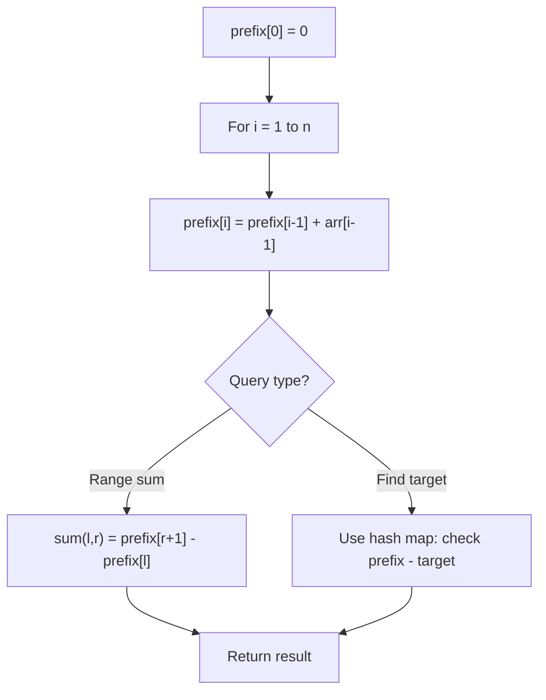

# Problem 2121: Intervals Between Identical Elements

**Difficulty:** Medium  
**Tags:** Array, Hash Table, Prefix Sum  
**Pattern:** Prefix Sum  
**Link:** [leetcode.com/problems/intervals-between-identical-elements](https://leetcode.com/problems/intervals-between-identical-elements/)

## Description

You are given a **0-indexed** array of `n` integers `arr`.

The **interval** between two elements in `arr` is defined as the **absolute difference** between their indices. More formally, the **interval** between `arr[i]` and `arr[j]` is `|i - j|`.

Return *an array* `intervals` *of length* `n` *where* `intervals[i]` *is **the sum of intervals** between *`arr[i]`* and each element in *`arr`* with the same value as *`arr[i]`*.*

**Note:** `|x|` is the absolute value of `x`.

 

Example 1:

```

**Input:** arr = [2,1,3,1,2,3,3]
**Output:** [4,2,7,2,4,4,5]
**Explanation:**
- Index 0: Another 2 is found at index 4. |0 - 4| = 4
- Index 1: Another 1 is found at index 3. |1 - 3| = 2
- Index 2: Two more 3s are found at indices 5 and 6. |2 - 5| + |2 - 6| = 7
- Index 3: Another 1 is found at index 1. |3 - 1| = 2
- Index 4: Another 2 is found at index 0. |4 - 0| = 4
- Index 5: Two more 3s are found at indices 2 and 6. |5 - 2| + |5 - 6| = 4
- Index 6: Two more 3s are found at indices 2 and 5. |6 - 2| + |6 - 5| = 5

```

Example 2:

```

**Input:** arr = [10,5,10,10]
**Output:** [5,0,3,4]
**Explanation:**
- Index 0: Two more 10s are found at indices 2 and 3. |0 - 2| + |0 - 3| = 5
- Index 1: There is only one 5 in the array, so its sum of intervals to identical elements is 0.
- Index 2: Two more 10s are found at indices 0 and 3. |2 - 0| + |2 - 3| = 3
- Index 3: Two more 10s are found at indices 0 and 2. |3 - 0| + |3 - 2| = 4

```

 

**Constraints:**

	- `n == arr.length`
	- `1 <= n <= 10^5`
	- `1 <= arr[i] <= 10^5`

 

**Note:** This question is the same as  2615: Sum of Distances.

## Approach: Prefix Sum

Build a prefix sum array where prefix[i] = sum of elements 0..i-1. Any subarray sum [l..r] = prefix[r+1] - prefix[l]. Combine with hash map for O(n) subarray sum queries.

## Pseudocode

```
1. Build prefix sum array: prefix[0]=0, prefix[i]=prefix[i-1]+arr[i-1]
2. Use prefix sums to answer queries:
   - Subarray sum [l..r] = prefix[r+1] - prefix[l]
   - Or use hash map to find prefix[j]-prefix[i] == target
3. Return result
```

## Algorithm Flow



## Complexity Analysis

- **Time:** O(n)
- **Space:** O(n)

## Solution (Python3)

```python
class Solution:
    def getDistances(self, arr: List[int]) -> List[int]:
        # Prefix sum approach - O(n) time, O(n) space
        prefix = {0: -1}
        curr_sum = 0
        result = 0
        target = arr if isinstance(arr, int) else 0
        for i, val in enumerate(arr):
            curr_sum += val
            if curr_sum - target in prefix:
                result = max(result, i - prefix[curr_sum - target])
            if curr_sum not in prefix:
                prefix[curr_sum] = i
        return result
```

## Solution (C++)

```cpp
#include <algorithm>
#include <string>
#include <unordered_map>
#include <vector>
using namespace std;

class Solution {
public:
    vector<int> getDistances(vector<int>& arr) {
        // Prefix sum approach - O(n) time, O(n) space
        unordered_map<int, int> prefix;
        prefix[0] = -1;
        int curr_sum = 0, result = 0;
        int target = arr;
        for (int i = 0; i < (int)arr.size(); i++) {
            curr_sum += arr[i];
            if (prefix.count(curr_sum - target)) {
                result = max(result, i - prefix[curr_sum - target]);
            }
            if (!prefix.count(curr_sum)) {
                prefix[curr_sum] = i;
            }
        }
        return result;
    }
};
```
