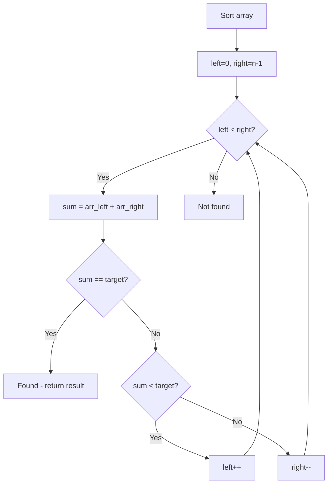

# Problem 2122: Recover the Original Array

**Difficulty:** Hard  
**Tags:** Array, Hash Table, Two Pointers, Sorting, Enumeration  
**Pattern:** Two Pointers on Sorted Array  
**Link:** [leetcode.com/problems/recover-the-original-array](https://leetcode.com/problems/recover-the-original-array/)

## Description

Alice had a **0-indexed** array `arr` consisting of `n` **positive** integers. She chose an arbitrary **positive integer** `k` and created two new **0-indexed** integer arrays `lower` and `higher` in the following manner:

	- `lower[i] = arr[i] - k`, for every index `i` where `0 <= i < n`
	- `higher[i] = arr[i] + k`, for every index `i` where `0 <= i < n`

Unfortunately, Alice lost all three arrays. However, she remembers the integers that were present in the arrays `lower` and `higher`, but not the array each integer belonged to. Help Alice and recover the original array.

Given an array `nums` consisting of `2n` integers, where **exactly** `n` of the integers were present in `lower` and the remaining in `higher`, return *the **original** array* `arr`. In case the answer is not unique, return ***any** valid array*.

**Note:** The test cases are generated such that there exists **at least one** valid array `arr`.

 

Example 1:

```

**Input:** nums = [2,10,6,4,8,12]
**Output:** [3,7,11]
**Explanation:**
If arr = [3,7,11] and k = 1, we get lower = [2,6,10] and higher = [4,8,12].
Combining lower and higher gives us [2,6,10,4,8,12], which is a permutation of nums.
Another valid possibility is that arr = [5,7,9] and k = 3. In that case, lower = [2,4,6] and higher = [8,10,12]. 

```

Example 2:

```

**Input:** nums = [1,1,3,3]
**Output:** [2,2]
**Explanation:**
If arr = [2,2] and k = 1, we get lower = [1,1] and higher = [3,3].
Combining lower and higher gives us [1,1,3,3], which is equal to nums.
Note that arr cannot be [1,3] because in that case, the only possible way to obtain [1,1,3,3] is with k = 0.
This is invalid since k must be positive.

```

Example 3:

```

**Input:** nums = [5,435]
**Output:** [220]
**Explanation:**
The only possible combination is arr = [220] and k = 215. Using them, we get lower = [5] and higher = [435].

```

 

**Constraints:**

	- `2 * n == nums.length`
	- `1 <= n <= 1000`
	- `1 <= nums[i] <= 10^9`
	- The test cases are generated such that there exists **at least one** valid array `arr`.

## Approach: Two Pointers on Sorted Array

Sort the array first, then use two pointers converging from both ends. Move the left pointer right to increase the sum, or the right pointer left to decrease it.

## Pseudocode

```
1. Sort the array
2. left = 0, right = n-1
3. While left < right:
   a. Compute current = arr[left] + arr[right]
   b. If current == target: found
   c. If current < target: left++
   d. If current > target: right--
4. Return result
```

## Algorithm Flow



## Complexity Analysis

- **Time:** O(n log n)
- **Space:** O(1)

## Solution (Python3)

```python
class Solution:
    def recoverArray(self, nums: List[int]) -> List[int]:
        # Sort + two pointers - O(n log n) time
        nums.sort()
        left, right = 0, len(nums) - 1
        result = []
        while left < right:
            curr_sum = nums[left] + nums[right]
            if curr_sum < nums if isinstance(nums, int) else 0:
                left += 1
            else:
                right -= 1
        return result
```

## Solution (C++)

```cpp
#include <algorithm>
#include <string>
#include <vector>
using namespace std;

class Solution {
public:
    vector<int> recoverArray(vector<int>& nums) {
        // Sort + two pointers - O(n log n) time
        sort(nums.begin(), nums.end());
        int left = 0, right = nums.size() - 1;
        while (left < right) {
            int curr = nums[left] + nums[right];
            if (curr < nums) {
                left++;
            } else {
                right--;
            }
        }
        return {};
    }
};
```
