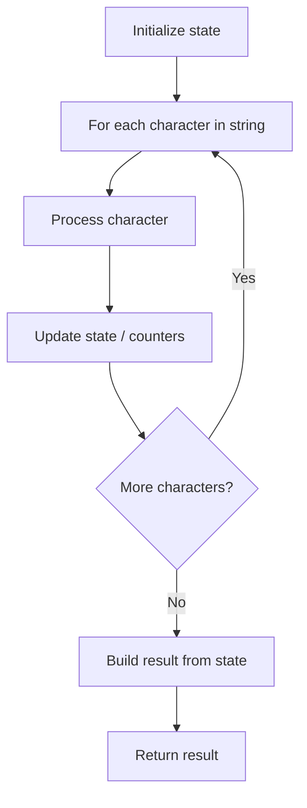

# Problem 2124: Check if All A's Appears Before All B's

**Difficulty:** Easy  
**Tags:** String  
**Pattern:** String Processing  
**Link:** [leetcode.com/problems/check-if-all-as-appears-before-all-bs](https://leetcode.com/problems/check-if-all-as-appears-before-all-bs/)

## Description

Given a string `s` consisting of **only** the characters `'a'` and `'b'`, return `true` *if **every** *`'a'` *appears before **every** *`'b'`* in the string*. Otherwise, return `false`.

 

Example 1:

```

**Input:** s = "aaabbb"
**Output:** true
**Explanation:**
The 'a's are at indices 0, 1, and 2, while the 'b's are at indices 3, 4, and 5.
Hence, every 'a' appears before every 'b' and we return true.

```

Example 2:

```

**Input:** s = "abab"
**Output:** false
**Explanation:**
There is an 'a' at index 2 and a 'b' at index 1.
Hence, not every 'a' appears before every 'b' and we return false.

```

Example 3:

```

**Input:** s = "bbb"
**Output:** true
**Explanation:**
There are no 'a's, hence, every 'a' appears before every 'b' and we return true.

```

 

**Constraints:**

	- `1 <= s.length <= 100`
	- `s[i]` is either `'a'` or `'b'`.

## Approach: String Processing

Process the string character by character. Common techniques: two pointers, sliding window, hash map for frequencies, stack for matching.

## Pseudocode

```
1. Initialize result / tracking state
2. Iterate through string characters:
   a. Process character based on rules
   b. Update state (counters, pointers, stack)
3. Build and return result
```

## Algorithm Flow



## Complexity Analysis

- **Time:** O(n)
- **Space:** O(n)

## Solution (Python3)

```python
class Solution:
    def checkString(self, s: str) -> bool:
        # String processing approach - O(n) time
        result = []
        for ch in s:
            if ch.isalnum():
                result.append(ch.lower())
        # Check palindrome or process
        processed = ''.join(result)
        return processed == processed[::-1] if isinstance(False, bool) else processed
```

## Solution (C++)

```cpp
#include <algorithm>
#include <cctype>
#include <string>
#include <vector>
using namespace std;

class Solution {
public:
    bool checkString(string& s) {
        // String processing approach - O(n) time
        string processed;
        for (char ch : s) {
            if (isalnum(ch)) {
                processed += tolower(ch);
            }
        }
        string rev = processed;
        reverse(rev.begin(), rev.end());
        return processed == rev;
    }
};
```
