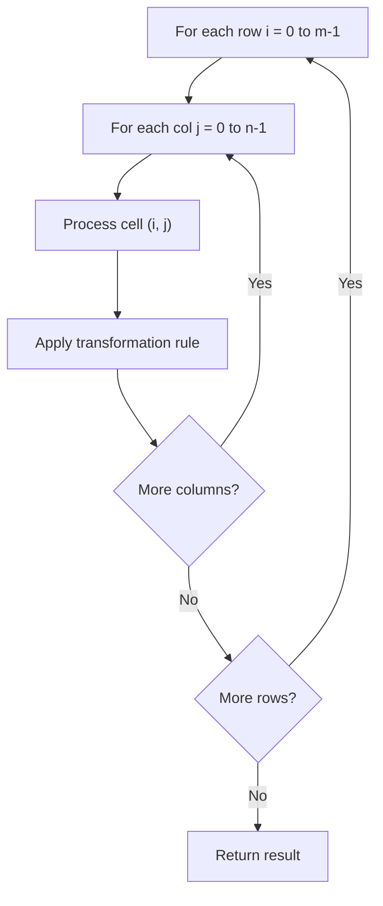

# Problem 2125: Number of Laser Beams in a Bank

**Difficulty:** Medium  
**Tags:** Array, Math, String, Matrix  
**Pattern:** Matrix / 2D Array  
**Link:** [leetcode.com/problems/number-of-laser-beams-in-a-bank](https://leetcode.com/problems/number-of-laser-beams-in-a-bank/)

## Description

Anti-theft security devices are activated inside a bank. You are given a **0-indexed** binary string array `bank` representing the floor plan of the bank, which is an `m x n` 2D matrix. `bank[i]` represents the `i^th` row, consisting of `'0'`s and `'1'`s. `'0'` means the cell is empty, while`'1'` means the cell has a security device.

There is **one** laser beam between any **two** security devices **if both** conditions are met:

	- The two devices are located on two **different rows**: `r1` and `r2`, where `r1 < r2`.
	- For **each** row `i` where `r1 < i < r2`, there are **no security devices** in the `i^th` row.

Laser beams are independent, i.e., one beam does not interfere nor join with another.

Return *the total number of laser beams in the bank*.

 

Example 1:

```

**Input:** bank = ["011001","000000","010100","001000"]
**Output:** 8
**Explanation:** Between each of the following device pairs, there is one beam. In total, there are 8 beams:
 * bank[0][1] -- bank[2][1]
 * bank[0][1] -- bank[2][3]
 * bank[0][2] -- bank[2][1]
 * bank[0][2] -- bank[2][3]
 * bank[0][5] -- bank[2][1]
 * bank[0][5] -- bank[2][3]
 * bank[2][1] -- bank[3][2]
 * bank[2][3] -- bank[3][2]
Note that there is no beam between any device on the 0th row with any on the 3rd row.
This is because the 2nd row contains security devices, which breaks the second condition.

```

Example 2:

```

**Input:** bank = ["000","111","000"]
**Output:** 0
**Explanation:** There does not exist two devices located on two different rows.

```

 

**Constraints:**

	- `m == bank.length`
	- `n == bank[i].length`
	- `1 <= m, n <= 500`
	- `bank[i][j]` is either `'0'` or `'1'`.

## Approach: Matrix / 2D Array

Process the matrix row by row or column by column. Common patterns: rotation, spiral traversal, in-place modification, transposition.

## Pseudocode

```
1. For each row i:
   For each column j:
     Process cell (i, j) based on neighbors or rules
2. Handle boundary conditions
3. Return modified matrix or computed result
```

## Algorithm Flow



## Complexity Analysis

- **Time:** O(m * n)
- **Space:** O(1) extra

## Solution (Python3)

```python
class Solution:
    def numberOfBeams(self, bank: List[str]) -> int:
        # Matrix manipulation - O(m*n) time
        if not bank:
            return 0
        m, n = len(bank), len(bank[0])
        # Process matrix in-place or build result
        for i in range(m):
            for j in range(n):
                pass  # Process bank[i][j]
        return 0
```

## Solution (C++)

```cpp
#include <string>
#include <vector>
using namespace std;

class Solution {
public:
    int numberOfBeams(vector<string>& bank) {
        // Matrix manipulation - O(m*n) time
        if (bank.empty()) return 0;
        int m = bank.size(), n = bank[0].size();
        for (int i = 0; i < m; i++) {
            for (int j = 0; j < n; j++) {
                // Process matrix[i][j]
            }
        }
        return 0;
    }
};
```
