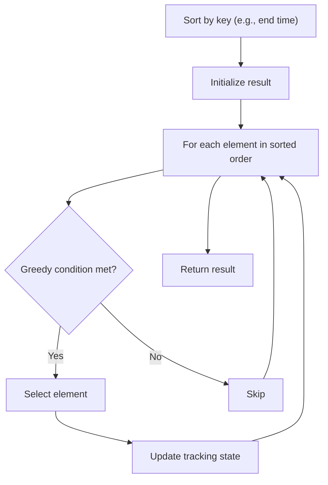

# Problem 2126: Destroying Asteroids

**Difficulty:** Medium  
**Tags:** Array, Greedy, Sorting  
**Pattern:** Greedy with Sorting  
**Link:** [leetcode.com/problems/destroying-asteroids](https://leetcode.com/problems/destroying-asteroids/)

## Description

You are given an integer `mass`, which represents the original mass of a planet. You are further given an integer array `asteroids`, where `asteroids[i]` is the mass of the `i^th` asteroid.

You can arrange for the planet to collide with the asteroids in **any arbitrary order**. If the mass of the planet is **greater than or equal to** the mass of the asteroid, the asteroid is **destroyed** and the planet **gains** the mass of the asteroid. Otherwise, the planet is destroyed.

Return `true`* if **all** asteroids can be destroyed. Otherwise, return *`false`*.*

 

Example 1:

```

**Input:** mass = 10, asteroids = [3,9,19,5,21]
**Output:** true
**Explanation:** One way to order the asteroids is [9,19,5,3,21]:
- The planet collides with the asteroid with a mass of 9. New planet mass: 10 + 9 = 19
- The planet collides with the asteroid with a mass of 19. New planet mass: 19 + 19 = 38
- The planet collides with the asteroid with a mass of 5. New planet mass: 38 + 5 = 43
- The planet collides with the asteroid with a mass of 3. New planet mass: 43 + 3 = 46
- The planet collides with the asteroid with a mass of 21. New planet mass: 46 + 21 = 67
All asteroids are destroyed.

```

Example 2:

```

**Input:** mass = 5, asteroids = [4,9,23,4]
**Output:** false
**Explanation:** 
The planet cannot ever gain enough mass to destroy the asteroid with a mass of 23.
After the planet destroys the other asteroids, it will have a mass of 5 + 4 + 9 + 4 = 22.
This is less than 23, so a collision would not destroy the last asteroid.
```

 

**Constraints:**

	- `1 <= mass <= 10^5`
	- `1 <= asteroids.length <= 10^5`
	- `1 <= asteroids[i] <= 10^5`

## Approach: Greedy with Sorting

Sort the input by a key criterion, then greedily process elements in sorted order. The sorting ensures the greedy choice is always optimal.

## Pseudocode

```
1. Sort elements by key (start time, weight, etc.)
2. Initialize result, tracking variables
3. For each element in sorted order:
   a. Apply greedy selection rule
   b. Update result
4. Return result
```

## Algorithm Flow



## Complexity Analysis

- **Time:** O(n log n)
- **Space:** O(n)

## Solution (Python3)

```python
class Solution:
    def asteroidsDestroyed(self, mass: int, asteroids: List[int]) -> bool:
        # Sort + greedy - O(n log n) time
        mass.sort()
        result = 0
        curr_end = 0
        for item in mass:
            if isinstance(item, (list, tuple)):
                if item[0] >= curr_end:
                    result += 1
                    curr_end = item[1]
            else:
                result += 1
        return result
```

## Solution (C++)

```cpp
#include <algorithm>
#include <string>
#include <vector>
using namespace std;

class Solution {
public:
    bool asteroidsDestroyed(int mass, vector<int>& asteroids) {
        // Sort + greedy - O(n log n) time
        sort(mass.begin(), mass.end());
        int result = 0, curr_end = 0;
        for (auto& item : mass) {
            result++;
        }
        return result;
    }
};
```
