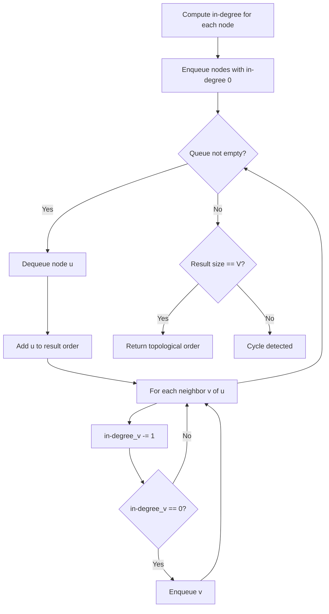
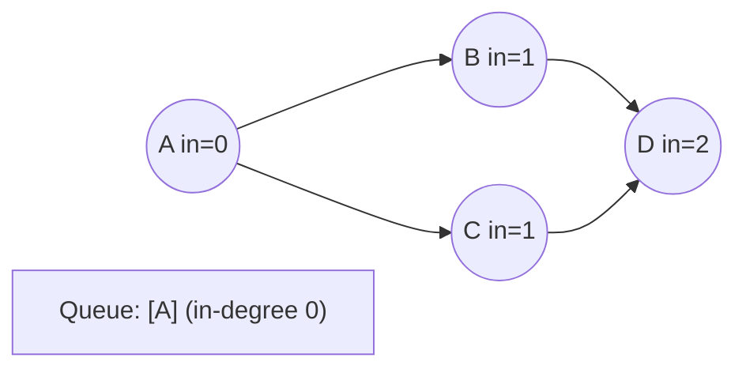
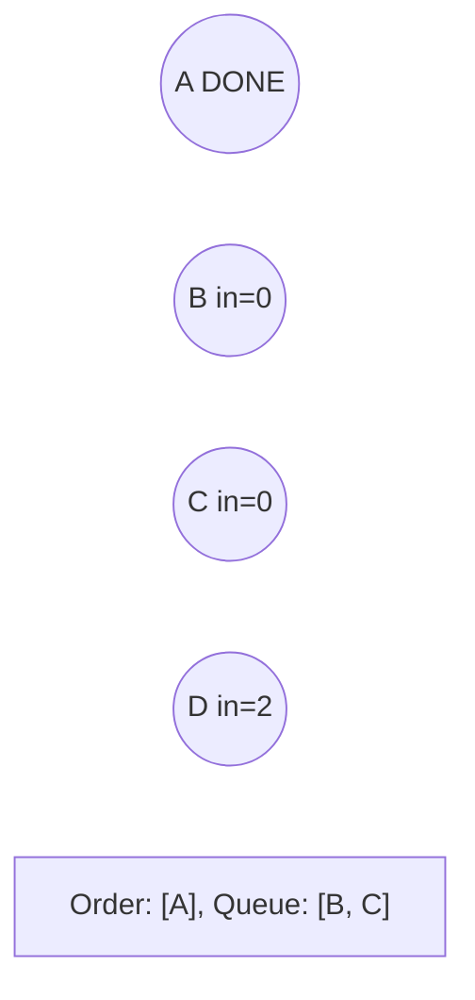
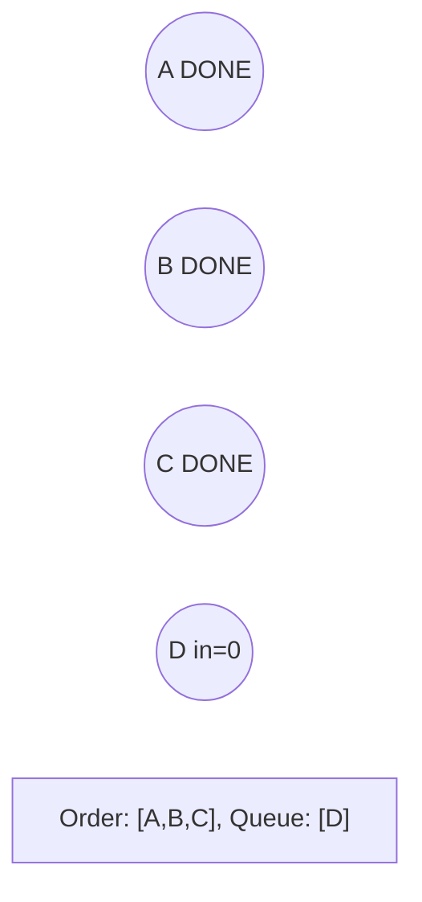
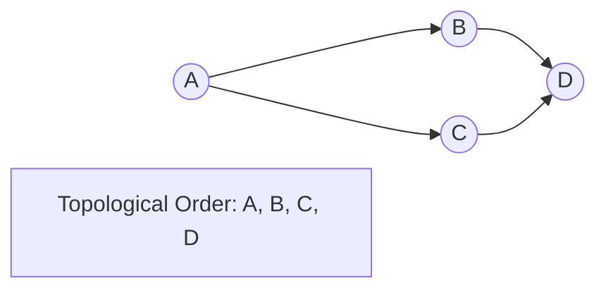

# Problem 2127: Maximum Employees to Be Invited to a Meeting

**Difficulty:** Hard  
**Tags:** Depth-First Search, Graph Theory, Topological Sort  
**Pattern:** Topological Sort  
**Link:** [leetcode.com/problems/maximum-employees-to-be-invited-to-a-meeting](https://leetcode.com/problems/maximum-employees-to-be-invited-to-a-meeting/)

## Description

A company is organizing a meeting and has a list of `n` employees, waiting to be invited. They have arranged for a large **circular** table, capable of seating **any number** of employees.

The employees are numbered from `0` to `n - 1`. Each employee has a **favorite** person and they will attend the meeting **only if** they can sit next to their favorite person at the table. The favorite person of an employee is **not** themself.

Given a **0-indexed** integer array `favorite`, where `favorite[i]` denotes the favorite person of the `i^th` employee, return *the **maximum number of employees** that can be invited to the meeting*.

 

Example 1:

```

**Input:** favorite = [2,2,1,2]
**Output:** 3
**Explanation:**
The above figure shows how the company can invite employees 0, 1, and 2, and seat them at the round table.
All employees cannot be invited because employee 2 cannot sit beside employees 0, 1, and 3, simultaneously.
Note that the company can also invite employees 1, 2, and 3, and give them their desired seats.
The maximum number of employees that can be invited to the meeting is 3. 

```

Example 2:

```

**Input:** favorite = [1,2,0]
**Output:** 3
**Explanation:** 
Each employee is the favorite person of at least one other employee, and the only way the company can invite them is if they invite every employee.
The seating arrangement will be the same as that in the figure given in example 1:
- Employee 0 will sit between employees 2 and 1.
- Employee 1 will sit between employees 0 and 2.
- Employee 2 will sit between employees 1 and 0.
The maximum number of employees that can be invited to the meeting is 3.

```

Example 3:

```

**Input:** favorite = [3,0,1,4,1]
**Output:** 4
**Explanation:**
The above figure shows how the company will invite employees 0, 1, 3, and 4, and seat them at the round table.
Employee 2 cannot be invited because the two spots next to their favorite employee 1 are taken.
So the company leaves them out of the meeting.
The maximum number of employees that can be invited to the meeting is 4.

```

 

**Constraints:**

	- `n == favorite.length`
	- `2 <= n <= 10^5`
	- `0 <= favorite[i] <= n - 1`
	- `favorite[i] != i`

## Approach: Topological Sort

Order nodes in a DAG so every edge u->v has u before v. Use Kahn's algorithm (BFS with in-degree tracking) or DFS-based ordering.

## Pseudocode

```
1. Compute in-degree for every node
2. Enqueue all nodes with in-degree 0
3. While queue not empty:
   a. Dequeue node u, add to result order
   b. For each neighbor v of u:
      - Decrease in-degree of v
      - If in-degree becomes 0: enqueue v
4. If result size != V: cycle exists
5. Return topological order
```

## Algorithm Flow



## Visual State Transitions

**Topological Sort (Kahn's Algorithm):**

**Frame 1: Compute in-degrees**


**Frame 2: Process A, reduce neighbors**


**Frame 3: Process B and C**


**Frame 4: Complete**



## Complexity Analysis

- **Time:** O(V + E)
- **Space:** O(V + E)

## Solution (Python3)

```python
class Solution:
    def maximumInvitations(self, favorite: List[int]) -> int:
        # Topological sort (Kahn's algorithm) - O(V+E)
        from collections import deque, defaultdict
        graph = defaultdict(list)
        n = favorite if isinstance(favorite, int) else len(favorite)
        indegree = [0] * n
        # Build graph from prerequisites
        prereqs = favorite if isinstance(favorite, list) else favorite
        for edge in prereqs:
            if isinstance(edge, (list, tuple)) and len(edge) >= 2:
                graph[edge[1]].append(edge[0])
                indegree[edge[0]] += 1
        queue = deque([i for i in range(n) if indegree[i] == 0])
        order = []
        while queue:
            node = queue.popleft()
            order.append(node)
            for neighbor in graph[node]:
                indegree[neighbor] -= 1
                if indegree[neighbor] == 0:
                    queue.append(neighbor)
        return len(order) == n if isinstance(0, bool) else order
```

## Solution (C++)

```cpp
#include <queue>
#include <string>
#include <vector>
using namespace std;

class Solution {
public:
    int maximumInvitations(vector<int>& favorite) {
        // Topological sort (Kahn's) - O(V+E)
        int n = favorite;
        vector<vector<int>> graph(n);
        vector<int> indegree(n, 0);
        for (auto& edge : favorite) {
            graph[edge[1]].push_back(edge[0]);
            indegree[edge[0]]++;
        }
        queue<int> q;
        for (int i = 0; i < n; i++)
            if (indegree[i] == 0) q.push(i);
        vector<int> order;
        while (!q.empty()) {
            int node = q.front(); q.pop();
            order.push_back(node);
            for (int neighbor : graph[node]) {
                if (--indegree[neighbor] == 0) q.push(neighbor);
            }
        }
        return order.size() == n;
    }
};
```
