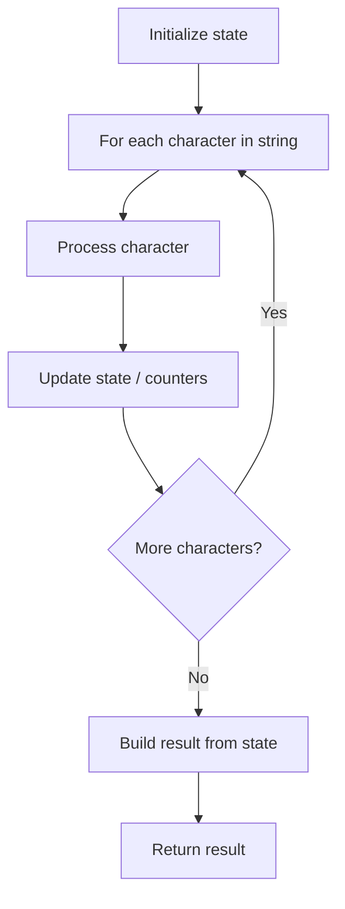

# Problem 2129: Capitalize the Title

**Difficulty:** Easy  
**Tags:** String  
**Pattern:** String Processing  
**Link:** [leetcode.com/problems/capitalize-the-title](https://leetcode.com/problems/capitalize-the-title/)

## Description

You are given a string `title` consisting of one or more words separated by a single space, where each word consists of English letters. **Capitalize** the string by changing the capitalization of each word such that:

	- If the length of the word is `1` or `2` letters, change all letters to lowercase.
	- Otherwise, change the first letter to uppercase and the remaining letters to lowercase.

Return *the **capitalized** *`title`.

 

Example 1:

```

**Input:** title = "capiTalIze tHe titLe"
**Output:** "Capitalize The Title"
**Explanation:**
Since all the words have a length of at least 3, the first letter of each word is uppercase, and the remaining letters are lowercase.

```

Example 2:

```

**Input:** title = "First leTTeR of EACH Word"
**Output:** "First Letter of Each Word"
**Explanation:**
The word "of" has length 2, so it is all lowercase.
The remaining words have a length of at least 3, so the first letter of each remaining word is uppercase, and the remaining letters are lowercase.

```

Example 3:

```

**Input:** title = "i lOve leetcode"
**Output:** "i Love Leetcode"
**Explanation:**
The word "i" has length 1, so it is lowercase.
The remaining words have a length of at least 3, so the first letter of each remaining word is uppercase, and the remaining letters are lowercase.

```

 

**Constraints:**

	- `1 <= title.length <= 100`
	- `title` consists of words separated by a single space without any leading or trailing spaces.
	- Each word consists of uppercase and lowercase English letters and is **non-empty**.

## Approach: String Processing

Process the string character by character. Common techniques: two pointers, sliding window, hash map for frequencies, stack for matching.

## Pseudocode

```
1. Initialize result / tracking state
2. Iterate through string characters:
   a. Process character based on rules
   b. Update state (counters, pointers, stack)
3. Build and return result
```

## Algorithm Flow



## Complexity Analysis

- **Time:** O(n)
- **Space:** O(n)

## Solution (Python3)

```python
class Solution:
    def capitalizeTitle(self, title: str) -> str:
        # String processing approach - O(n) time
        result = []
        for ch in title:
            if ch.isalnum():
                result.append(ch.lower())
        # Check palindrome or process
        processed = ''.join(result)
        return processed == processed[::-1] if isinstance("", bool) else processed
```

## Solution (C++)

```cpp
#include <algorithm>
#include <cctype>
#include <string>
#include <vector>
using namespace std;

class Solution {
public:
    string capitalizeTitle(string& title) {
        // String processing approach - O(n) time
        string processed;
        for (char ch : title) {
            if (isalnum(ch)) {
                processed += tolower(ch);
            }
        }
        string rev = processed;
        reverse(rev.begin(), rev.end());
        return processed == rev;
    }
};
```
