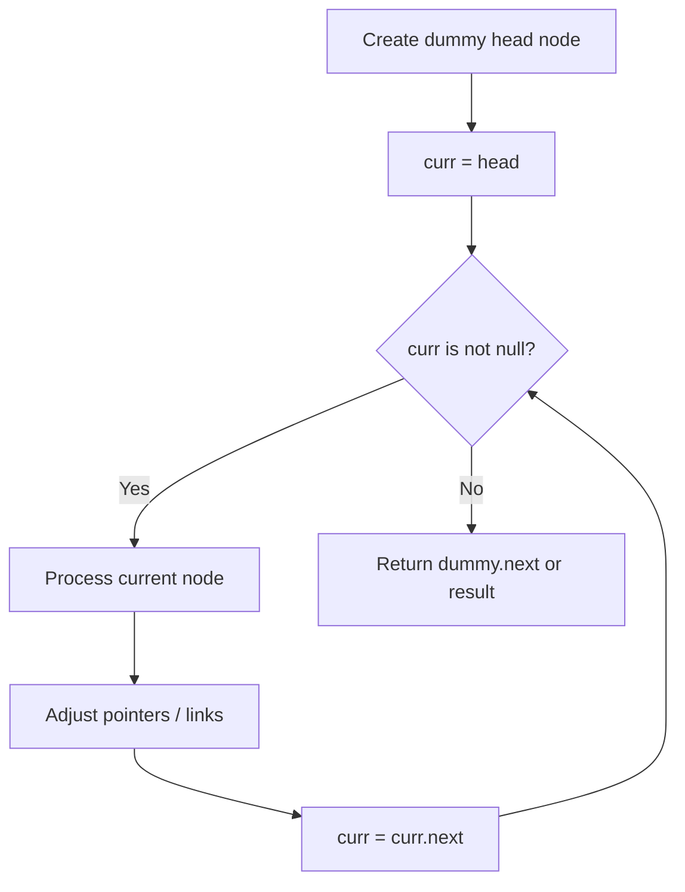
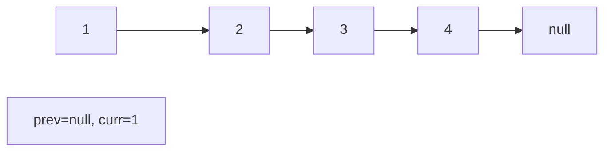
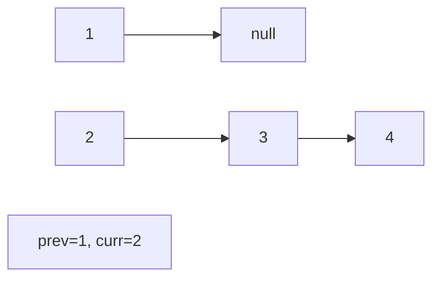
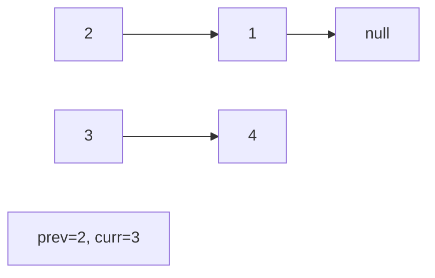
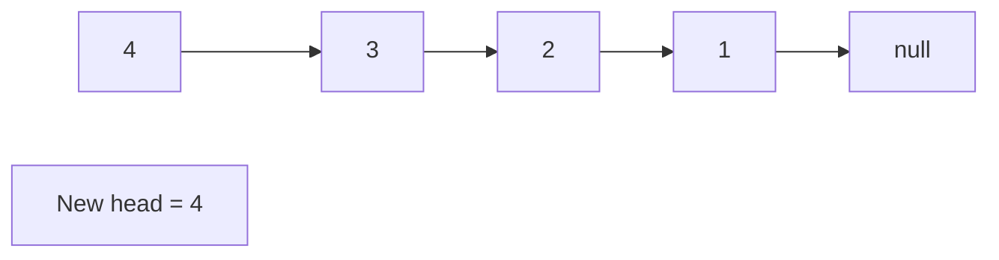

# Problem 2130: Maximum Twin Sum of a Linked List

**Difficulty:** Medium  
**Tags:** Linked List, Two Pointers, Stack  
**Pattern:** Linked List / Two Pointers  
**Link:** [leetcode.com/problems/maximum-twin-sum-of-a-linked-list](https://leetcode.com/problems/maximum-twin-sum-of-a-linked-list/)

## Description

In a linked list of size `n`, where `n` is **even**, the `i^th` node (**0-indexed**) of the linked list is known as the **twin** of the `(n-1-i)^th` node, if `0 <= i <= (n / 2) - 1`.

	- For example, if `n = 4`, then node `0` is the twin of node `3`, and node `1` is the twin of node `2`. These are the only nodes with twins for `n = 4`.

The **twin sum **is defined as the sum of a node and its twin.

Given the `head` of a linked list with even length, return *the **maximum twin sum** of the linked list*.

 

Example 1:

```

**Input:** head = [5,4,2,1]
**Output:** 6
**Explanation:**
Nodes 0 and 1 are the twins of nodes 3 and 2, respectively. All have twin sum = 6.
There are no other nodes with twins in the linked list.
Thus, the maximum twin sum of the linked list is 6. 

```

Example 2:

```

**Input:** head = [4,2,2,3]
**Output:** 7
**Explanation:**
The nodes with twins present in this linked list are:
- Node 0 is the twin of node 3 having a twin sum of 4 + 3 = 7.
- Node 1 is the twin of node 2 having a twin sum of 2 + 2 = 4.
Thus, the maximum twin sum of the linked list is max(7, 4) = 7. 

```

Example 3:

```

**Input:** head = [1,100000]
**Output:** 100001
**Explanation:**
There is only one node with a twin in the linked list having twin sum of 1 + 100000 = 100001.

```

 

**Constraints:**

	- The number of nodes in the list is an **even** integer in the range `[2, 10^5]`.
	- `1 <= Node.val <= 10^5`

## Approach: Linked List / Two Pointers

Find middle, reverse second half, compute pairwise sums.

## Pseudocode

```
1. Create dummy head if needed
2. Initialize pointer(s) at head
3. Traverse / modify list:
   a. Process current node
   b. Adjust next pointers as needed
   c. Move to next node
4. Return dummy.next or result
```

## Algorithm Flow



## Visual State Transitions

**Linked List Operation (Reverse):**

**Frame 1: Initial list**


**Frame 2: Reverse first link**


**Frame 3: Reverse second link**


**Frame 4: Fully reversed**



## Complexity Analysis

- **Time:** O(n)
- **Space:** O(1)

## Solution (Python3)

```python
class Solution:
    def pairSum(self, head) -> int:
        # Find middle
        slow = fast = head
        while fast and fast.next:
            slow = slow.next
            fast = fast.next.next
        # Reverse second half
        prev = None
        while slow:
            slow.next, prev, slow = prev, slow, slow.next
        # Find max twin sum
        max_sum = 0
        while prev:
            max_sum = max(max_sum, head.val + prev.val)
            head = head.next
            prev = prev.next
        return max_sum
```

## Solution (C++)

```cpp
#include <string>
#include <vector>
using namespace std;

class Solution {
public:
    int pairSum(ListNode* head) {
        // Linked list traversal/manipulation
        ListNode dummy(0);
        dummy.next = head;
        ListNode* prev = &dummy;
        ListNode* curr = head;
        while (curr) {
            ListNode* nxt = curr->next;
            // Process current node
            prev = curr;
            curr = nxt;
        }
        return dummy.next;
    }
};
```
