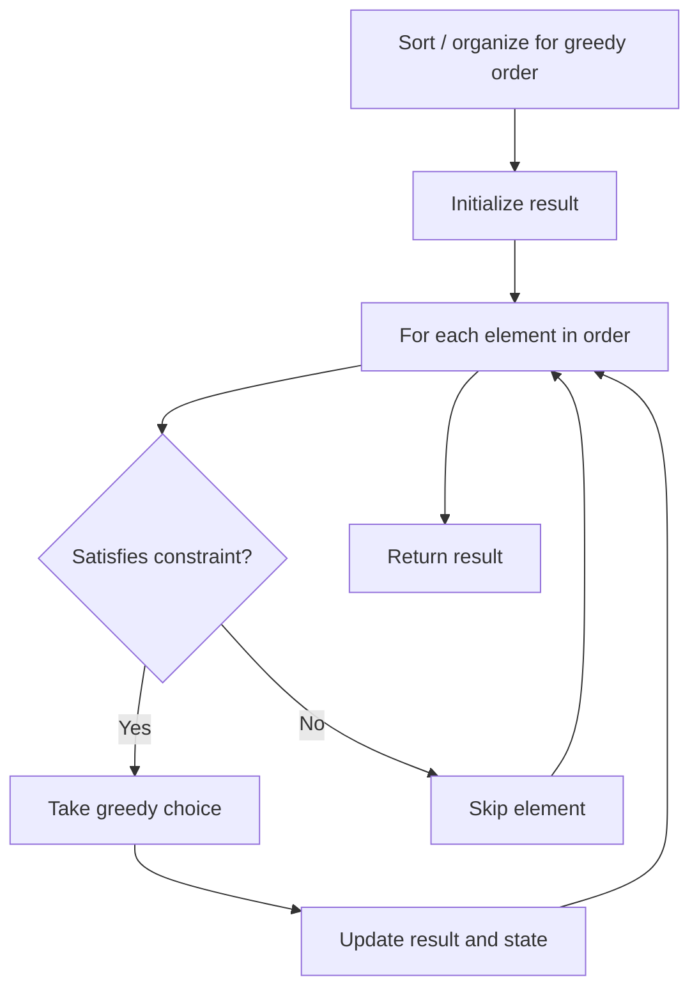

# Problem 2131: Longest Palindrome by Concatenating Two Letter Words

**Difficulty:** Medium  
**Tags:** Array, Hash Table, String, Greedy, Counting  
**Pattern:** Greedy  
**Link:** [leetcode.com/problems/longest-palindrome-by-concatenating-two-letter-words](https://leetcode.com/problems/longest-palindrome-by-concatenating-two-letter-words/)

## Description

You are given an array of strings `words`. Each element of `words` consists of **two** lowercase English letters.

Create the **longest possible palindrome** by selecting some elements from `words` and concatenating them in **any order**. Each element can be selected **at most once**.

Return *the **length** of the longest palindrome that you can create*. If it is impossible to create any palindrome, return `0`.

A **palindrome** is a string that reads the same forward and backward.

 

Example 1:

```

**Input:** words = ["lc","cl","gg"]
**Output:** 6
**Explanation:** One longest palindrome is "lc" + "gg" + "cl" = "lcggcl", of length 6.
Note that "clgglc" is another longest palindrome that can be created.

```

Example 2:

```

**Input:** words = ["ab","ty","yt","lc","cl","ab"]
**Output:** 8
**Explanation:** One longest palindrome is "ty" + "lc" + "cl" + "yt" = "tylcclyt", of length 8.
Note that "lcyttycl" is another longest palindrome that can be created.

```

Example 3:

```

**Input:** words = ["cc","ll","xx"]
**Output:** 2
**Explanation:** One longest palindrome is "cc", of length 2.
Note that "ll" is another longest palindrome that can be created, and so is "xx".

```

 

**Constraints:**

	- `1 <= words.length <= 10^5`
	- `words[i].length == 2`
	- `words[i]` consists of lowercase English letters.

## Approach: Greedy

Make the locally optimal choice at each step, trusting it leads to a global optimum. Greedy works when the problem has the greedy-choice property and optimal substructure.

## Pseudocode

```
1. Sort or organize data for greedy ordering
2. Initialize result
3. For each element in greedy order:
   a. If element satisfies constraint:
      - Take the greedy choice
      - Update result and state
4. Return result
```

## Algorithm Flow



## Complexity Analysis

- **Time:** O(n log n)
- **Space:** O(1)

## Solution (Python3)

```python
class Solution:
    def longestPalindrome(self, words: List[str]) -> int:
        # Greedy approach - O(n) time
        result = 0
        curr_max = 0
        for i in range(len(words)):
            if isinstance(words[i], int):
                curr_max = max(curr_max, words[i])
                result = max(result, curr_max)
            else:
                result += 1
        return result
```

## Solution (C++)

```cpp
#include <algorithm>
#include <string>
#include <vector>
using namespace std;

class Solution {
public:
    int longestPalindrome(vector<string>& words) {
        // Greedy approach - O(n) time
        int result = 0, curr_max = 0;
        for (int i = 0; i < (int)words.size(); i++) {
            curr_max = max(curr_max, words[i]);
            result = max(result, curr_max);
        }
        return result;
    }
};
```
