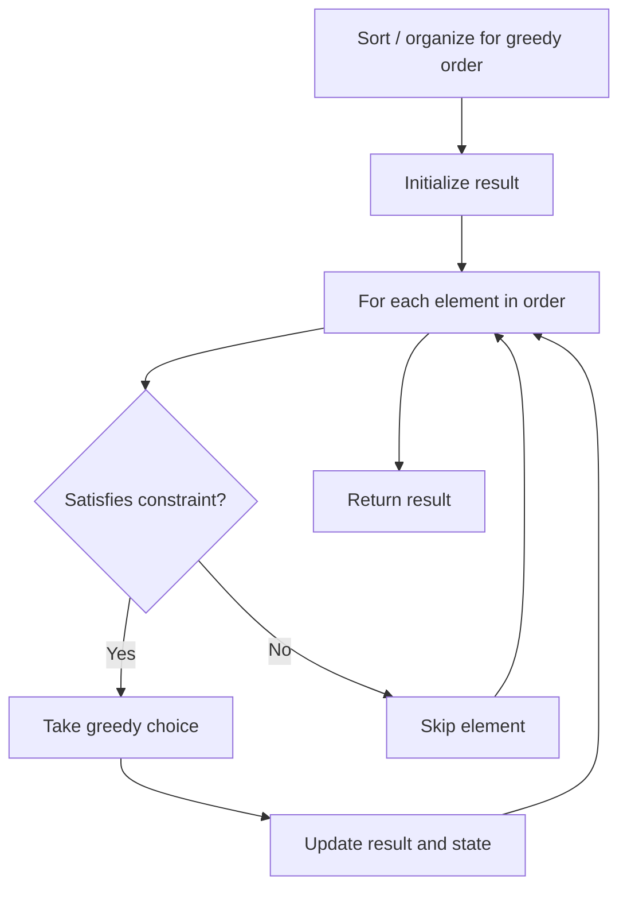

# Problem 2132: Stamping the Grid

**Difficulty:** Hard  
**Tags:** Array, Greedy, Matrix, Prefix Sum  
**Pattern:** Greedy  
**Link:** [leetcode.com/problems/stamping-the-grid](https://leetcode.com/problems/stamping-the-grid/)

## Description

You are given an `m x n` binary matrix `grid` where each cell is either `0` (empty) or `1` (occupied).

You are then given stamps of size `stampHeight x stampWidth`. We want to fit the stamps such that they follow the given **restrictions** and **requirements**:

	- Cover all the **empty** cells.
	- Do not cover any of the **occupied** cells.
	- We can put as **many** stamps as we want.
	- Stamps can **overlap** with each other.
	- Stamps are not allowed to be **rotated**.
	- Stamps must stay completely **inside** the grid.

Return `true` *if it is possible to fit the stamps while following the given restrictions and requirements. Otherwise, return* `false`.

 

Example 1:

```

**Input:** grid = [[1,0,0,0],[1,0,0,0],[1,0,0,0],[1,0,0,0],[1,0,0,0]], stampHeight = 4, stampWidth = 3
**Output:** true
**Explanation:** We have two overlapping stamps (labeled 1 and 2 in the image) that are able to cover all the empty cells.

```

Example 2:

```

**Input:** grid = [[1,0,0,0],[0,1,0,0],[0,0,1,0],[0,0,0,1]], stampHeight = 2, stampWidth = 2 
**Output:** false 
**Explanation:** There is no way to fit the stamps onto all the empty cells without the stamps going outside the grid.

```

 

**Constraints:**

	- `m == grid.length`
	- `n == grid[r].length`
	- `1 <= m, n <= 10^5`
	- `1 <= m * n <= 2 * 10^5`
	- `grid[r][c]` is either `0` or `1`.
	- `1 <= stampHeight, stampWidth <= 10^5`

## Approach: Greedy

Make the locally optimal choice at each step, trusting it leads to a global optimum. Greedy works when the problem has the greedy-choice property and optimal substructure.

## Pseudocode

```
1. Sort or organize data for greedy ordering
2. Initialize result
3. For each element in greedy order:
   a. If element satisfies constraint:
      - Take the greedy choice
      - Update result and state
4. Return result
```

## Algorithm Flow



## Complexity Analysis

- **Time:** O(n log n)
- **Space:** O(1)

## Solution (Python3)

```python
class Solution:
    def possibleToStamp(self, grid: List[List[int]], stampHeight: int, stampWidth: int) -> bool:
        # Greedy approach - O(n) time
        result = 0
        curr_max = 0
        for i in range(len(grid)):
            if isinstance(grid[i], int):
                curr_max = max(curr_max, grid[i])
                result = max(result, curr_max)
            else:
                result += 1
        return result
```

## Solution (C++)

```cpp
#include <algorithm>
#include <string>
#include <vector>
using namespace std;

class Solution {
public:
    bool possibleToStamp(vector<vector<int>>& grid, int stampHeight, int stampWidth) {
        // Greedy approach - O(n) time
        int result = 0, curr_max = 0;
        for (int i = 0; i < (int)grid.size(); i++) {
            curr_max = max(curr_max, grid[i]);
            result = max(result, curr_max);
        }
        return result;
    }
};
```
