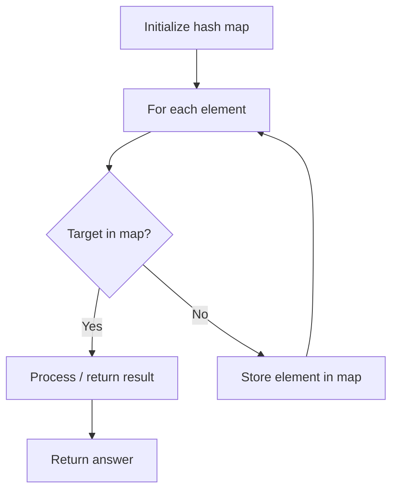

# Problem 2133: Check if Every Row and Column Contains All Numbers

**Difficulty:** Easy  
**Tags:** Array, Hash Table, Matrix  
**Pattern:** Hash Map Lookup  
**Link:** [leetcode.com/problems/check-if-every-row-and-column-contains-all-numbers](https://leetcode.com/problems/check-if-every-row-and-column-contains-all-numbers/)

## Description

An `n x n` matrix is **valid** if every row and every column contains **all** the integers from `1` to `n` (**inclusive**).

Given an `n x n` integer matrix `matrix`, return `true` *if the matrix is **valid**.* Otherwise, return `false`.

 

Example 1:

```

**Input:** matrix = [[1,2,3],[3,1,2],[2,3,1]]
**Output:** true
**Explanation:** In this case, n = 3, and every row and column contains the numbers 1, 2, and 3.
Hence, we return true.

```

Example 2:

```

**Input:** matrix = [[1,1,1],[1,2,3],[1,2,3]]
**Output:** false
**Explanation:** In this case, n = 3, but the first row and the first column do not contain the numbers 2 or 3.
Hence, we return false.

```

 

**Constraints:**

	- `n == matrix.length == matrix[i].length`
	- `1 <= n <= 100`
	- `1 <= matrix[i][j] <= n`

## Approach: Hash Map Lookup

Use a hash map (dictionary) to store elements for O(1) lookup. Iterate through the input, checking membership or counting frequencies in the map.

## Pseudocode

```
1. Initialize hash map
2. Iterate through elements:
   a. Check if target/complement exists in map
   b. If found: process result
   c. Otherwise: store element in map
3. Return result
```

## Algorithm Flow



## Complexity Analysis

- **Time:** O(n)
- **Space:** O(n)

## Solution (Python3)

```python
class Solution:
    def checkValid(self, matrix: List[List[int]]) -> bool:
        # Hash map approach - O(n) time, O(n) space
        seen = {}
        for i, val in enumerate(matrix):
            complement = matrix - val
            if complement in seen:
                return [seen[complement], i]
            seen[val] = i
        return False
```

## Solution (C++)

```cpp
#include <string>
#include <unordered_map>
#include <vector>
using namespace std;

class Solution {
public:
    bool checkValid(vector<vector<int>>& matrix) {
        // Hash map approach - O(n) time, O(n) space
        unordered_map<int, int> seen;
        for (int i = 0; i < matrix.size(); i++) {
            int complement = matrix - matrix[i];
            if (seen.count(complement)) {
                return {seen[complement], i};
            }
            seen[matrix[i]] = i;
        }
        return false;
    }
};
```
