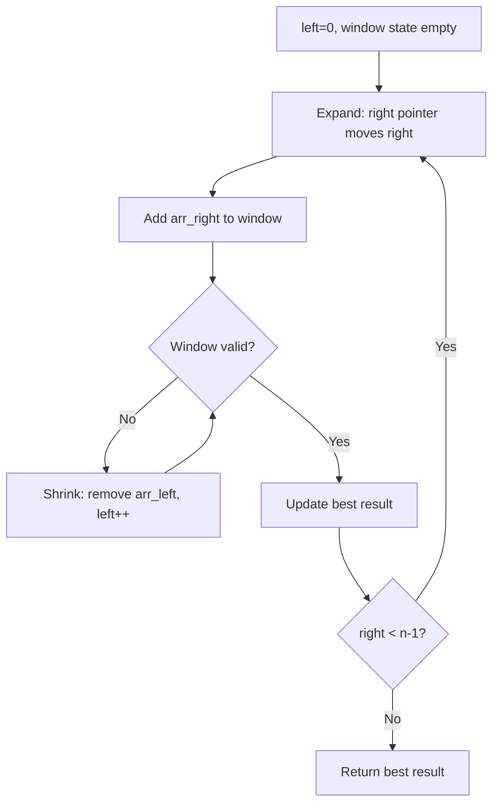
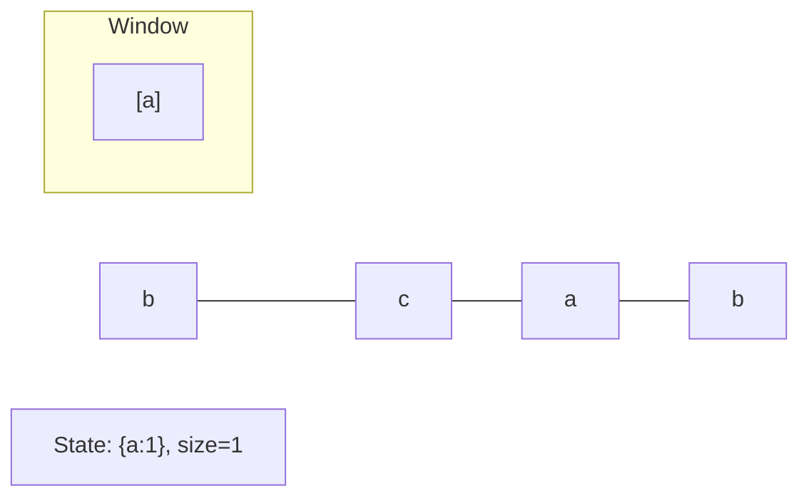
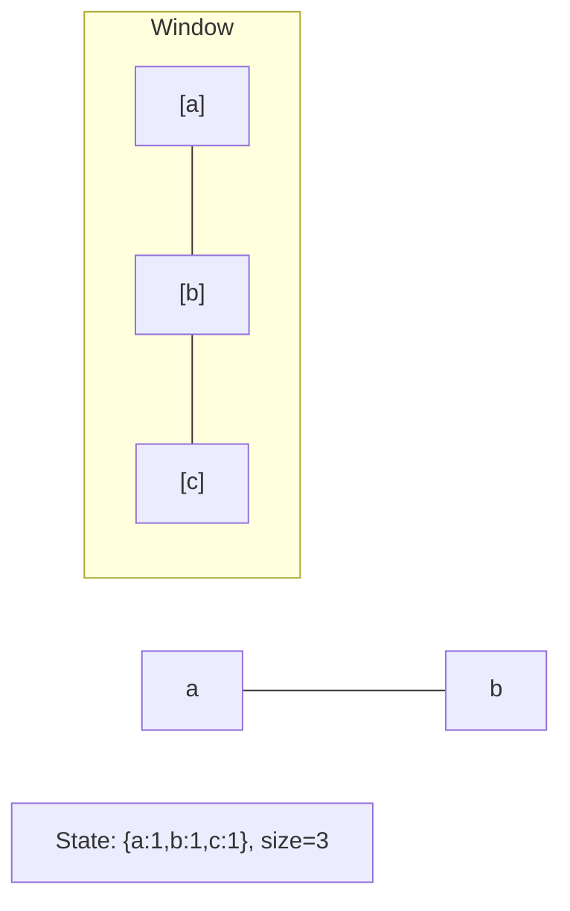
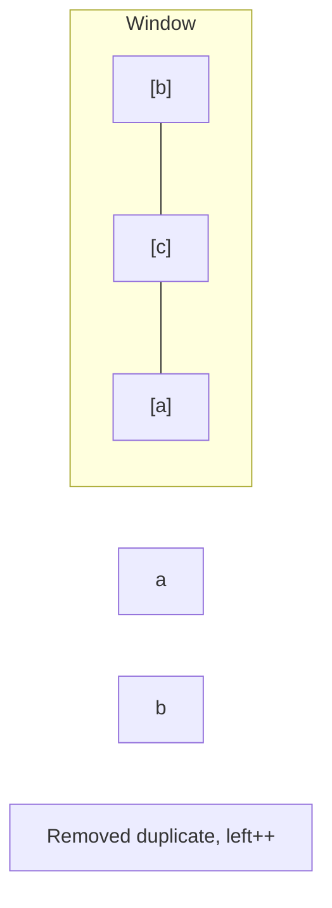
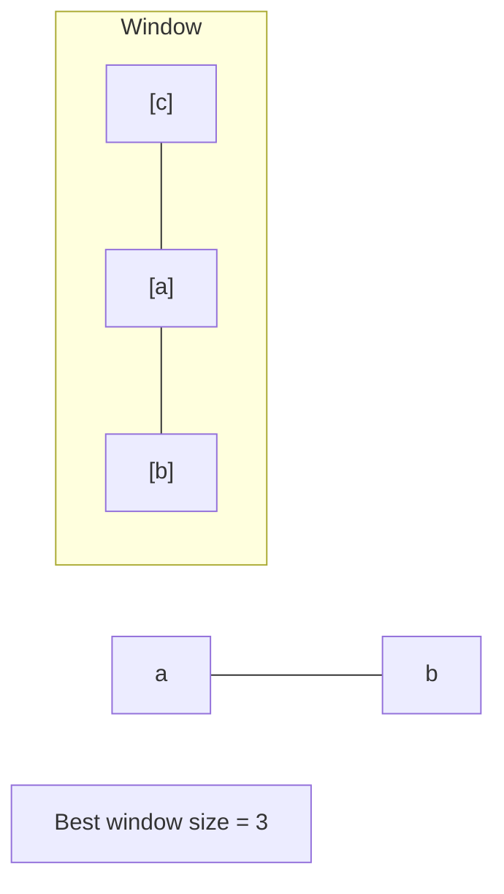

# Problem 2134: Minimum Swaps to Group All 1's Together II

**Difficulty:** Medium  
**Tags:** Array, Sliding Window  
**Pattern:** Sliding Window  
**Link:** [leetcode.com/problems/minimum-swaps-to-group-all-1s-together-ii](https://leetcode.com/problems/minimum-swaps-to-group-all-1s-together-ii/)

## Description

A **swap** is defined as taking two **distinct** positions in an array and swapping the values in them.

A **circular** array is defined as an array where we consider the **first** element and the **last** element to be **adjacent**.

Given a **binary** **circular** array `nums`, return *the minimum number of swaps required to group all *`1`*'s present in the array together at **any location***.

 

Example 1:

```

**Input:** nums = [0,1,0,1,1,0,0]
**Output:** 1
**Explanation:** Here are a few of the ways to group all the 1's together:
[0,0,1,1,1,0,0] using 1 swap.
[0,1,1,1,0,0,0] using 1 swap.
[1,1,0,0,0,0,1] using 2 swaps (using the circular property of the array).
There is no way to group all 1's together with 0 swaps.
Thus, the minimum number of swaps required is 1.

```

Example 2:

```

**Input:** nums = [0,1,1,1,0,0,1,1,0]
**Output:** 2
**Explanation:** Here are a few of the ways to group all the 1's together:
[1,1,1,0,0,0,0,1,1] using 2 swaps (using the circular property of the array).
[1,1,1,1,1,0,0,0,0] using 2 swaps.
There is no way to group all 1's together with 0 or 1 swaps.
Thus, the minimum number of swaps required is 2.

```

Example 3:

```

**Input:** nums = [1,1,0,0,1]
**Output:** 0
**Explanation:** All the 1's are already grouped together due to the circular property of the array.
Thus, the minimum number of swaps required is 0.

```

 

**Constraints:**

	- `1 <= nums.length <= 10^5`
	- `nums[i]` is either `0` or `1`.

## Approach: Sliding Window

Maintain a window over the data using two pointers. Expand the right boundary to include new elements, and shrink the left boundary when the window constraint is violated. Track the optimal window.

## Pseudocode

```
1. Initialize left = 0, result = initial_value
2. For right in range(n):
   a. Add element at right to window state
   b. While window is invalid:
      - Remove element at left from window state
      - left++
   c. Update result = best of (result, window size/value)
3. Return result
```

## Algorithm Flow



## Visual State Transitions

**Sliding Window Step-by-Step:**

**Frame 1: Initial window (left=0, right=0)**


**Frame 2: Expand right (right=2)**


**Frame 3: Violation - shrink left**


**Frame 4: Continue expanding**



## Complexity Analysis

- **Time:** O(n)
- **Space:** O(k)

## Solution (Python3)

```python
class Solution:
    def minSwaps(self, nums: List[int]) -> int:
        # Sliding window approach - O(n) time, O(k) space
        from collections import defaultdict
        window = defaultdict(int)
        left = 0
        result = 0
        for right in range(len(nums)):
            window[nums[right]] += 1
            while len(window) > (nums if isinstance(nums, int) else len(nums)):
                window[nums[left]] -= 1
                if window[nums[left]] == 0:
                    del window[nums[left]]
                left += 1
            result = max(result, right - left + 1)
        return result
```

## Solution (C++)

```cpp
#include <algorithm>
#include <string>
#include <unordered_map>
#include <vector>
using namespace std;

class Solution {
public:
    int minSwaps(vector<int>& nums) {
        // Sliding window approach - O(n) time, O(k) space
        unordered_map<char, int> window;
        int left = 0, result = 0;
        for (int right = 0; right < nums.size(); right++) {
            window[nums[right]]++;
            while ((int)window.size() > nums) {
                window[nums[left]]--;
                if (window[nums[left]] == 0)
                    window.erase(nums[left]);
                left++;
            }
            result = max(result, right - left + 1);
        }
        return result;
    }
};
```
