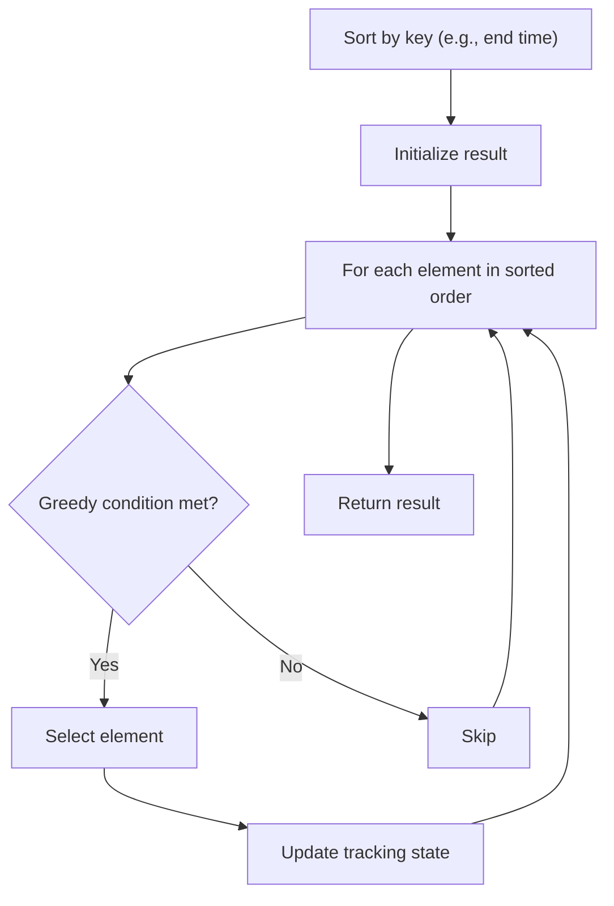

# Problem 2136: Earliest Possible Day of Full Bloom

**Difficulty:** Hard  
**Tags:** Array, Greedy, Sorting  
**Pattern:** Greedy with Sorting  
**Link:** [leetcode.com/problems/earliest-possible-day-of-full-bloom](https://leetcode.com/problems/earliest-possible-day-of-full-bloom/)

## Description

You have `n` flower seeds. Every seed must be planted first before it can begin to grow, then bloom. Planting a seed takes time and so does the growth of a seed. You are given two **0-indexed** integer arrays `plantTime` and `growTime`, of length `n` each:

	- `plantTime[i]` is the number of **full days** it takes you to **plant** the `i^th` seed. Every day, you can work on planting exactly one seed. You **do not** have to work on planting the same seed on consecutive days, but the planting of a seed is not complete **until** you have worked `plantTime[i]` days on planting it in total.
	- `growTime[i]` is the number of **full days** it takes the `i^th` seed to grow after being completely planted. **After** the last day of its growth, the flower **blooms** and stays bloomed forever.

From the beginning of day `0`, you can plant the seeds in **any** order.

Return *the **earliest** possible day where **all** seeds are blooming*.

 

Example 1:

```

**Input:** plantTime = [1,4,3], growTime = [2,3,1]
**Output:** 9
**Explanation:** The grayed out pots represent planting days, colored pots represent growing days, and the flower represents the day it blooms.
One optimal way is:
On day 0, plant the 0th seed. The seed grows for 2 full days and blooms on day 3.
On days 1, 2, 3, and 4, plant the 1st seed. The seed grows for 3 full days and blooms on day 8.
On days 5, 6, and 7, plant the 2nd seed. The seed grows for 1 full day and blooms on day 9.
Thus, on day 9, all the seeds are blooming.

```

Example 2:

```

**Input:** plantTime = [1,2,3,2], growTime = [2,1,2,1]
**Output:** 9
**Explanation:** The grayed out pots represent planting days, colored pots represent growing days, and the flower represents the day it blooms.
One optimal way is:
On day 1, plant the 0th seed. The seed grows for 2 full days and blooms on day 4.
On days 0 and 3, plant the 1st seed. The seed grows for 1 full day and blooms on day 5.
On days 2, 4, and 5, plant the 2nd seed. The seed grows for 2 full days and blooms on day 8.
On days 6 and 7, plant the 3rd seed. The seed grows for 1 full day and blooms on day 9.
Thus, on day 9, all the seeds are blooming.

```

Example 3:

```

**Input:** plantTime = [1], growTime = [1]
**Output:** 2
**Explanation:** On day 0, plant the 0th seed. The seed grows for 1 full day and blooms on day 2.
Thus, on day 2, all the seeds are blooming.

```

 

**Constraints:**

	- `n == plantTime.length == growTime.length`
	- `1 <= n <= 10^5`
	- `1 <= plantTime[i], growTime[i] <= 10^4`

## Approach: Greedy with Sorting

Sort the input by a key criterion, then greedily process elements in sorted order. The sorting ensures the greedy choice is always optimal.

## Pseudocode

```
1. Sort elements by key (start time, weight, etc.)
2. Initialize result, tracking variables
3. For each element in sorted order:
   a. Apply greedy selection rule
   b. Update result
4. Return result
```

## Algorithm Flow



## Complexity Analysis

- **Time:** O(n log n)
- **Space:** O(n)

## Solution (Python3)

```python
class Solution:
    def earliestFullBloom(self, plantTime: List[int], growTime: List[int]) -> int:
        # Sort + greedy - O(n log n) time
        plantTime.sort()
        result = 0
        curr_end = 0
        for item in plantTime:
            if isinstance(item, (list, tuple)):
                if item[0] >= curr_end:
                    result += 1
                    curr_end = item[1]
            else:
                result += 1
        return result
```

## Solution (C++)

```cpp
#include <algorithm>
#include <string>
#include <vector>
using namespace std;

class Solution {
public:
    int earliestFullBloom(vector<int>& plantTime, vector<int>& growTime) {
        // Sort + greedy - O(n log n) time
        sort(plantTime.begin(), plantTime.end());
        int result = 0, curr_end = 0;
        for (auto& item : plantTime) {
            result++;
        }
        return result;
    }
};
```
