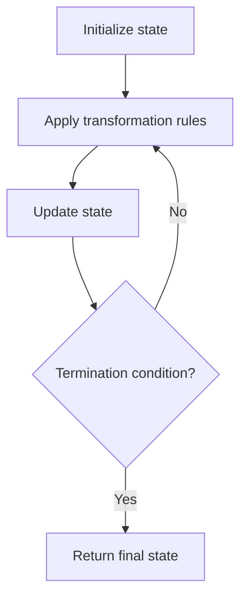

# Problem 2138: Divide a String Into Groups of Size k

**Difficulty:** Easy  
**Tags:** String, Simulation  
**Pattern:** Simulation  
**Link:** [leetcode.com/problems/divide-a-string-into-groups-of-size-k](https://leetcode.com/problems/divide-a-string-into-groups-of-size-k/)

## Description

A string `s` can be partitioned into groups of size `k` using the following procedure:

	- The first group consists of the first `k` characters of the string, the second group consists of the next `k` characters of the string, and so on. Each element can be a part of **exactly one** group.
	- For the last group, if the string **does not** have `k` characters remaining, a character `fill` is used to complete the group.

Note that the partition is done so that after removing the `fill` character from the last group (if it exists) and concatenating all the groups in order, the resultant string should be `s`.

Given the string `s`, the size of each group `k` and the character `fill`, return *a string array denoting the **composition of every group** *`s`* has been divided into, using the above procedure*.

 

Example 1:

```

**Input:** s = "abcdefghi", k = 3, fill = "x"
**Output:** ["abc","def","ghi"]
**Explanation:**
The first 3 characters "abc" form the first group.
The next 3 characters "def" form the second group.
The last 3 characters "ghi" form the third group.
Since all groups can be completely filled by characters from the string, we do not need to use fill.
Thus, the groups formed are "abc", "def", and "ghi".

```

Example 2:

```

**Input:** s = "abcdefghij", k = 3, fill = "x"
**Output:** ["abc","def","ghi","jxx"]
**Explanation:**
Similar to the previous example, we are forming the first three groups "abc", "def", and "ghi".
For the last group, we can only use the character 'j' from the string. To complete this group, we add 'x' twice.
Thus, the 4 groups formed are "abc", "def", "ghi", and "jxx".

```

 

**Constraints:**

	- `1 <= s.length <= 100`
	- `s` consists of lowercase English letters only.
	- `1 <= k <= 100`
	- `fill` is a lowercase English letter.

## Approach: Simulation

Simulate the process described in the problem step by step. Follow the rules exactly, tracking state at each step.

## Pseudocode

```
1. Initialize state (grid, pointers, counters)
2. For each step / iteration:
   a. Apply the transformation rules
   b. Update state
   c. Check termination condition
3. Return final state or result
```

## Algorithm Flow



## Complexity Analysis

- **Time:** O(n) or O(n * k)
- **Space:** O(n)

## Solution (Python3)

```python
class Solution:
    def divideString(self, s: str, k: int, fill: str) -> List[str]:
        # Simulation approach - follow the rules step by step
        result = []
        for i in range(len(s) if isinstance(s, list) else s):
            # Simulate each step
            pass
        return result
```

## Solution (C++)

```cpp
#include <string>
#include <vector>
using namespace std;

class Solution {
public:
    vector<string> divideString(string& s, int k, string& fill) {
        // Simulation approach
        int n = s.size();
        for (int i = 0; i < n; i++) {
            // Simulate each step
        }
        return {};
    }
};
```
