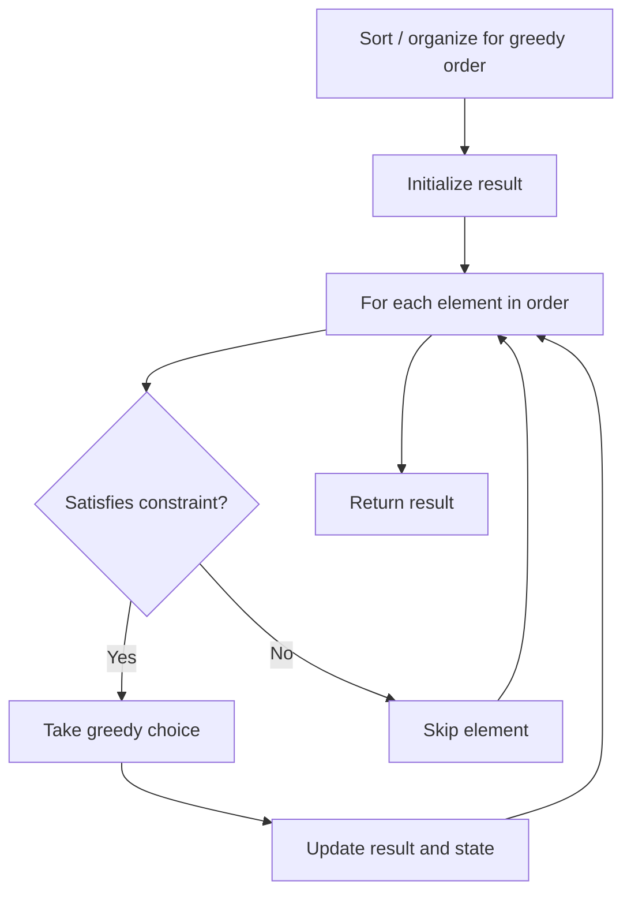

# Problem 2139: Minimum Moves to Reach Target Score

**Difficulty:** Medium  
**Tags:** Math, Greedy  
**Pattern:** Greedy  
**Link:** [leetcode.com/problems/minimum-moves-to-reach-target-score](https://leetcode.com/problems/minimum-moves-to-reach-target-score/)

## Description

You are playing a game with integers. You start with the integer `1` and you want to reach the integer `target`.

In one move, you can either:

	- **Increment** the current integer by one (i.e., `x = x + 1`).
	- **Double** the current integer (i.e., `x = 2 * x`).

You can use the **increment** operation **any** number of times, however, you can only use the **double** operation **at most** `maxDoubles` times.

Given the two integers `target` and `maxDoubles`, return *the minimum number of moves needed to reach *`target`* starting with *`1`.

 

Example 1:

```

**Input:** target = 5, maxDoubles = 0
**Output:** 4
**Explanation:** Keep incrementing by 1 until you reach target.

```

Example 2:

```

**Input:** target = 19, maxDoubles = 2
**Output:** 7
**Explanation:** Initially, x = 1
Increment 3 times so x = 4
Double once so x = 8
Increment once so x = 9
Double again so x = 18
Increment once so x = 19

```

Example 3:

```

**Input:** target = 10, maxDoubles = 4
**Output:** 4
**Explanation:**** **Initially, x = 1
Increment once so x = 2
Double once so x = 4
Increment once so x = 5
Double again so x = 10

```

 

**Constraints:**

	- `1 <= target <= 10^9`
	- `0 <= maxDoubles <= 100`

## Approach: Greedy

Make the locally optimal choice at each step, trusting it leads to a global optimum. Greedy works when the problem has the greedy-choice property and optimal substructure.

## Pseudocode

```
1. Sort or organize data for greedy ordering
2. Initialize result
3. For each element in greedy order:
   a. If element satisfies constraint:
      - Take the greedy choice
      - Update result and state
4. Return result
```

## Algorithm Flow



## Complexity Analysis

- **Time:** O(n log n)
- **Space:** O(1)

## Solution (Python3)

```python
class Solution:
    def minMoves(self, target: int, maxDoubles: int) -> int:
        # Greedy approach - O(n) time
        result = 0
        curr_max = 0
        for i in range(len(target)):
            if isinstance(target[i], int):
                curr_max = max(curr_max, target[i])
                result = max(result, curr_max)
            else:
                result += 1
        return result
```

## Solution (C++)

```cpp
#include <algorithm>
#include <string>
#include <vector>
using namespace std;

class Solution {
public:
    int minMoves(int target, int maxDoubles) {
        // Greedy approach - O(n) time
        int result = 0, curr_max = 0;
        for (int i = 0; i < (int)target.size(); i++) {
            curr_max = max(curr_max, target[i]);
            result = max(result, curr_max);
        }
        return result;
    }
};
```
