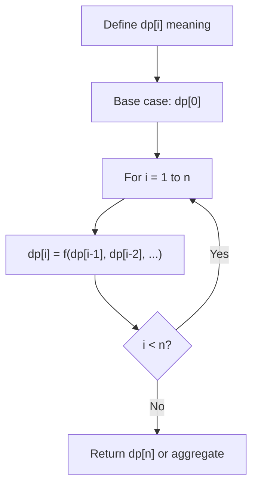
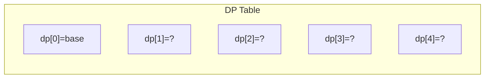
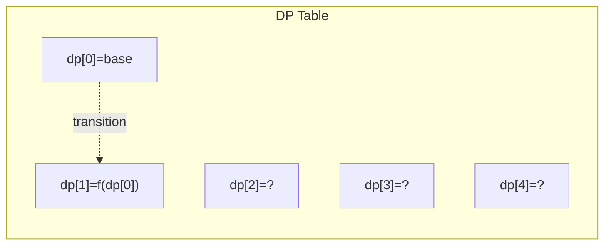
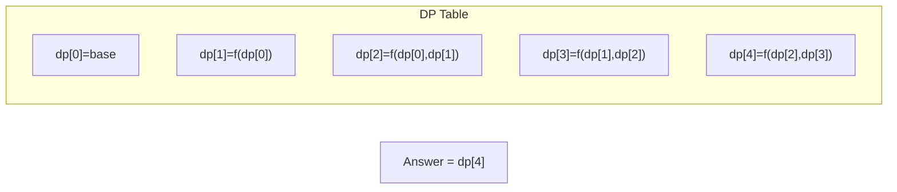

# Problem 2140: Solving Questions With Brainpower

**Difficulty:** Medium  
**Tags:** Array, Dynamic Programming  
**Pattern:** Dynamic Programming (1D)  
**Link:** [leetcode.com/problems/solving-questions-with-brainpower](https://leetcode.com/problems/solving-questions-with-brainpower/)

## Description

You are given a **0-indexed** 2D integer array `questions` where `questions[i] = [pointsi, brainpoweri]`.

The array describes the questions of an exam, where you have to process the questions **in order** (i.e., starting from question `0`) and make a decision whether to **solve** or **skip** each question. Solving question `i` will **earn** you `pointsi` points but you will be **unable** to solve each of the next `brainpoweri` questions. If you skip question `i`, you get to make the decision on the next question.

	- For example, given `questions = [[3, 2], [4, 3], [4, 4], [2, 5]]`:

	
		If question `0` is solved, you will earn `3` points but you will be unable to solve questions `1` and `2`.
		- If instead, question `0` is skipped and question `1` is solved, you will earn `4` points but you will be unable to solve questions `2` and `3`.
	
	

Return *the **maximum** points you can earn for the exam*.

 

Example 1:

```

**Input:** questions = [[3,2],[4,3],[4,4],[2,5]]
**Output:** 5
**Explanation:** The maximum points can be earned by solving questions 0 and 3.
- Solve question 0: Earn 3 points, will be unable to solve the next 2 questions
- Unable to solve questions 1 and 2
- Solve question 3: Earn 2 points
Total points earned: 3 + 2 = 5. There is no other way to earn 5 or more points.

```

Example 2:

```

**Input:** questions = [[1,1],[2,2],[3,3],[4,4],[5,5]]
**Output:** 7
**Explanation:** The maximum points can be earned by solving questions 1 and 4.
- Skip question 0
- Solve question 1: Earn 2 points, will be unable to solve the next 2 questions
- Unable to solve questions 2 and 3
- Solve question 4: Earn 5 points
Total points earned: 2 + 5 = 7. There is no other way to earn 7 or more points.

```

 

**Constraints:**

	- `1 <= questions.length <= 10^5`
	- `questions[i].length == 2`
	- `1 <= pointsi, brainpoweri <= 10^5`

## Approach: Dynamic Programming (1D)

Break the problem into overlapping subproblems. Define dp[i] as the optimal value for the subproblem ending at or considering index i. Build the solution bottom-up, using previously computed dp values.

## Pseudocode

```
1. Define dp[i] = optimal value for subproblem i
2. Base case: dp[0] = initial value
3. For i from 1 to n:
   a. dp[i] = recurrence(dp[i-1], dp[i-2], ...)
4. Return dp[n] or max/min of dp
```

## Algorithm Flow



## Visual State Transitions

**1D Dynamic Programming Table Build:**

**Frame 1: Initialize base cases**


**Frame 2: Fill dp[1] from dp[0]**


**Frame 3: Fill remaining cells**



## Complexity Analysis

- **Time:** O(n)
- **Space:** O(n)

## Solution (Python3)

```python
class Solution:
    def mostPoints(self, questions: List[List[int]]) -> int:
        # Dynamic programming (1D) - O(n) time, O(n) space
        if not questions:
            return 0
        n = len(questions) if isinstance(questions, list) else questions
        dp = [0] * (n + 1)
        dp[0] = 1  # base case
        for i in range(1, n + 1):
            dp[i] = dp[i-1]  # transition (customize per problem)
            if i >= 2:
                dp[i] += dp[i-2]
        return dp[n]
```

## Solution (C++)

```cpp
#include <string>
#include <vector>
using namespace std;

class Solution {
public:
    int mostPoints(vector<vector<int>>& questions) {
        // Dynamic programming (1D) - O(n) time, O(n) space
        int n = questions;
        if (n <= 0) return 0;
        vector<int> dp(n + 1, 0);
        dp[0] = 1;
        for (int i = 1; i <= n; i++) {
            dp[i] = dp[i-1];
            if (i >= 2) dp[i] += dp[i-2];
        }
        return dp[n];
    }
};
```
