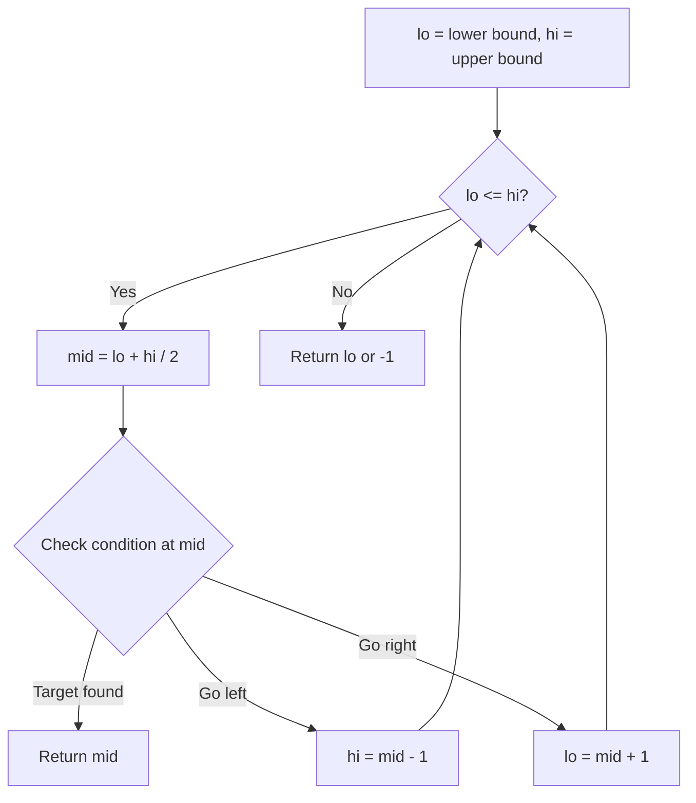
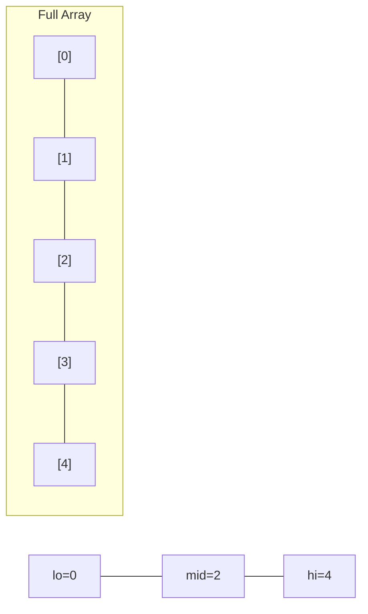
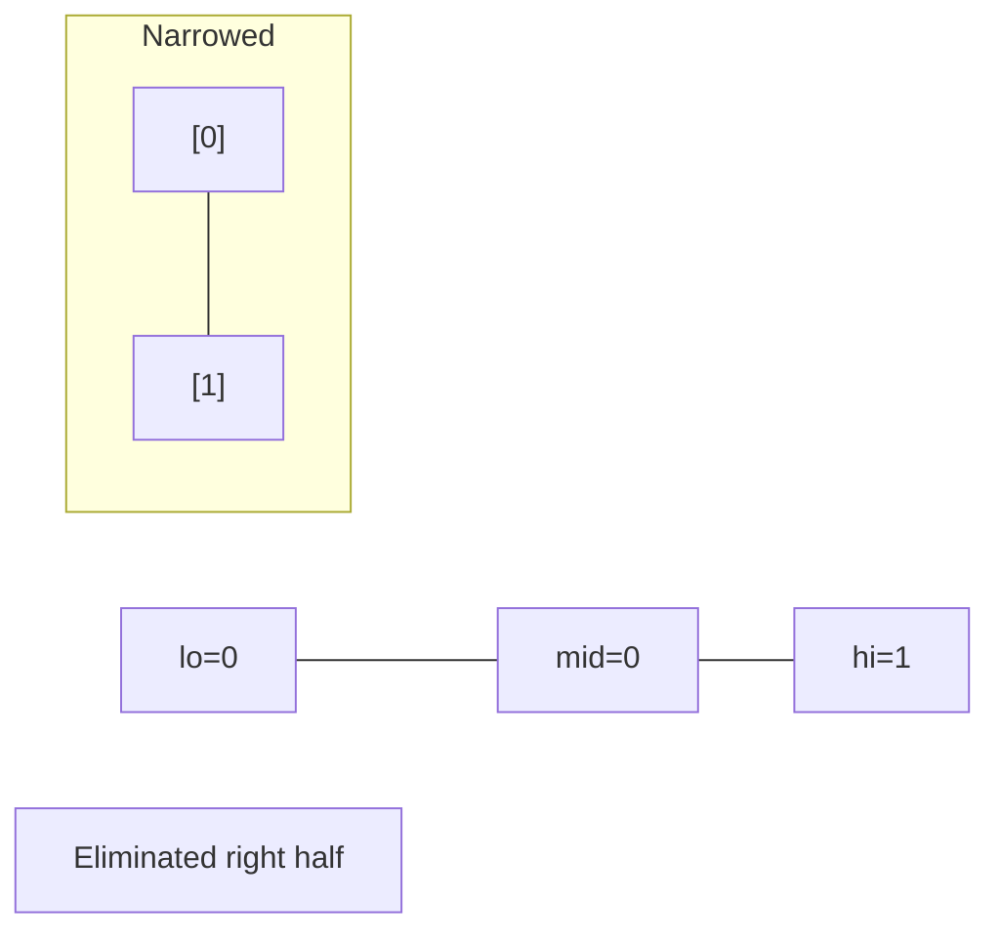
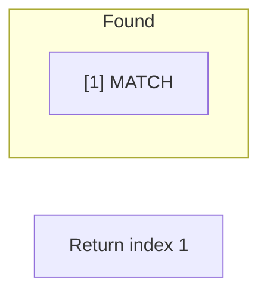

# Problem 2141: Maximum Running Time of N Computers

**Difficulty:** Hard  
**Tags:** Array, Binary Search, Greedy, Sorting  
**Pattern:** Binary Search  
**Link:** [leetcode.com/problems/maximum-running-time-of-n-computers](https://leetcode.com/problems/maximum-running-time-of-n-computers/)

## Description

You have `n` computers. You are given the integer `n` and a **0-indexed** integer array `batteries` where the `i^th` battery can **run** a computer for `batteries[i]` minutes. You are interested in running **all** `n` computers **simultaneously** using the given batteries.

Initially, you can insert **at most one battery** into each computer. After that and at any integer time moment, you can remove a battery from a computer and insert another battery **any number of times**. The inserted battery can be a totally new battery or a battery from another computer. You may assume that the removing and inserting processes take no time.

Note that the batteries cannot be recharged.

Return *the **maximum** number of minutes you can run all the *`n`* computers simultaneously.*

 

Example 1:

```

**Input:** n = 2, batteries = [3,3,3]
**Output:** 4
**Explanation:** 
Initially, insert battery 0 into the first computer and battery 1 into the second computer.
After two minutes, remove battery 1 from the second computer and insert battery 2 instead. Note that battery 1 can still run for one minute.
At the end of the third minute, battery 0 is drained, and you need to remove it from the first computer and insert battery 1 instead.
By the end of the fourth minute, battery 1 is also drained, and the first computer is no longer running.
We can run the two computers simultaneously for at most 4 minutes, so we return 4.

```

Example 2:

```

**Input:** n = 2, batteries = [1,1,1,1]
**Output:** 2
**Explanation:** 
Initially, insert battery 0 into the first computer and battery 2 into the second computer. 
After one minute, battery 0 and battery 2 are drained so you need to remove them and insert battery 1 into the first computer and battery 3 into the second computer. 
After another minute, battery 1 and battery 3 are also drained so the first and second computers are no longer running.
We can run the two computers simultaneously for at most 2 minutes, so we return 2.

```

 

**Constraints:**

	- `1 <= n <= batteries.length <= 10^5`
	- `1 <= batteries[i] <= 10^9`

## Approach: Binary Search

Use binary search to halve the search space each iteration. Define the search range [lo, hi], compute mid, and decide which half to keep based on the problem's monotonic condition.

## Pseudocode

```
1. lo = lower_bound, hi = upper_bound
2. While lo <= hi (or lo < hi):
   a. mid = (lo + hi) // 2
   b. If condition(mid) is satisfied: record answer, search left half
   c. Else: search right half
3. Return answer
```

## Algorithm Flow



## Visual State Transitions

**Binary Search Step-by-Step:**

**Frame 1: Initial search space**


**Frame 2: Compare mid, narrow search**


**Frame 3: Found target**



## Complexity Analysis

- **Time:** O(log n)
- **Space:** O(1)

## Solution (Python3)

```python
class Solution:
    def maxRunTime(self, n: int, batteries: List[int]) -> int:
        # Binary search - O(log n) time, O(1) space
        lo, hi = 0, len(n) - 1
        while lo <= hi:
            mid = lo + (hi - lo) // 2
            if n[mid] == batteries:
                return mid
            elif n[mid] < batteries:
                lo = mid + 1
            else:
                hi = mid - 1
        return 0
```

## Solution (C++)

```cpp
#include <string>
#include <vector>
using namespace std;

class Solution {
public:
    int maxRunTime(int n, vector<int>& batteries) {
        // Binary search - O(log n) time, O(1) space
        int lo = 0, hi = n.size() - 1;
        while (lo <= hi) {
            int mid = lo + (hi - lo) / 2;
            if (n[mid] == batteries) {
                return mid;
            } else if (n[mid] < batteries) {
                lo = mid + 1;
            } else {
                hi = mid - 1;
            }
        }
        return 0;
    }
};
```
