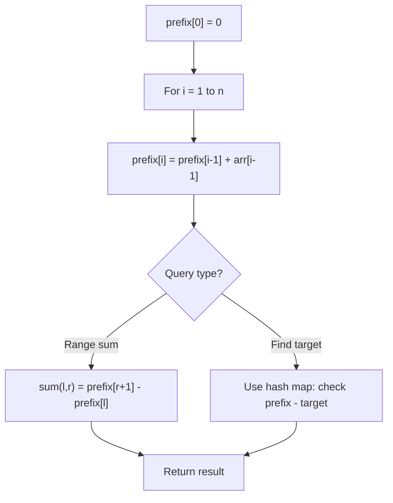

# Problem 2145: Count the Hidden Sequences

**Difficulty:** Medium  
**Tags:** Array, Prefix Sum  
**Pattern:** Prefix Sum  
**Link:** [leetcode.com/problems/count-the-hidden-sequences](https://leetcode.com/problems/count-the-hidden-sequences/)

## Description

You are given a **0-indexed** array of `n` integers `differences`, which describes the **differences **between each pair of **consecutive **integers of a **hidden** sequence of length `(n + 1)`. More formally, call the hidden sequence `hidden`, then we have that `differences[i] = hidden[i + 1] - hidden[i]`.

You are further given two integers `lower` and `upper` that describe the **inclusive** range of values `[lower, upper]` that the hidden sequence can contain.

	- For example, given `differences = [1, -3, 4]`, `lower = 1`, `upper = 6`, the hidden sequence is a sequence of length `4` whose elements are in between `1` and `6` (**inclusive**).

	
		`[3, 4, 1, 5]` and `[4, 5, 2, 6]` are possible hidden sequences.
		- `[5, 6, 3, 7]` is not possible since it contains an element greater than `6`.
		- `[1, 2, 3, 4]` is not possible since the differences are not correct.
	
	

Return *the number of **possible** hidden sequences there are.* If there are no possible sequences, return `0`.

 

Example 1:

```

**Input:** differences = [1,-3,4], lower = 1, upper = 6
**Output:** 2
**Explanation:** The possible hidden sequences are:
- [3, 4, 1, 5]
- [4, 5, 2, 6]
Thus, we return 2.

```

Example 2:

```

**Input:** differences = [3,-4,5,1,-2], lower = -4, upper = 5
**Output:** 4
**Explanation:** The possible hidden sequences are:
- [-3, 0, -4, 1, 2, 0]
- [-2, 1, -3, 2, 3, 1]
- [-1, 2, -2, 3, 4, 2]
- [0, 3, -1, 4, 5, 3]
Thus, we return 4.

```

Example 3:

```

**Input:** differences = [4,-7,2], lower = 3, upper = 6
**Output:** 0
**Explanation:** There are no possible hidden sequences. Thus, we return 0.

```

 

**Constraints:**

	- `n == differences.length`
	- `1 <= n <= 10^5`
	- `-10^5 <= differences[i] <= 10^5`
	- `-10^5 <= lower <= upper <= 10^5`

## Approach: Prefix Sum

Build a prefix sum array where prefix[i] = sum of elements 0..i-1. Any subarray sum [l..r] = prefix[r+1] - prefix[l]. Combine with hash map for O(n) subarray sum queries.

## Pseudocode

```
1. Build prefix sum array: prefix[0]=0, prefix[i]=prefix[i-1]+arr[i-1]
2. Use prefix sums to answer queries:
   - Subarray sum [l..r] = prefix[r+1] - prefix[l]
   - Or use hash map to find prefix[j]-prefix[i] == target
3. Return result
```

## Algorithm Flow



## Complexity Analysis

- **Time:** O(n)
- **Space:** O(n)

## Solution (Python3)

```python
class Solution:
    def numberOfArrays(self, differences: List[int], lower: int, upper: int) -> int:
        # Prefix sum approach - O(n) time, O(n) space
        prefix = {0: -1}
        curr_sum = 0
        result = 0
        target = lower if isinstance(lower, int) else 0
        for i, val in enumerate(differences):
            curr_sum += val
            if curr_sum - target in prefix:
                result = max(result, i - prefix[curr_sum - target])
            if curr_sum not in prefix:
                prefix[curr_sum] = i
        return result
```

## Solution (C++)

```cpp
#include <algorithm>
#include <string>
#include <unordered_map>
#include <vector>
using namespace std;

class Solution {
public:
    int numberOfArrays(vector<int>& differences, int lower, int upper) {
        // Prefix sum approach - O(n) time, O(n) space
        unordered_map<int, int> prefix;
        prefix[0] = -1;
        int curr_sum = 0, result = 0;
        int target = lower;
        for (int i = 0; i < (int)differences.size(); i++) {
            curr_sum += differences[i];
            if (prefix.count(curr_sum - target)) {
                result = max(result, i - prefix[curr_sum - target]);
            }
            if (!prefix.count(curr_sum)) {
                prefix[curr_sum] = i;
            }
        }
        return result;
    }
};
```
