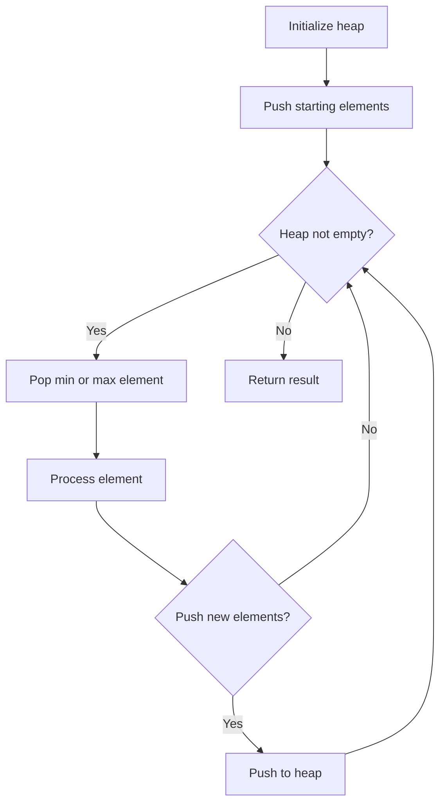
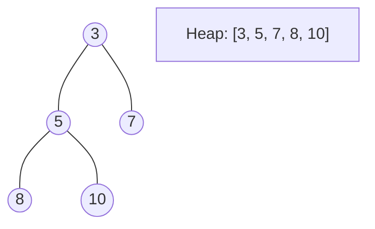
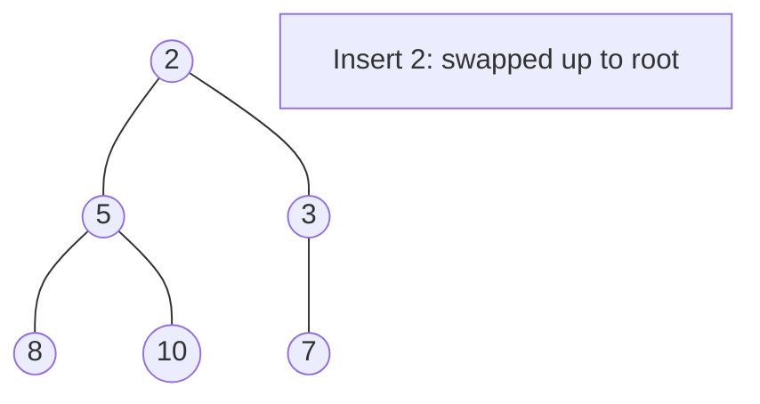
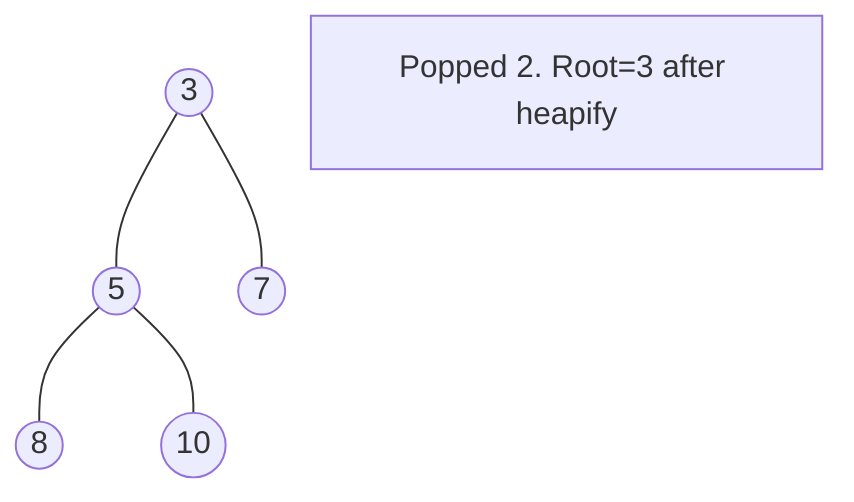

# Problem 2146: K Highest Ranked Items Within a Price Range

**Difficulty:** Medium  
**Tags:** Array, Breadth-First Search, Sorting, Heap (Priority Queue), Matrix  
**Pattern:** Heap / Priority Queue  
**Link:** [leetcode.com/problems/k-highest-ranked-items-within-a-price-range](https://leetcode.com/problems/k-highest-ranked-items-within-a-price-range/)

## Description

You are given a **0-indexed** 2D integer array `grid` of size `m x n` that represents a map of the items in a shop. The integers in the grid represent the following:

	- `0` represents a wall that you cannot pass through.
	- `1` represents an empty cell that you can freely move to and from.
	- All other positive integers represent the price of an item in that cell. You may also freely move to and from these item cells.

It takes `1` step to travel between adjacent grid cells.

You are also given integer arrays `pricing` and `start` where `pricing = [low, high]` and `start = [row, col]` indicates that you start at the position `(row, col)` and are interested only in items with a price in the range of `[low, high]` (**inclusive**). You are further given an integer `k`.

You are interested in the **positions** of the `k` **highest-ranked** items whose prices are **within** the given price range. The rank is determined by the **first** of these criteria that is different:

	- Distance, defined as the length of the shortest path from the `start` (**shorter** distance has a higher rank).
	- Price (**lower** price has a higher rank, but it must be **in the price range**).
	- The row number (**smaller** row number has a higher rank).
	- The column number (**smaller** column number has a higher rank).

Return *the *`k`* highest-ranked items within the price range **sorted** by their rank (highest to lowest)*. If there are fewer than `k` reachable items within the price range, return ***all** of them*.

 

Example 1:

```

**Input:** grid = [[1,2,0,1],[1,3,0,1],[0,2,5,1]], pricing = [2,5], start = [0,0], k = 3
**Output:** [[0,1],[1,1],[2,1]]
**Explanation:** You start at (0,0).
With a price range of [2,5], we can take items from (0,1), (1,1), (2,1) and (2,2).
The ranks of these items are:
- (0,1) with distance 1
- (1,1) with distance 2
- (2,1) with distance 3
- (2,2) with distance 4
Thus, the 3 highest ranked items in the price range are (0,1), (1,1), and (2,1).

```

Example 2:

```

**Input:** grid = [[1,2,0,1],[1,3,3,1],[0,2,5,1]], pricing = [2,3], start = [2,3], k = 2
**Output:** [[2,1],[1,2]]
**Explanation:** You start at (2,3).
With a price range of [2,3], we can take items from (0,1), (1,1), (1,2) and (2,1).
The ranks of these items are:
- (2,1) with distance 2, price 2
- (1,2) with distance 2, price 3
- (1,1) with distance 3
- (0,1) with distance 4
Thus, the 2 highest ranked items in the price range are (2,1) and (1,2).

```

Example 3:

```

**Input:** grid = [[1,1,1],[0,0,1],[2,3,4]], pricing = [2,3], start = [0,0], k = 3
**Output:** [[2,1],[2,0]]
**Explanation:** You start at (0,0).
With a price range of [2,3], we can take items from (2,0) and (2,1). 
The ranks of these items are: 
- (2,1) with distance 5
- (2,0) with distance 6
Thus, the 2 highest ranked items in the price range are (2,1) and (2,0). 
Note that k = 3 but there are only 2 reachable items within the price range.

```

 

**Constraints:**

	- `m == grid.length`
	- `n == grid[i].length`
	- `1 <= m, n <= 10^5`
	- `1 <= m * n <= 10^5`
	- `0 <= grid[i][j] <= 10^5`
	- `pricing.length == 2`
	- `2 <= low <= high <= 10^5`
	- `start.length == 2`
	- `0 <= row <= m - 1`
	- `0 <= col <= n - 1`
	- `grid[row][col] > 0`
	- `1 <= k <= m * n`

## Approach: Heap / Priority Queue

Use a min-heap or max-heap to efficiently access the smallest/largest element. Push elements and pop the top to process in priority order.

## Pseudocode

```
1. Initialize heap (min or max)
2. Push initial elements onto heap
3. While heap not empty and condition:
   a. Pop top element (min or max)
   b. Process element
   c. Push new elements if needed
4. Return result
```

## Algorithm Flow



## Visual State Transitions

**Heap Operations (Min-Heap):**

**Frame 1: Initial heap**


**Frame 2: Insert 2 - bubble up**


**Frame 3: Pop minimum (2) - heapify down**



## Complexity Analysis

- **Time:** O(n log n)
- **Space:** O(n)

## Solution (Python3)

```python
class Solution:
    def highestRankedKItems(self, grid: List[List[int]], pricing: List[int], start: List[int], k: int) -> List[List[int]]:
        # Heap/Priority Queue - O(n log k) time
        import heapq
        if not grid:
            return []
        # Min heap (negate for max heap)
        heap = []
        for val in grid:
            heapq.heappush(heap, val)
            if len(heap) > (pricing if isinstance(pricing, int) else len(grid)):
                heapq.heappop(heap)
        return heap[0] if heap else []
```

## Solution (C++)

```cpp
#include <queue>
#include <string>
#include <vector>
using namespace std;

class Solution {
public:
    vector<vector<int>> highestRankedKItems(vector<vector<int>>& grid, vector<int>& pricing, vector<int>& start, int k) {
        // Heap/Priority Queue - O(n log k) time
        priority_queue<int, vector<int>, greater<int>> pq;
        for (int val : grid) {
            pq.push(val);
            if ((int)pq.size() > pricing)
                pq.pop();
        }
        return pq.empty() ? {} : pq.top();
    }
};
```
