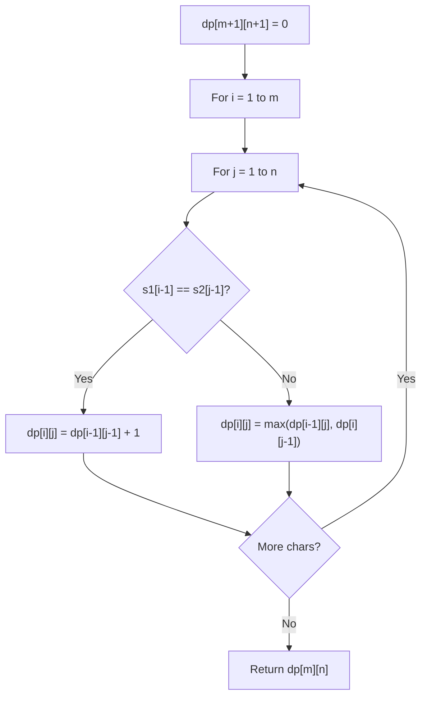

# Problem 2147: Number of Ways to Divide a Long Corridor

**Difficulty:** Hard  
**Tags:** Math, String, Dynamic Programming  
**Pattern:** Dynamic Programming (String)  
**Link:** [leetcode.com/problems/number-of-ways-to-divide-a-long-corridor](https://leetcode.com/problems/number-of-ways-to-divide-a-long-corridor/)

## Description

Along a long library corridor, there is a line of seats and decorative plants. You are given a **0-indexed** string `corridor` of length `n` consisting of letters `'S'` and `'P'` where each `'S'` represents a seat and each `'P'` represents a plant.

One room divider has **already** been installed to the left of index `0`, and **another** to the right of index `n - 1`. Additional room dividers can be installed. For each position between indices `i - 1` and `i` (`1 <= i <= n - 1`), at most one divider can be installed.

Divide the corridor into non-overlapping sections, where each section has **exactly two seats** with any number of plants. There may be multiple ways to perform the division. Two ways are **different** if there is a position with a room divider installed in the first way but not in the second way.

Return *the number of ways to divide the corridor*. Since the answer may be very large, return it **modulo** `10^9 + 7`. If there is no way, return `0`.

 

Example 1:

```

**Input:** corridor = "SSPPSPS"
**Output:** 3
**Explanation:** There are 3 different ways to divide the corridor.
The black bars in the above image indicate the two room dividers already installed.
Note that in each of the ways, **each** section has exactly **two** seats.

```

Example 2:

```

**Input:** corridor = "PPSPSP"
**Output:** 1
**Explanation:** There is only 1 way to divide the corridor, by not installing any additional dividers.
Installing any would create some section that does not have exactly two seats.

```

Example 3:

```

**Input:** corridor = "S"
**Output:** 0
**Explanation:** There is no way to divide the corridor because there will always be a section that does not have exactly two seats.

```

 

**Constraints:**

	- `n == corridor.length`
	- `1 <= n <= 10^5`
	- `corridor[i]` is either `'S'` or `'P'`.

## Approach: Dynamic Programming (String)

Compare or match two strings using a 2D DP table. dp[i][j] represents the answer for substrings s1[0..i-1] and s2[0..j-1]. Common patterns: LCS, edit distance, regex matching.

## Pseudocode

```
1. Create dp[m+1][n+1]
2. Initialize base cases
3. For i from 1 to m:
   For j from 1 to n:
     If s1[i-1] == s2[j-1]: dp[i][j] = dp[i-1][j-1] + 1
     Else: dp[i][j] = best of (dp[i-1][j], dp[i][j-1], dp[i-1][j-1])
4. Return dp[m][n]
```

## Algorithm Flow



## Complexity Analysis

- **Time:** O(m * n)
- **Space:** O(m * n)

## Solution (Python3)

```python
class Solution:
    def numberOfWays(self, corridor: str) -> int:
        # String DP - O(m*n) time and space
        m, n = len(corridor), len(corridor)
        dp = [[0] * (n + 1) for _ in range(m + 1)]
        for i in range(1, m + 1):
            for j in range(1, n + 1):
                if corridor[i-1] == corridor[j-1]:
                    dp[i][j] = dp[i-1][j-1] + 1
                else:
                    dp[i][j] = max(dp[i-1][j], dp[i][j-1])
        return dp[m][n]
```

## Solution (C++)

```cpp
#include <algorithm>
#include <string>
#include <vector>
using namespace std;

class Solution {
public:
    int numberOfWays(string& corridor) {
        // String DP - O(m*n) time and space
        int m = corridor.size(), n = corridor.size();
        vector<vector<int>> dp(m + 1, vector<int>(n + 1, 0));
        for (int i = 1; i <= m; i++) {
            for (int j = 1; j <= n; j++) {
                if (corridor[i-1] == corridor[j-1])
                    dp[i][j] = dp[i-1][j-1] + 1;
                else
                    dp[i][j] = max(dp[i-1][j], dp[i][j-1]);
            }
        }
        return dp[m][n];
    }
};
```
