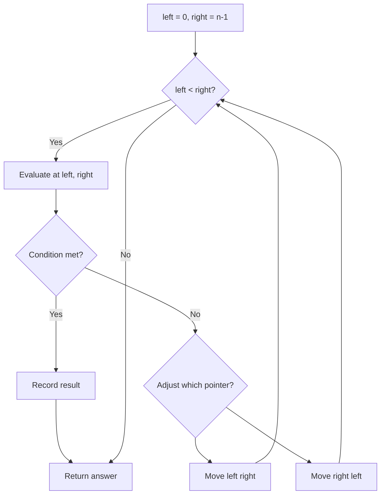
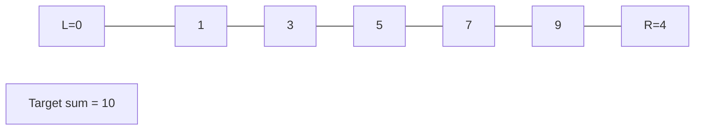
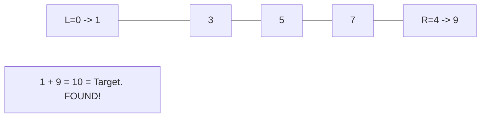

# Problem 2149: Rearrange Array Elements by Sign

**Difficulty:** Medium  
**Tags:** Array, Two Pointers, Simulation  
**Pattern:** Two Pointers  
**Link:** [leetcode.com/problems/rearrange-array-elements-by-sign](https://leetcode.com/problems/rearrange-array-elements-by-sign/)

## Description

You are given a **0-indexed** integer array `nums` of **even** length consisting of an **equal** number of positive and negative integers.

You should return the array of nums such that the array follows the given conditions:

	- Every **consecutive pair** of integers have **opposite signs**.
	- For all integers with the same sign, the **order** in which they were present in `nums` is **preserved**.
	- The rearranged array begins with a positive integer.

Return *the modified array after rearranging the elements to satisfy the aforementioned conditions*.

 

Example 1:

```

**Input:** nums = [3,1,-2,-5,2,-4]
**Output:** [3,-2,1,-5,2,-4]
**Explanation:**
The positive integers in nums are [3,1,2]. The negative integers are [-2,-5,-4].
The only possible way to rearrange them such that they satisfy all conditions is [3,-2,1,-5,2,-4].
Other ways such as [1,-2,2,-5,3,-4], [3,1,2,-2,-5,-4], [-2,3,-5,1,-4,2] are incorrect because they do not satisfy one or more conditions.  

```

Example 2:

```

**Input:** nums = [-1,1]
**Output:** [1,-1]
**Explanation:**
1 is the only positive integer and -1 the only negative integer in nums.
So nums is rearranged to [1,-1].

```

 

**Constraints:**

	- `2 <= nums.length <= 2 * 10^5`
	- `nums.length` is **even**
	- `1 <= |nums[i]| <= 10^5`
	- `nums` consists of **equal** number of positive and negative integers.

 

It is not required to do the modifications in-place.

## Approach: Two Pointers

Use two pointers moving through the data structure. Depending on the problem, pointers may move toward each other (converging), in the same direction (fast/slow), or independently.

## Pseudocode

```
1. Initialize left = 0, right = n-1 (or two independent pointers)
2. While pointers haven't crossed:
   a. Evaluate condition at pointer positions
   b. Move left pointer right or right pointer left
3. Return result
```

## Algorithm Flow



## Visual State Transitions

**Two Pointer Convergence:**

**Frame 1: Initialize pointers**


**Frame 2: Sum = 1+9 = 10, found!**



## Complexity Analysis

- **Time:** O(n)
- **Space:** O(1)

## Solution (Python3)

```python
class Solution:
    def rearrangeArray(self, nums: List[int]) -> List[int]:
        # Two pointer approach - O(n) time, O(1) space
        left, right = 0, len(nums) - 1
        while left < right:
            curr = nums[left] + nums[right]
            if curr == nums:
                return [left, right]
            elif curr < nums:
                left += 1
            else:
                right -= 1
        return []
```

## Solution (C++)

```cpp
#include <string>
#include <vector>
using namespace std;

class Solution {
public:
    vector<int> rearrangeArray(vector<int>& nums) {
        // Two pointer approach - O(n) time, O(1) space
        int left = 0, right = nums.size() - 1;
        while (left < right) {
            int curr = nums[left] + nums[right];
            if (curr == nums) {
                return {left, right};
            } else if (curr < nums) {
                left++;
            } else {
                right--;
            }
        }
        return {};
    }
};
```
