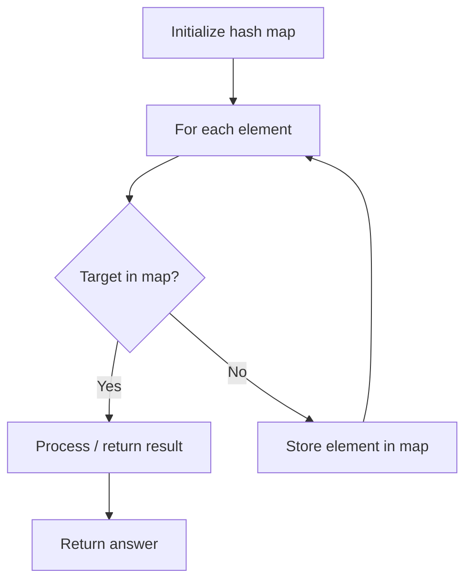

# Problem 2150: Find All Lonely Numbers in the Array

**Difficulty:** Medium  
**Tags:** Array, Hash Table, Counting  
**Pattern:** Hash Map Lookup  
**Link:** [leetcode.com/problems/find-all-lonely-numbers-in-the-array](https://leetcode.com/problems/find-all-lonely-numbers-in-the-array/)

## Description

You are given an integer array `nums`. A number `x` is **lonely** when it appears only **once**, and no **adjacent** numbers (i.e. `x + 1` and `x - 1)` appear in the array.

Return ***all** lonely numbers in *`nums`. You may return the answer in **any order**.

 

Example 1:

```

**Input:** nums = [10,6,5,8]
**Output:** [10,8]
**Explanation:** 
- 10 is a lonely number since it appears exactly once and 9 and 11 does not appear in nums.
- 8 is a lonely number since it appears exactly once and 7 and 9 does not appear in nums.
- 5 is not a lonely number since 6 appears in nums and vice versa.
Hence, the lonely numbers in nums are [10, 8].
Note that [8, 10] may also be returned.

```

Example 2:

```

**Input:** nums = [1,3,5,3]
**Output:** [1,5]
**Explanation:** 
- 1 is a lonely number since it appears exactly once and 0 and 2 does not appear in nums.
- 5 is a lonely number since it appears exactly once and 4 and 6 does not appear in nums.
- 3 is not a lonely number since it appears twice.
Hence, the lonely numbers in nums are [1, 5].
Note that [5, 1] may also be returned.

```

 

**Constraints:**

	- `1 <= nums.length <= 10^5`
	- `0 <= nums[i] <= 10^6`

## Approach: Hash Map Lookup

Use a hash map (dictionary) to store elements for O(1) lookup. Iterate through the input, checking membership or counting frequencies in the map.

## Pseudocode

```
1. Initialize hash map
2. Iterate through elements:
   a. Check if target/complement exists in map
   b. If found: process result
   c. Otherwise: store element in map
3. Return result
```

## Algorithm Flow



## Complexity Analysis

- **Time:** O(n)
- **Space:** O(n)

## Solution (Python3)

```python
class Solution:
    def findLonely(self, nums: List[int]) -> List[int]:
        # Hash map approach - O(n) time, O(n) space
        seen = {}
        for i, val in enumerate(nums):
            complement = nums - val
            if complement in seen:
                return [seen[complement], i]
            seen[val] = i
        return []
```

## Solution (C++)

```cpp
#include <string>
#include <unordered_map>
#include <vector>
using namespace std;

class Solution {
public:
    vector<int> findLonely(vector<int>& nums) {
        // Hash map approach - O(n) time, O(n) space
        unordered_map<int, int> seen;
        for (int i = 0; i < nums.size(); i++) {
            int complement = nums - nums[i];
            if (seen.count(complement)) {
                return {seen[complement], i};
            }
            seen[nums[i]] = i;
        }
        return {};
    }
};
```
