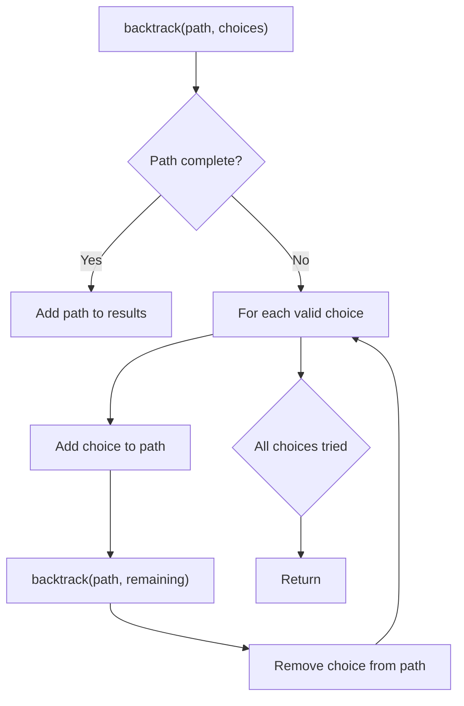
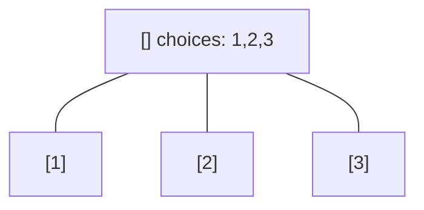
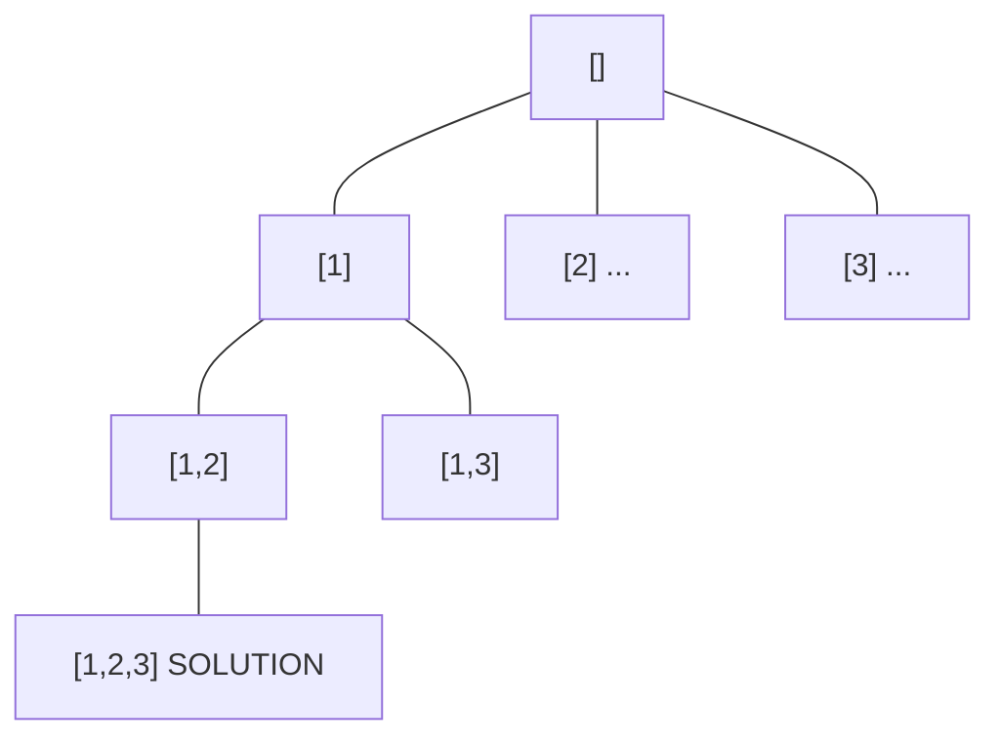
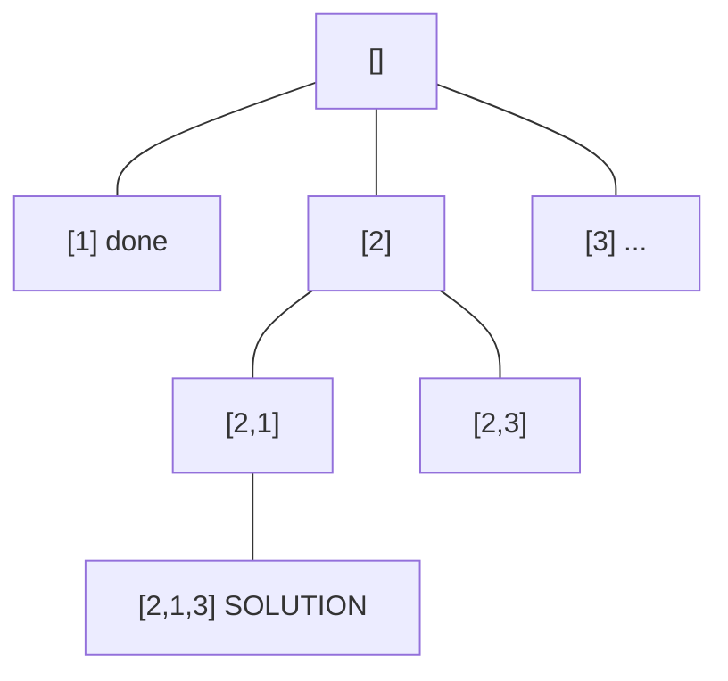
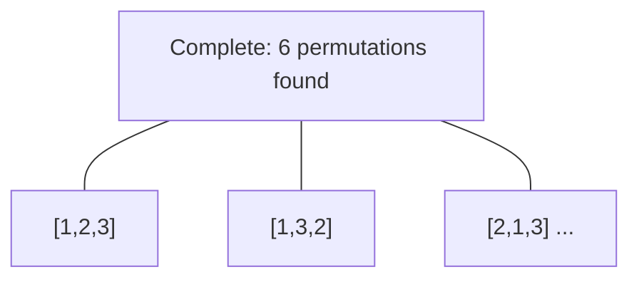

# Problem 2151: Maximum Good People Based on Statements

**Difficulty:** Hard  
**Tags:** Array, Backtracking, Bit Manipulation, Enumeration  
**Pattern:** Backtracking  
**Link:** [leetcode.com/problems/maximum-good-people-based-on-statements](https://leetcode.com/problems/maximum-good-people-based-on-statements/)

## Description

There are two types of persons:

	- The **good person**: The person who always tells the truth.
	- The **bad person**: The person who might tell the truth and might lie.

You are given a **0-indexed** 2D integer array `statements` of size `n x n` that represents the statements made by `n` people about each other. More specifically, `statements[i][j]` could be one of the following:

	- `0` which represents a statement made by person `i` that person `j` is a **bad** person.
	- `1` which represents a statement made by person `i` that person `j` is a **good** person.
	- `2` represents that **no statement** is made by person `i` about person `j`.

Additionally, no person ever makes a statement about themselves. Formally, we have that `statements[i][i] = 2` for all `0 <= i < n`.

Return *the **maximum** number of people who can be **good** based on the statements made by the *`n`* people*.

 

Example 1:

```

**Input:** statements = [[2,1,2],[1,2,2],[2,0,2]]
**Output:** 2
**Explanation:** Each person makes a single statement.
- Person 0 states that person 1 is good.
- Person 1 states that person 0 is good.
- Person 2 states that person 1 is bad.
Let's take person 2 as the key.
- Assuming that person 2 is a good person:
    - Based on the statement made by person 2, person 1 is a bad person.
    - Now we know for sure that person 1 is bad and person 2 is good.
    - Based on the statement made by person 1, and since person 1 is bad, they could be:
        - telling the truth. There will be a contradiction in this case and this assumption is invalid.
        - lying. In this case, person 0 is also a bad person and lied in their statement.
    - **Following that person 2 is a good person, there will be only one good person in the group**.
- Assuming that person 2 is a bad person:
    - Based on the statement made by person 2, and since person 2 is bad, they could be:
        - telling the truth. Following this scenario, person 0 and 1 are both bad as explained before.
            - **Following that person 2 is bad but told the truth, there will be no good persons in the group**.
        - lying. In this case person 1 is a good person.
            - Since person 1 is a good person, person 0 is also a good person.
            - **Following that person 2 is bad and lied, there will be two good persons in the group**.
We can see that at most 2 persons are good in the best case, so we return 2.
Note that there is more than one way to arrive at this conclusion.

```

Example 2:

```

**Input:** statements = [[2,0],[0,2]]
**Output:** 1
**Explanation:** Each person makes a single statement.
- Person 0 states that person 1 is bad.
- Person 1 states that person 0 is bad.
Let's take person 0 as the key.
- Assuming that person 0 is a good person:
    - Based on the statement made by person 0, person 1 is a bad person and was lying.
    - **Following that person 0 is a good person, there will be only one good person in the group**.
- Assuming that person 0 is a bad person:
    - Based on the statement made by person 0, and since person 0 is bad, they could be:
        - telling the truth. Following this scenario, person 0 and 1 are both bad.
            - **Following that person 0 is bad but told the truth, there will be no good persons in the group**.
        - lying. In this case person 1 is a good person.
            - **Following that person 0 is bad and lied, there will be only one good person in the group**.
We can see that at most, one person is good in the best case, so we return 1.
Note that there is more than one way to arrive at this conclusion.

```

 

**Constraints:**

	- `n == statements.length == statements[i].length`
	- `2 <= n <= 15`
	- `statements[i][j]` is either `0`, `1`, or `2`.
	- `statements[i][i] == 2`

## Approach: Backtracking

Explore all possible solutions by building candidates incrementally. At each step, make a choice and recurse. If the choice leads to a dead end, undo the choice (backtrack) and try the next option.

## Pseudocode

```
1. Define backtrack(path, choices):
   a. If path is a complete solution: add to results
   b. For each choice in choices:
      - If choice is valid:
        * Add choice to path
        * backtrack(path, remaining_choices)
        * Remove choice from path (backtrack)
2. Call backtrack([], all_choices)
```

## Algorithm Flow



## Visual State Transitions

**Backtracking Decision Tree:**

**Frame 1: Root - start with empty path**


**Frame 2: Explore branch [1]**


**Frame 3: Backtrack, explore [2]**


**Frame 4: All solutions found**



## Complexity Analysis

- **Time:** O(k^n) or O(n!)
- **Space:** O(n)

## Solution (Python3)

```python
class Solution:
    def maximumGood(self, statements: List[List[int]]) -> int:
        # Backtracking - O(2^n) or O(n!) time
        result = []
        
        def backtrack(path, start):
            result.append(path[:])
            for i in range(start, len(statements)):
                path.append(statements[i])
                backtrack(path, i + 1)
                path.pop()
        
        backtrack([], 0)
        return result
```

## Solution (C++)

```cpp
#include <functional>
#include <string>
#include <vector>
using namespace std;

class Solution {
public:
    int maximumGood(vector<vector<int>>& statements) {
        // Backtracking - O(2^n) or O(n!) time
        vector<vector<int>> result;
        vector<int> path;
        function<void(int)> backtrack = [&](int start) {
            result.push_back(path);
            for (int i = start; i < (int)statements.size(); i++) {
                path.push_back(statements[i]);
                backtrack(i + 1);
                path.pop_back();
            }
        };
        backtrack(0);
        return result;
    }
};
```
