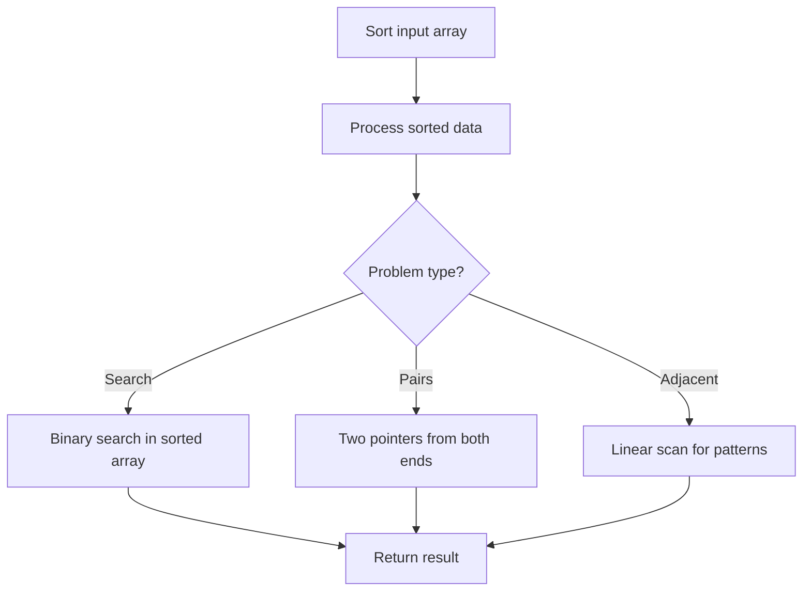

# Problem 2154: Keep Multiplying Found Values by Two

**Difficulty:** Easy  
**Tags:** Array, Hash Table, Sorting, Simulation  
**Pattern:** Sorting  
**Link:** [leetcode.com/problems/keep-multiplying-found-values-by-two](https://leetcode.com/problems/keep-multiplying-found-values-by-two/)

## Description

You are given an array of integers `nums`. You are also given an integer `original` which is the first number that needs to be searched for in `nums`.

You then do the following steps:

	- If `original` is found in `nums`, **multiply** it by two (i.e., set `original = 2 * original`).
	- Otherwise, **stop** the process.
	- **Repeat** this process with the new number as long as you keep finding the number.

Return *the **final** value of *`original`.

 

Example 1:

```

**Input:** nums = [5,3,6,1,12], original = 3
**Output:** 24
**Explanation:** 
- 3 is found in nums. 3 is multiplied by 2 to obtain 6.
- 6 is found in nums. 6 is multiplied by 2 to obtain 12.
- 12 is found in nums. 12 is multiplied by 2 to obtain 24.
- 24 is not found in nums. Thus, 24 is returned.

```

Example 2:

```

**Input:** nums = [2,7,9], original = 4
**Output:** 4
**Explanation:**
- 4 is not found in nums. Thus, 4 is returned.

```

 

**Constraints:**

	- `1 <= nums.length <= 1000`
	- `1 <= nums[i], original <= 1000`

## Approach: Sorting

Sort the data to enable efficient processing. After sorting, use techniques like binary search, two pointers, or linear scan to solve the problem.

## Pseudocode

```
1. Sort the input array
2. Process sorted data:
   - Use binary search for lookups
   - Use two pointers for pair finding
   - Scan for adjacent patterns
3. Return result
```

## Algorithm Flow



## Complexity Analysis

- **Time:** O(n log n)
- **Space:** O(n)

## Solution (Python3)

```python
class Solution:
    def findFinalValue(self, nums: List[int], original: int) -> int:
        # Sort-based approach - O(n log n) time
        nums.sort(key=lambda x: x[0] if isinstance(x, (list, tuple)) else x)
        result = [nums[0]]
        for i in range(1, len(nums)):
            curr = nums[i]
            if isinstance(curr, (list, tuple)) and isinstance(result[-1], (list, tuple)):
                if curr[0] <= result[-1][1]:
                    result[-1] = [result[-1][0], max(result[-1][1], curr[1])]
                else:
                    result.append(curr)
            else:
                result.append(curr)
        return result
```

## Solution (C++)

```cpp
#include <algorithm>
#include <string>
#include <vector>
using namespace std;

class Solution {
public:
    int findFinalValue(vector<int>& nums, int original) {
        // Sort-based approach - O(n log n) time
        sort(nums.begin(), nums.end());
        vector<vector<int>> result;
        result.push_back(nums[0]);
        for (int i = 1; i < (int)nums.size(); i++) {
            if (nums[i][0] <= result.back()[1]) {
                result.back()[1] = max(result.back()[1], nums[i][1]);
            } else {
                result.push_back(nums[i]);
            }
        }
        return result;
    }
};
```
