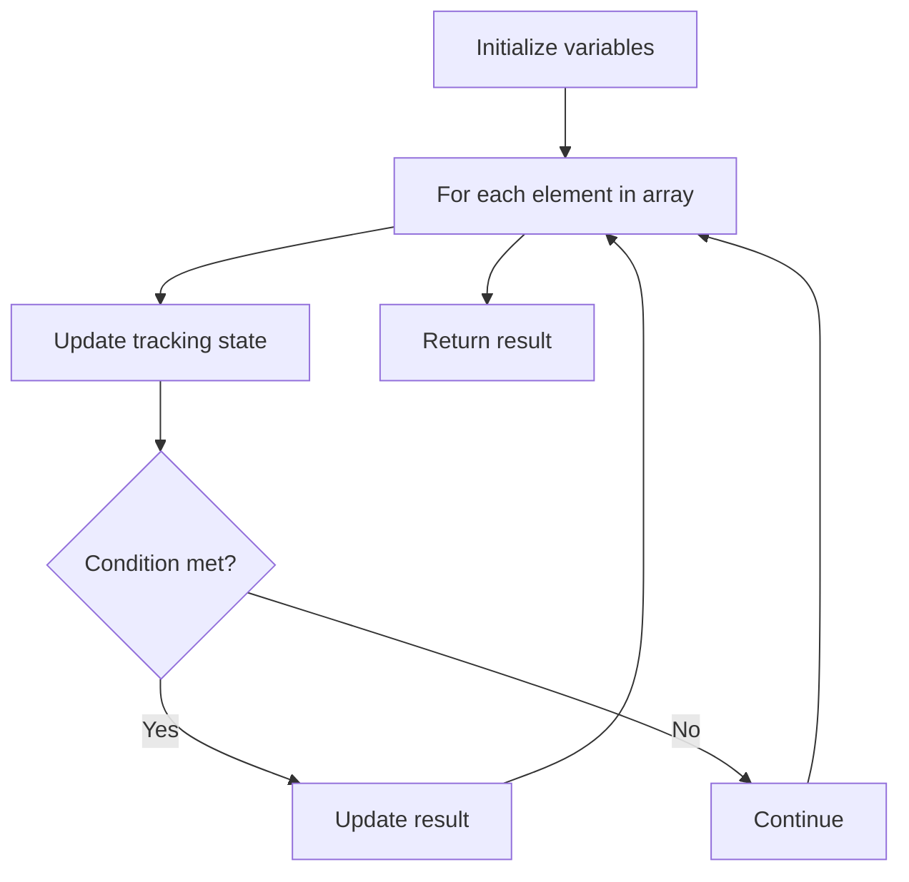

# Problem 2155: All Divisions With the Highest Score of a Binary Array

**Difficulty:** Medium  
**Tags:** Array  
**Pattern:** Array Processing  
**Link:** [leetcode.com/problems/all-divisions-with-the-highest-score-of-a-binary-array](https://leetcode.com/problems/all-divisions-with-the-highest-score-of-a-binary-array/)

## Description

You are given a **0-indexed** binary array `nums` of length `n`. `nums` can be divided at index `i` (where `0 <= i <= n)` into two arrays (possibly empty) `numsleft` and `numsright`:

	- `numsleft` has all the elements of `nums` between index `0` and `i - 1` **(inclusive)**, while `numsright` has all the elements of nums between index `i` and `n - 1` **(inclusive)**.
	- If `i == 0`, `numsleft` is **empty**, while `numsright` has all the elements of `nums`.
	- If `i == n`, `numsleft` has all the elements of nums, while `numsright` is **empty**.

The **division score** of an index `i` is the **sum** of the number of `0`'s in `numsleft` and the number of `1`'s in `numsright`.

Return ***all distinct indices** that have the **highest** possible **division score***. You may return the answer in **any order**.

 

Example 1:

```

**Input:** nums = [0,0,1,0]
**Output:** [2,4]
**Explanation:** Division at index
- 0: numsleft is []. numsright is [0,0,**1**,0]. The score is 0 + 1 = 1.
- 1: numsleft is [**0**]. numsright is [0,**1**,0]. The score is 1 + 1 = 2.
- 2: numsleft is [**0**,**0**]. numsright is [**1**,0]. The score is 2 + 1 = 3.
- 3: numsleft is [**0**,**0**,1]. numsright is [0]. The score is 2 + 0 = 2.
- 4: numsleft is [**0**,**0**,1,**0**]. numsright is []. The score is 3 + 0 = 3.
Indices 2 and 4 both have the highest possible division score 3.
Note the answer [4,2] would also be accepted.
```

Example 2:

```

**Input:** nums = [0,0,0]
**Output:** [3]
**Explanation:** Division at index
- 0: numsleft is []. numsright is [0,0,0]. The score is 0 + 0 = 0.
- 1: numsleft is [**0**]. numsright is [0,0]. The score is 1 + 0 = 1.
- 2: numsleft is [**0**,**0**]. numsright is [0]. The score is 2 + 0 = 2.
- 3: numsleft is [**0**,**0**,**0**]. numsright is []. The score is 3 + 0 = 3.
Only index 3 has the highest possible division score 3.

```

Example 3:

```

**Input:** nums = [1,1]
**Output:** [0]
**Explanation:** Division at index
- 0: numsleft is []. numsright is [**1**,**1**]. The score is 0 + 2 = 2.
- 1: numsleft is [1]. numsright is [**1**]. The score is 0 + 1 = 1.
- 2: numsleft is [1,1]. numsright is []. The score is 0 + 0 = 0.
Only index 0 has the highest possible division score 2.

```

 

**Constraints:**

	- `n == nums.length`
	- `1 <= n <= 10^5`
	- `nums[i]` is either `0` or `1`.

## Approach: Array Processing

Process the array with a linear scan, tracking state variables. Look for patterns: running maximum/minimum, counting, or transformations.

## Pseudocode

```
1. Initialize tracking variables
2. Iterate through array:
   a. Update tracking state
   b. Check conditions
   c. Update result
3. Return result
```

## Algorithm Flow



## Complexity Analysis

- **Time:** O(n)
- **Space:** O(1)

## Solution (Python3)

```python
class Solution:
    def maxScoreIndices(self, nums: List[int]) -> List[int]:
        # Array processing - O(n) time
        result = []
        for i in range(len(nums)):
            # Process element
            pass
        return result
```

## Solution (C++)

```cpp
#include <string>
#include <vector>
using namespace std;

class Solution {
public:
    vector<int> maxScoreIndices(vector<int>& nums) {
        // Array processing - O(n) time
        for (int i = 0; i < (int)nums.size(); i++) {
            // Process element
        }
        return {};
    }
};
```
