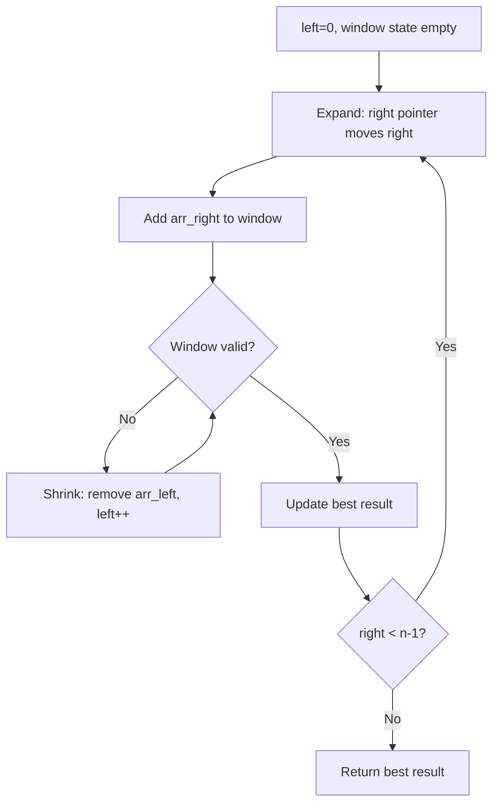
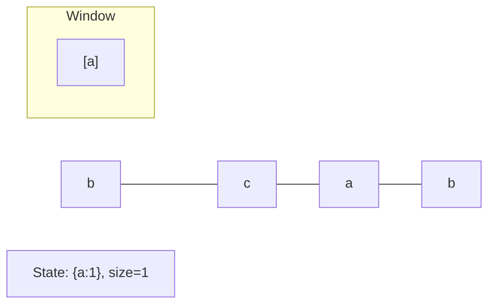
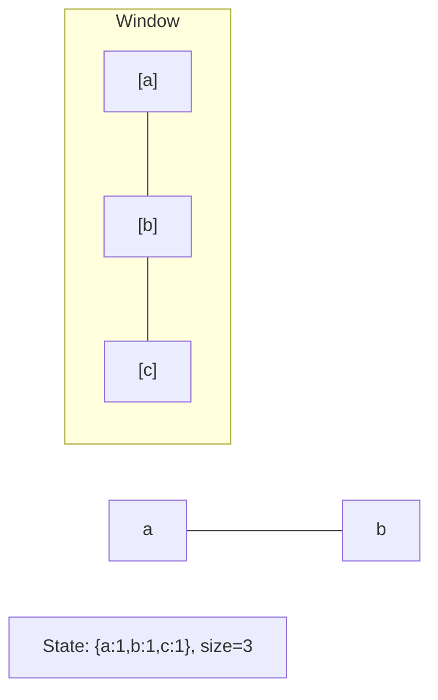
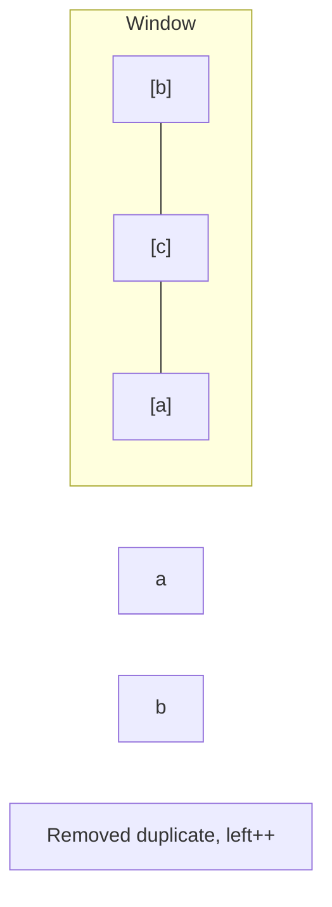
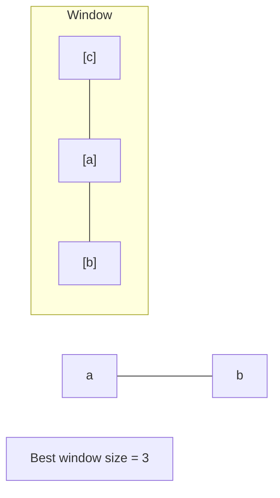

# Problem 2156: Find Substring With Given Hash Value

**Difficulty:** Hard  
**Tags:** String, Sliding Window, Rolling Hash, Hash Function  
**Pattern:** Sliding Window  
**Link:** [leetcode.com/problems/find-substring-with-given-hash-value](https://leetcode.com/problems/find-substring-with-given-hash-value/)

## Description

The hash of a **0-indexed** string `s` of length `k`, given integers `p` and `m`, is computed using the following function:

	- `hash(s, p, m) = (val(s[0]) * p^0 + val(s[1]) * p^1 + ... + val(s[k-1]) * p^k-1) mod m`.

Where `val(s[i])` represents the index of `s[i]` in the alphabet from `val('a') = 1` to `val('z') = 26`.

You are given a string `s` and the integers `power`, `modulo`, `k`, and `hashValue.` Return `sub`,* the **first** **substring** of *`s`* of length *`k`* such that *`hash(sub, power, modulo) == hashValue`.

The test cases will be generated such that an answer always **exists**.

A **substring** is a contiguous non-empty sequence of characters within a string.

 

Example 1:

```

**Input:** s = "leetcode", power = 7, modulo = 20, k = 2, hashValue = 0
**Output:** "ee"
**Explanation:** The hash of "ee" can be computed to be hash("ee", 7, 20) = (5 * 1 + 5 * 7) mod 20 = 40 mod 20 = 0. 
"ee" is the first substring of length 2 with hashValue 0. Hence, we return "ee".

```

Example 2:

```

**Input:** s = "fbxzaad", power = 31, modulo = 100, k = 3, hashValue = 32
**Output:** "fbx"
**Explanation:** The hash of "fbx" can be computed to be hash("fbx", 31, 100) = (6 * 1 + 2 * 31 + 24 * 312) mod 100 = 23132 mod 100 = 32. 
The hash of "bxz" can be computed to be hash("bxz", 31, 100) = (2 * 1 + 24 * 31 + 26 * 312) mod 100 = 25732 mod 100 = 32. 
"fbx" is the first substring of length 3 with hashValue 32. Hence, we return "fbx".
Note that "bxz" also has a hash of 32 but it appears later than "fbx".

```

 

**Constraints:**

	- `1 <= k <= s.length <= 2 * 10^4`
	- `1 <= power, modulo <= 10^9`
	- `0 <= hashValue < modulo`
	- `s` consists of lowercase English letters only.
	- The test cases are generated such that an answer always **exists**.

## Approach: Sliding Window

Maintain a window over the data using two pointers. Expand the right boundary to include new elements, and shrink the left boundary when the window constraint is violated. Track the optimal window.

## Pseudocode

```
1. Initialize left = 0, result = initial_value
2. For right in range(n):
   a. Add element at right to window state
   b. While window is invalid:
      - Remove element at left from window state
      - left++
   c. Update result = best of (result, window size/value)
3. Return result
```

## Algorithm Flow



## Visual State Transitions

**Sliding Window Step-by-Step:**

**Frame 1: Initial window (left=0, right=0)**


**Frame 2: Expand right (right=2)**


**Frame 3: Violation - shrink left**


**Frame 4: Continue expanding**



## Complexity Analysis

- **Time:** O(n)
- **Space:** O(k)

## Solution (Python3)

```python
class Solution:
    def subStrHash(self, s: str, power: int, modulo: int, k: int, hashValue: int) -> str:
        # Sliding window approach - O(n) time, O(k) space
        from collections import defaultdict
        window = defaultdict(int)
        left = 0
        result = 0
        for right in range(len(s)):
            window[s[right]] += 1
            while len(window) > (power if isinstance(power, int) else len(s)):
                window[s[left]] -= 1
                if window[s[left]] == 0:
                    del window[s[left]]
                left += 1
            result = max(result, right - left + 1)
        return result
```

## Solution (C++)

```cpp
#include <algorithm>
#include <string>
#include <unordered_map>
#include <vector>
using namespace std;

class Solution {
public:
    string subStrHash(string& s, int power, int modulo, int k, int hashValue) {
        // Sliding window approach - O(n) time, O(k) space
        unordered_map<char, int> window;
        int left = 0, result = 0;
        for (int right = 0; right < s.size(); right++) {
            window[s[right]]++;
            while ((int)window.size() > power) {
                window[s[left]]--;
                if (window[s[left]] == 0)
                    window.erase(s[left]);
                left++;
            }
            result = max(result, right - left + 1);
        }
        return result;
    }
};
```
