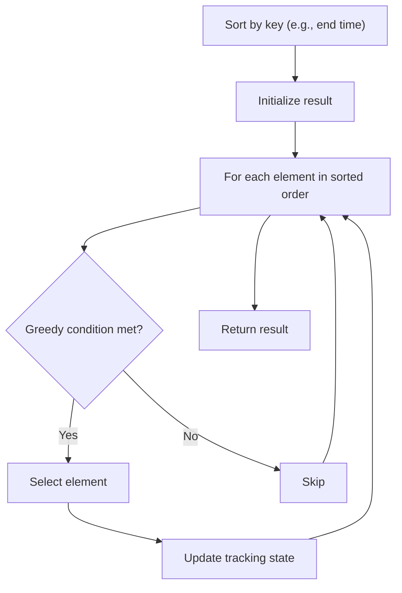

# Problem 2160: Minimum Sum of Four Digit Number After Splitting Digits

**Difficulty:** Easy  
**Tags:** Math, Greedy, Sorting  
**Pattern:** Greedy with Sorting  
**Link:** [leetcode.com/problems/minimum-sum-of-four-digit-number-after-splitting-digits](https://leetcode.com/problems/minimum-sum-of-four-digit-number-after-splitting-digits/)

## Description

You are given a **positive** integer `num` consisting of exactly four digits. Split `num` into two new integers `new1` and `new2` by using the **digits** found in `num`. **Leading zeros** are allowed in `new1` and `new2`, and **all** the digits found in `num` must be used.

	- For example, given `num = 2932`, you have the following digits: two `2`'s, one `9` and one `3`. Some of the possible pairs `[new1, new2]` are `[22, 93]`, `[23, 92]`, `[223, 9]` and `[2, 329]`.

Return *the **minimum** possible sum of *`new1`* and *`new2`.

 

Example 1:

```

**Input:** num = 2932
**Output:** 52
**Explanation:** Some possible pairs [new1, new2] are [29, 23], [223, 9], etc.
The minimum sum can be obtained by the pair [29, 23]: 29 + 23 = 52.

```

Example 2:

```

**Input:** num = 4009
**Output:** 13
**Explanation:** Some possible pairs [new1, new2] are [0, 49], [490, 0], etc. 
The minimum sum can be obtained by the pair [4, 9]: 4 + 9 = 13.

```

 

**Constraints:**

	- `1000 <= num <= 9999`

## Approach: Greedy with Sorting

Sort the input by a key criterion, then greedily process elements in sorted order. The sorting ensures the greedy choice is always optimal.

## Pseudocode

```
1. Sort elements by key (start time, weight, etc.)
2. Initialize result, tracking variables
3. For each element in sorted order:
   a. Apply greedy selection rule
   b. Update result
4. Return result
```

## Algorithm Flow



## Complexity Analysis

- **Time:** O(n log n)
- **Space:** O(n)

## Solution (Python3)

```python
class Solution:
    def minimumSum(self, num: int) -> int:
        # Sort + greedy - O(n log n) time
        num.sort()
        result = 0
        curr_end = 0
        for item in num:
            if isinstance(item, (list, tuple)):
                if item[0] >= curr_end:
                    result += 1
                    curr_end = item[1]
            else:
                result += 1
        return result
```

## Solution (C++)

```cpp
#include <algorithm>
#include <string>
#include <vector>
using namespace std;

class Solution {
public:
    int minimumSum(int num) {
        // Sort + greedy - O(n log n) time
        sort(num.begin(), num.end());
        int result = 0, curr_end = 0;
        for (auto& item : num) {
            result++;
        }
        return result;
    }
};
```
