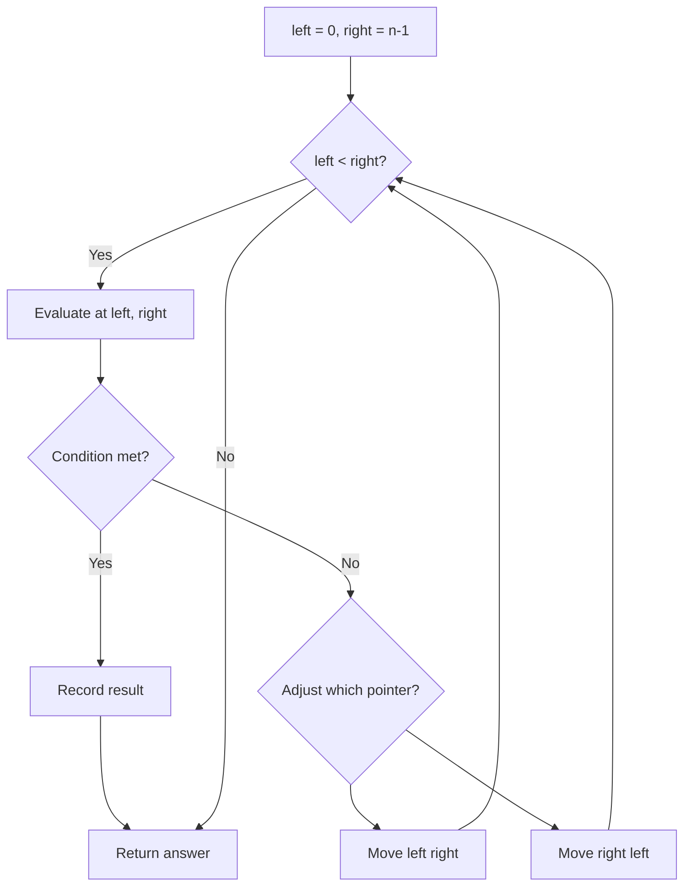
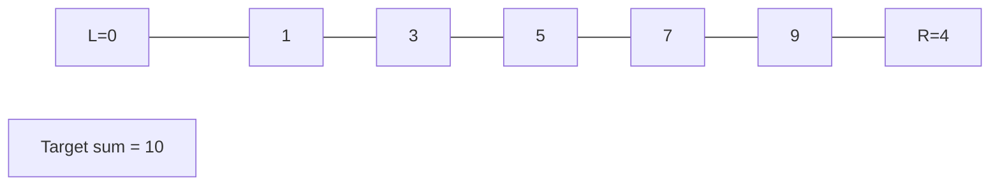
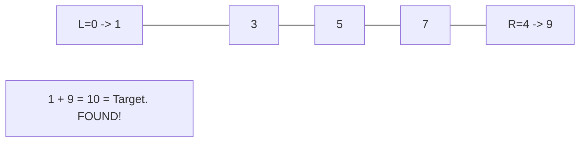

# Problem 2161: Partition Array According to Given Pivot

**Difficulty:** Medium  
**Tags:** Array, Two Pointers, Simulation  
**Pattern:** Two Pointers  
**Link:** [leetcode.com/problems/partition-array-according-to-given-pivot](https://leetcode.com/problems/partition-array-according-to-given-pivot/)

## Description

You are given a **0-indexed** integer array `nums` and an integer `pivot`. Rearrange `nums` such that the following conditions are satisfied:

	- Every element less than `pivot` appears **before** every element greater than `pivot`.
	- Every element equal to `pivot` appears **in between** the elements less than and greater than `pivot`.
	- The **relative order** of the elements less than `pivot` and the elements greater than `pivot` is maintained.
	
		More formally, consider every `pi`, `pj` where `pi` is the new position of the `i^th` element and `pj` is the new position of the `j^th` element. If `i < j` and **both** elements are smaller (*or larger*) than `pivot`, then `pi < pj`.
	
	

Return `nums`* after the rearrangement.*

 

Example 1:

```

**Input:** nums = [9,12,5,10,14,3,10], pivot = 10
**Output:** [9,5,3,10,10,12,14]
**Explanation:** 
The elements 9, 5, and 3 are less than the pivot so they are on the left side of the array.
The elements 12 and 14 are greater than the pivot so they are on the right side of the array.
The relative ordering of the elements less than and greater than pivot is also maintained. [9, 5, 3] and [12, 14] are the respective orderings.

```

Example 2:

```

**Input:** nums = [-3,4,3,2], pivot = 2
**Output:** [-3,2,4,3]
**Explanation:** 
The element -3 is less than the pivot so it is on the left side of the array.
The elements 4 and 3 are greater than the pivot so they are on the right side of the array.
The relative ordering of the elements less than and greater than pivot is also maintained. [-3] and [4, 3] are the respective orderings.

```

 

**Constraints:**

	- `1 <= nums.length <= 10^5`
	- `-10^6 <= nums[i] <= 10^6`
	- `pivot` equals to an element of `nums`.

## Approach: Two Pointers

Use two pointers moving through the data structure. Depending on the problem, pointers may move toward each other (converging), in the same direction (fast/slow), or independently.

## Pseudocode

```
1. Initialize left = 0, right = n-1 (or two independent pointers)
2. While pointers haven't crossed:
   a. Evaluate condition at pointer positions
   b. Move left pointer right or right pointer left
3. Return result
```

## Algorithm Flow



## Visual State Transitions

**Two Pointer Convergence:**

**Frame 1: Initialize pointers**


**Frame 2: Sum = 1+9 = 10, found!**



## Complexity Analysis

- **Time:** O(n)
- **Space:** O(1)

## Solution (Python3)

```python
class Solution:
    def pivotArray(self, nums: List[int], pivot: int) -> List[int]:
        # Two pointer approach - O(n) time, O(1) space
        left, right = 0, len(nums) - 1
        while left < right:
            curr = nums[left] + nums[right]
            if curr == pivot:
                return [left, right]
            elif curr < pivot:
                left += 1
            else:
                right -= 1
        return []
```

## Solution (C++)

```cpp
#include <string>
#include <vector>
using namespace std;

class Solution {
public:
    vector<int> pivotArray(vector<int>& nums, int pivot) {
        // Two pointer approach - O(n) time, O(1) space
        int left = 0, right = nums.size() - 1;
        while (left < right) {
            int curr = nums[left] + nums[right];
            if (curr == pivot) {
                return {left, right};
            } else if (curr < pivot) {
                left++;
            } else {
                right--;
            }
        }
        return {};
    }
};
```
