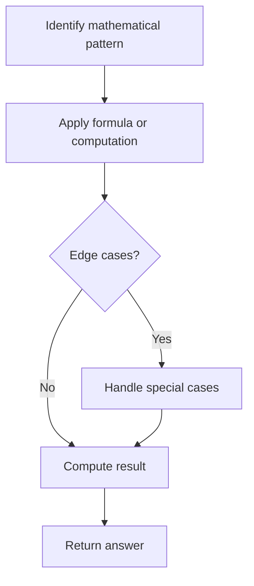

# Problem 2162: Minimum Cost to Set Cooking Time

**Difficulty:** Medium  
**Tags:** Math, Enumeration  
**Pattern:** Math  
**Link:** [leetcode.com/problems/minimum-cost-to-set-cooking-time](https://leetcode.com/problems/minimum-cost-to-set-cooking-time/)

## Description

A generic microwave supports cooking times for:

	- at least `1` second.
	- at most `99` minutes and `99` seconds.

To set the cooking time, you push **at most four digits**. The microwave normalizes what you push as four digits by **prepending zeroes**. It interprets the **first** two digits as the minutes and the **last** two digits as the seconds. It then **adds** them up as the cooking time. For example,

	- You push `9` `5` `4` (three digits). It is normalized as `0954` and interpreted as `9` minutes and `54` seconds.
	- You push `0` `0` `0` `8` (four digits). It is interpreted as `0` minutes and `8` seconds.
	- You push `8` `0` `9` `0`. It is interpreted as `80` minutes and `90` seconds.
	- You push `8` `1` `3` `0`. It is interpreted as `81` minutes and `30` seconds.

You are given integers `startAt`, `moveCost`, `pushCost`, and `targetSeconds`. **Initially**, your finger is on the digit `startAt`. Moving the finger above **any specific digit** costs `moveCost` units of fatigue. Pushing the digit below the finger **once** costs `pushCost` units of fatigue.

There can be multiple ways to set the microwave to cook for `targetSeconds` seconds but you are interested in the way with the minimum cost.

Return *the **minimum cost** to set* `targetSeconds` *seconds of cooking time*.

Remember that one minute consists of `60` seconds.

 

Example 1:

```

**Input:** startAt = 1, moveCost = 2, pushCost = 1, targetSeconds = 600
**Output:** 6
**Explanation:** The following are the possible ways to set the cooking time.
- 1 0 0 0, interpreted as 10 minutes and 0 seconds.
  The finger is already on digit 1, pushes 1 (with cost 1), moves to 0 (with cost 2), pushes 0 (with cost 1), pushes 0 (with cost 1), and pushes 0 (with cost 1).
  The cost is: 1 + 2 + 1 + 1 + 1 = 6. This is the minimum cost.
- 0 9 6 0, interpreted as 9 minutes and 60 seconds. That is also 600 seconds.
  The finger moves to 0 (with cost 2), pushes 0 (with cost 1), moves to 9 (with cost 2), pushes 9 (with cost 1), moves to 6 (with cost 2), pushes 6 (with cost 1), moves to 0 (with cost 2), and pushes 0 (with cost 1).
  The cost is: 2 + 1 + 2 + 1 + 2 + 1 + 2 + 1 = 12.
- 9 6 0, normalized as 0960 and interpreted as 9 minutes and 60 seconds.
  The finger moves to 9 (with cost 2), pushes 9 (with cost 1), moves to 6 (with cost 2), pushes 6 (with cost 1), moves to 0 (with cost 2), and pushes 0 (with cost 1).
  The cost is: 2 + 1 + 2 + 1 + 2 + 1 = 9.

```

Example 2:

```

**Input:** startAt = 0, moveCost = 1, pushCost = 2, targetSeconds = 76
**Output:** 6
**Explanation:** The optimal way is to push two digits: 7 6, interpreted as 76 seconds.
The finger moves to 7 (with cost 1), pushes 7 (with cost 2), moves to 6 (with cost 1), and pushes 6 (with cost 2). The total cost is: 1 + 2 + 1 + 2 = 6
Note other possible ways are 0076, 076, 0116, and 116, but none of them produces the minimum cost.

```

 

**Constraints:**

	- `0 <= startAt <= 9`
	- `1 <= moveCost, pushCost <= 10^5`
	- `1 <= targetSeconds <= 6039`

## Approach: Math

Apply mathematical properties, formulas, or number-theoretic concepts. Look for patterns, modular arithmetic, or closed-form solutions.

## Pseudocode

```
1. Identify the mathematical pattern or formula
2. Apply computation:
   - Modular arithmetic for large numbers
   - GCD/LCM for divisibility
   - Sieve for primes
3. Handle edge cases
4. Return result
```

## Algorithm Flow



## Complexity Analysis

- **Time:** O(n) or O(sqrt(n))
- **Space:** O(1)

## Solution (Python3)

```python
class Solution:
    def minCostSetTime(self, startAt: int, moveCost: int, pushCost: int, targetSeconds: int) -> int:
        # Mathematical approach
        result = 0
        x = startAt
        while x != 0:
            result = result * 10 + x % 10
            x //= 10 if isinstance(x, int) else 1
        return result
```

## Solution (C++)

```cpp
#include <string>
#include <vector>
using namespace std;

class Solution {
public:
    int minCostSetTime(int startAt, int moveCost, int pushCost, int targetSeconds) {
        // Mathematical approach
        long long result = 0;
        int x = startAt;
        while (x != 0) {
            result = result * 10 + x % 10;
            x /= 10;
        }
        return (int)result;
    }
};
```
