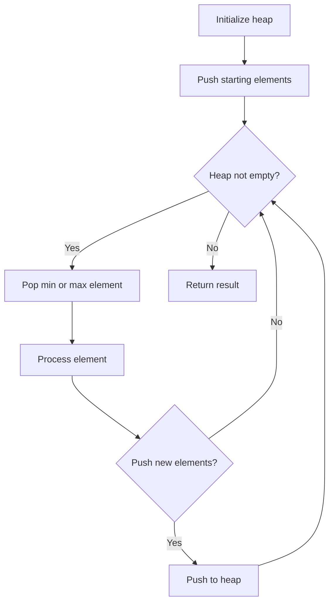
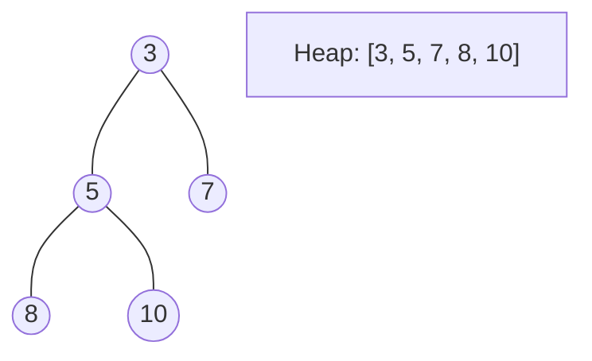
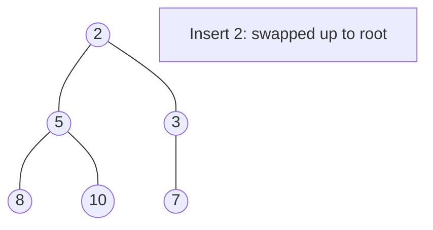
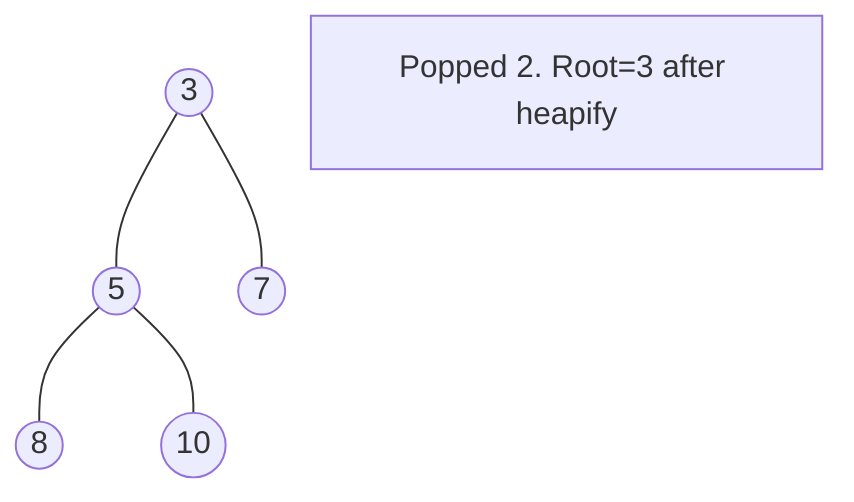

# Problem 2163: Minimum Difference in Sums After Removal of Elements

**Difficulty:** Hard  
**Tags:** Array, Dynamic Programming, Heap (Priority Queue)  
**Pattern:** Heap / Priority Queue  
**Link:** [leetcode.com/problems/minimum-difference-in-sums-after-removal-of-elements](https://leetcode.com/problems/minimum-difference-in-sums-after-removal-of-elements/)

## Description

You are given a **0-indexed** integer array `nums` consisting of `3 * n` elements.

You are allowed to remove any **subsequence** of elements of size **exactly** `n` from `nums`. The remaining `2 * n` elements will be divided into two **equal** parts:

	- The first `n` elements belonging to the first part and their sum is `sumfirst`.
	- The next `n` elements belonging to the second part and their sum is `sumsecond`.

The **difference in sums** of the two parts is denoted as `sumfirst - sumsecond`.

	- For example, if `sumfirst = 3` and `sumsecond = 2`, their difference is `1`.
	- Similarly, if `sumfirst = 2` and `sumsecond = 3`, their difference is `-1`.

Return *the **minimum difference** possible between the sums of the two parts after the removal of *`n`* elements*.

 

Example 1:

```

**Input:** nums = [3,1,2]
**Output:** -1
**Explanation:** Here, nums has 3 elements, so n = 1. 
Thus we have to remove 1 element from nums and divide the array into two equal parts.
- If we remove nums[0] = 3, the array will be [1,2]. The difference in sums of the two parts will be 1 - 2 = -1.
- If we remove nums[1] = 1, the array will be [3,2]. The difference in sums of the two parts will be 3 - 2 = 1.
- If we remove nums[2] = 2, the array will be [3,1]. The difference in sums of the two parts will be 3 - 1 = 2.
The minimum difference between sums of the two parts is min(-1,1,2) = -1. 

```

Example 2:

```

**Input:** nums = [7,9,5,8,1,3]
**Output:** 1
**Explanation:** Here n = 2. So we must remove 2 elements and divide the remaining array into two parts containing two elements each.
If we remove nums[2] = 5 and nums[3] = 8, the resultant array will be [7,9,1,3]. The difference in sums will be (7+9) - (1+3) = 12.
To obtain the minimum difference, we should remove nums[1] = 9 and nums[4] = 1. The resultant array becomes [7,5,8,3]. The difference in sums of the two parts is (7+5) - (8+3) = 1.
It can be shown that it is not possible to obtain a difference smaller than 1.

```

 

**Constraints:**

	- `nums.length == 3 * n`
	- `1 <= n <= 10^5`
	- `1 <= nums[i] <= 10^5`

## Approach: Heap / Priority Queue

Use a min-heap or max-heap to efficiently access the smallest/largest element. Push elements and pop the top to process in priority order.

## Pseudocode

```
1. Initialize heap (min or max)
2. Push initial elements onto heap
3. While heap not empty and condition:
   a. Pop top element (min or max)
   b. Process element
   c. Push new elements if needed
4. Return result
```

## Algorithm Flow



## Visual State Transitions

**Heap Operations (Min-Heap):**

**Frame 1: Initial heap**


**Frame 2: Insert 2 - bubble up**


**Frame 3: Pop minimum (2) - heapify down**



## Complexity Analysis

- **Time:** O(n log n)
- **Space:** O(n)

## Solution (Python3)

```python
class Solution:
    def minimumDifference(self, nums: List[int]) -> int:
        # Heap/Priority Queue - O(n log k) time
        import heapq
        if not nums:
            return 0
        # Min heap (negate for max heap)
        heap = []
        for val in nums:
            heapq.heappush(heap, val)
            if len(heap) > (nums if isinstance(nums, int) else len(nums)):
                heapq.heappop(heap)
        return heap[0] if heap else 0
```

## Solution (C++)

```cpp
#include <queue>
#include <string>
#include <vector>
using namespace std;

class Solution {
public:
    int minimumDifference(vector<int>& nums) {
        // Heap/Priority Queue - O(n log k) time
        priority_queue<int, vector<int>, greater<int>> pq;
        for (int val : nums) {
            pq.push(val);
            if ((int)pq.size() > nums)
                pq.pop();
        }
        return pq.empty() ? 0 : pq.top();
    }
};
```
