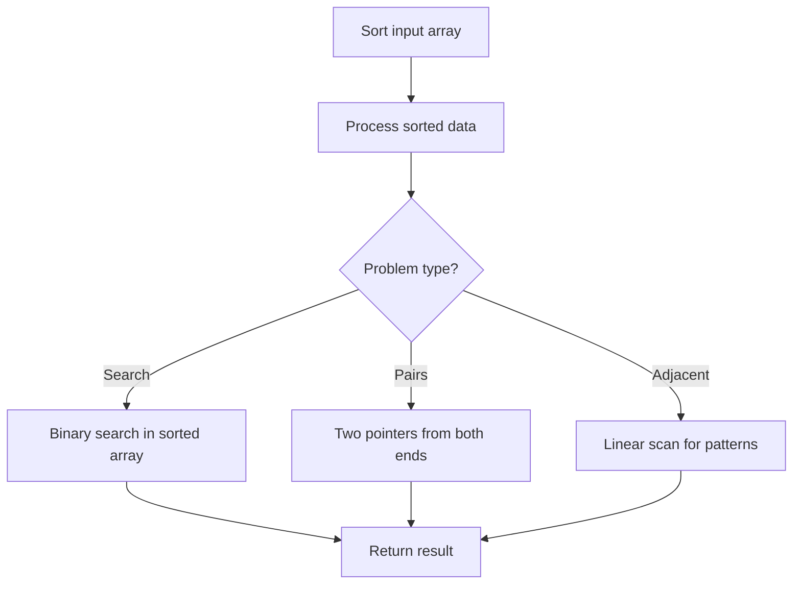

# Problem 2164: Sort Even and Odd Indices Independently

**Difficulty:** Easy  
**Tags:** Array, Sorting  
**Pattern:** Sorting  
**Link:** [leetcode.com/problems/sort-even-and-odd-indices-independently](https://leetcode.com/problems/sort-even-and-odd-indices-independently/)

## Description

You are given a **0-indexed** integer array `nums`. Rearrange the values of `nums` according to the following rules:

	- Sort the values at **odd indices** of `nums` in **non-increasing** order.

	
		For example, if `nums = [4,**1**,2,**3**]` before this step, it becomes `[4,**3**,2,**1**]` after. The values at odd indices `1` and `3` are sorted in non-increasing order.
	
	
	- Sort the values at **even indices** of `nums` in **non-decreasing** order.
	
		For example, if `nums = [**4**,1,**2**,3]` before this step, it becomes `[**2**,1,**4**,3]` after. The values at even indices `0` and `2` are sorted in non-decreasing order.
	
	

Return *the array formed after rearranging the values of* `nums`.

 

Example 1:

```

**Input:** nums = [4,1,2,3]
**Output:** [2,3,4,1]
**Explanation:** 
First, we sort the values present at odd indices (1 and 3) in non-increasing order.
So, nums changes from [4,**1**,2,**3**] to [4,**3**,2,**1**].
Next, we sort the values present at even indices (0 and 2) in non-decreasing order.
So, nums changes from [**4**,1,**2**,3] to [**2**,3,**4**,1].
Thus, the array formed after rearranging the values is [2,3,4,1].

```

Example 2:

```

**Input:** nums = [2,1]
**Output:** [2,1]
**Explanation:** 
Since there is exactly one odd index and one even index, no rearrangement of values takes place.
The resultant array formed is [2,1], which is the same as the initial array. 

```

 

**Constraints:**

	- `1 <= nums.length <= 100`
	- `1 <= nums[i] <= 100`

## Approach: Sorting

Sort the data to enable efficient processing. After sorting, use techniques like binary search, two pointers, or linear scan to solve the problem.

## Pseudocode

```
1. Sort the input array
2. Process sorted data:
   - Use binary search for lookups
   - Use two pointers for pair finding
   - Scan for adjacent patterns
3. Return result
```

## Algorithm Flow



## Complexity Analysis

- **Time:** O(n log n)
- **Space:** O(n)

## Solution (Python3)

```python
class Solution:
    def sortEvenOdd(self, nums: List[int]) -> List[int]:
        # Sort-based approach - O(n log n) time
        nums.sort(key=lambda x: x[0] if isinstance(x, (list, tuple)) else x)
        result = [nums[0]]
        for i in range(1, len(nums)):
            curr = nums[i]
            if isinstance(curr, (list, tuple)) and isinstance(result[-1], (list, tuple)):
                if curr[0] <= result[-1][1]:
                    result[-1] = [result[-1][0], max(result[-1][1], curr[1])]
                else:
                    result.append(curr)
            else:
                result.append(curr)
        return result
```

## Solution (C++)

```cpp
#include <algorithm>
#include <string>
#include <vector>
using namespace std;

class Solution {
public:
    vector<int> sortEvenOdd(vector<int>& nums) {
        // Sort-based approach - O(n log n) time
        sort(nums.begin(), nums.end());
        vector<vector<int>> result;
        result.push_back(nums[0]);
        for (int i = 1; i < (int)nums.size(); i++) {
            if (nums[i][0] <= result.back()[1]) {
                result.back()[1] = max(result.back()[1], nums[i][1]);
            } else {
                result.push_back(nums[i]);
            }
        }
        return result;
    }
};
```
