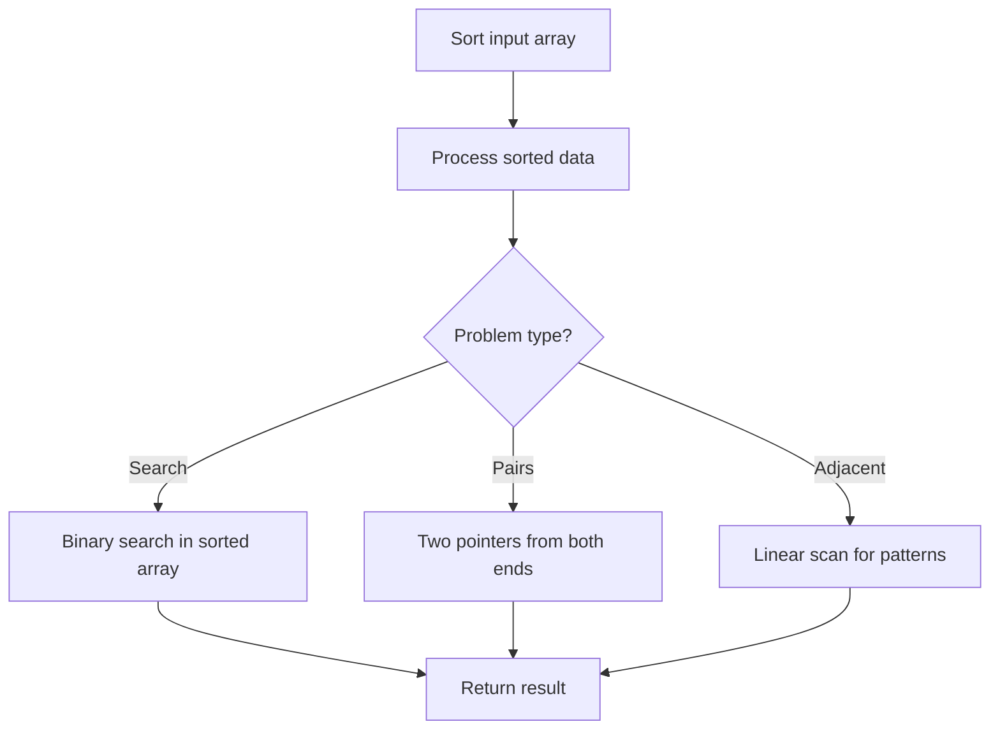

# Problem 2165: Smallest Value of the Rearranged Number

**Difficulty:** Medium  
**Tags:** Math, Sorting  
**Pattern:** Sorting  
**Link:** [leetcode.com/problems/smallest-value-of-the-rearranged-number](https://leetcode.com/problems/smallest-value-of-the-rearranged-number/)

## Description

You are given an integer `num.` **Rearrange** the digits of `num` such that its value is **minimized** and it does not contain **any** leading zeros.

Return *the rearranged number with minimal value*.

Note that the sign of the number does not change after rearranging the digits.

 

Example 1:

```

**Input:** num = 310
**Output:** 103
**Explanation:** The possible arrangements for the digits of 310 are 013, 031, 103, 130, 301, 310. 
The arrangement with the smallest value that does not contain any leading zeros is 103.

```

Example 2:

```

**Input:** num = -7605
**Output:** -7650
**Explanation:** Some possible arrangements for the digits of -7605 are -7650, -6705, -5076, -0567.
The arrangement with the smallest value that does not contain any leading zeros is -7650.

```

 

**Constraints:**

	- `-10^15 <= num <= 10^15`

## Approach: Sorting

Sort the data to enable efficient processing. After sorting, use techniques like binary search, two pointers, or linear scan to solve the problem.

## Pseudocode

```
1. Sort the input array
2. Process sorted data:
   - Use binary search for lookups
   - Use two pointers for pair finding
   - Scan for adjacent patterns
3. Return result
```

## Algorithm Flow



## Complexity Analysis

- **Time:** O(n log n)
- **Space:** O(n)

## Solution (Python3)

```python
class Solution:
    def smallestNumber(self, num: int) -> int:
        # Sort-based approach - O(n log n) time
        num.sort(key=lambda x: x[0] if isinstance(x, (list, tuple)) else x)
        result = [num[0]]
        for i in range(1, len(num)):
            curr = num[i]
            if isinstance(curr, (list, tuple)) and isinstance(result[-1], (list, tuple)):
                if curr[0] <= result[-1][1]:
                    result[-1] = [result[-1][0], max(result[-1][1], curr[1])]
                else:
                    result.append(curr)
            else:
                result.append(curr)
        return result
```

## Solution (C++)

```cpp
#include <algorithm>
#include <string>
#include <vector>
using namespace std;

class Solution {
public:
    int smallestNumber(int num) {
        // Sort-based approach - O(n log n) time
        sort(num.begin(), num.end());
        vector<vector<int>> result;
        result.push_back(num[0]);
        for (int i = 1; i < (int)num.size(); i++) {
            if (num[i][0] <= result.back()[1]) {
                result.back()[1] = max(result.back()[1], num[i][1]);
            } else {
                result.push_back(num[i]);
            }
        }
        return result;
    }
};
```
