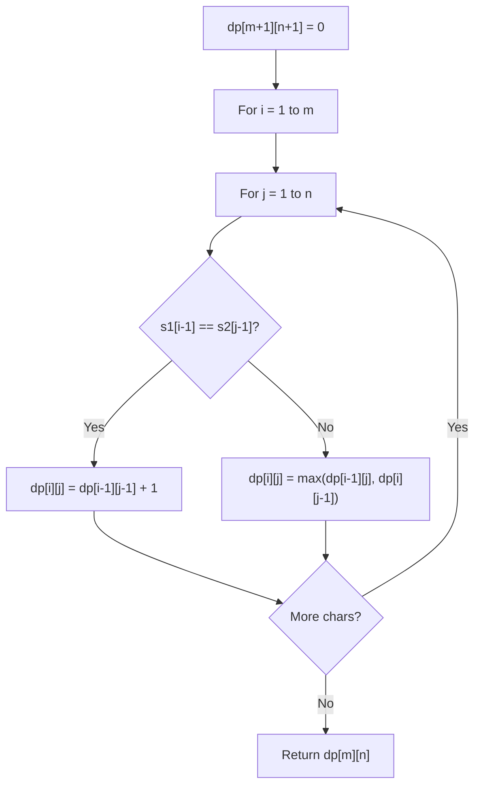

# Problem 2167: Minimum Time to Remove All Cars Containing Illegal Goods

**Difficulty:** Hard  
**Tags:** String, Dynamic Programming  
**Pattern:** Dynamic Programming (String)  
**Link:** [leetcode.com/problems/minimum-time-to-remove-all-cars-containing-illegal-goods](https://leetcode.com/problems/minimum-time-to-remove-all-cars-containing-illegal-goods/)

## Description

You are given a **0-indexed** binary string `s` which represents a sequence of train cars. `s[i] = '0'` denotes that the `i^th` car does **not** contain illegal goods and `s[i] = '1'` denotes that the `i^th` car does contain illegal goods.

As the train conductor, you would like to get rid of all the cars containing illegal goods. You can do any of the following three operations **any** number of times:

	- Remove a train car from the **left** end (i.e., remove `s[0]`) which takes 1 unit of time.
	- Remove a train car from the **right** end (i.e., remove `s[s.length - 1]`) which takes 1 unit of time.
	- Remove a train car from **anywhere** in the sequence which takes 2 units of time.

Return *the **minimum** time to remove all the cars containing illegal goods*.

Note that an empty sequence of cars is considered to have no cars containing illegal goods.

 

Example 1:

```

**Input:** s = "**11**00**1**0**1**"
**Output:** 5
**Explanation:** 
One way to remove all the cars containing illegal goods from the sequence is to
- remove a car from the left end 2 times. Time taken is 2 * 1 = 2.
- remove a car from the right end. Time taken is 1.
- remove the car containing illegal goods found in the middle. Time taken is 2.
This obtains a total time of 2 + 1 + 2 = 5. 

An alternative way is to
- remove a car from the left end 2 times. Time taken is 2 * 1 = 2.
- remove a car from the right end 3 times. Time taken is 3 * 1 = 3.
This also obtains a total time of 2 + 3 = 5.

5 is the minimum time taken to remove all the cars containing illegal goods. 
There are no other ways to remove them with less time.

```

Example 2:

```

**Input:** s = "00**1**0"
**Output:** 2
**Explanation:**
One way to remove all the cars containing illegal goods from the sequence is to
- remove a car from the left end 3 times. Time taken is 3 * 1 = 3.
This obtains a total time of 3.

Another way to remove all the cars containing illegal goods from the sequence is to
- remove the car containing illegal goods found in the middle. Time taken is 2.
This obtains a total time of 2.

Another way to remove all the cars containing illegal goods from the sequence is to 
- remove a car from the right end 2 times. Time taken is 2 * 1 = 2. 
This obtains a total time of 2.

2 is the minimum time taken to remove all the cars containing illegal goods. 
There are no other ways to remove them with less time.
```

 

**Constraints:**

	- `1 <= s.length <= 2 * 10^5`
	- `s[i]` is either `'0'` or `'1'`.

## Approach: Dynamic Programming (String)

Compare or match two strings using a 2D DP table. dp[i][j] represents the answer for substrings s1[0..i-1] and s2[0..j-1]. Common patterns: LCS, edit distance, regex matching.

## Pseudocode

```
1. Create dp[m+1][n+1]
2. Initialize base cases
3. For i from 1 to m:
   For j from 1 to n:
     If s1[i-1] == s2[j-1]: dp[i][j] = dp[i-1][j-1] + 1
     Else: dp[i][j] = best of (dp[i-1][j], dp[i][j-1], dp[i-1][j-1])
4. Return dp[m][n]
```

## Algorithm Flow



## Complexity Analysis

- **Time:** O(m * n)
- **Space:** O(m * n)

## Solution (Python3)

```python
class Solution:
    def minimumTime(self, s: str) -> int:
        # String DP - O(m*n) time and space
        m, n = len(s), len(s)
        dp = [[0] * (n + 1) for _ in range(m + 1)]
        for i in range(1, m + 1):
            for j in range(1, n + 1):
                if s[i-1] == s[j-1]:
                    dp[i][j] = dp[i-1][j-1] + 1
                else:
                    dp[i][j] = max(dp[i-1][j], dp[i][j-1])
        return dp[m][n]
```

## Solution (C++)

```cpp
#include <algorithm>
#include <string>
#include <vector>
using namespace std;

class Solution {
public:
    int minimumTime(string& s) {
        // String DP - O(m*n) time and space
        int m = s.size(), n = s.size();
        vector<vector<int>> dp(m + 1, vector<int>(n + 1, 0));
        for (int i = 1; i <= m; i++) {
            for (int j = 1; j <= n; j++) {
                if (s[i-1] == s[j-1])
                    dp[i][j] = dp[i-1][j-1] + 1;
                else
                    dp[i][j] = max(dp[i-1][j], dp[i][j-1]);
            }
        }
        return dp[m][n];
    }
};
```
