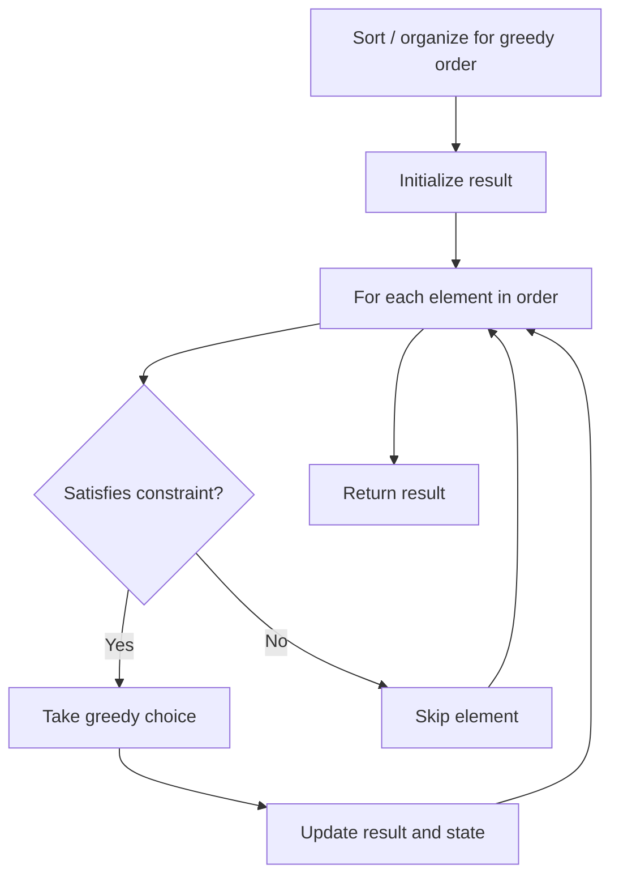

# Problem 2170: Minimum Operations to Make the Array Alternating

**Difficulty:** Medium  
**Tags:** Array, Hash Table, Greedy, Counting  
**Pattern:** Greedy  
**Link:** [leetcode.com/problems/minimum-operations-to-make-the-array-alternating](https://leetcode.com/problems/minimum-operations-to-make-the-array-alternating/)

## Description

You are given a **0-indexed** array `nums` consisting of `n` positive integers.

The array `nums` is called **alternating** if:

	- `nums[i - 2] == nums[i]`, where `2 <= i <= n - 1`.
	- `nums[i - 1] != nums[i]`, where `1 <= i <= n - 1`.

In one **operation**, you can choose an index `i` and **change** `nums[i]` into **any** positive integer.

Return *the **minimum number of operations** required to make the array alternating*.

 

Example 1:

```

**Input:** nums = [3,1,3,2,4,3]
**Output:** 3
**Explanation:**
One way to make the array alternating is by converting it to [3,1,3,**1**,**3**,**1**].
The number of operations required in this case is 3.
It can be proven that it is not possible to make the array alternating in less than 3 operations. 

```

Example 2:

```

**Input:** nums = [1,2,2,2,2]
**Output:** 2
**Explanation:**
One way to make the array alternating is by converting it to [1,2,**1**,2,**1**].
The number of operations required in this case is 2.
Note that the array cannot be converted to [**2**,2,2,2,2] because in this case nums[0] == nums[1] which violates the conditions of an alternating array.

```

 

**Constraints:**

	- `1 <= nums.length <= 10^5`
	- `1 <= nums[i] <= 10^5`

## Approach: Greedy

Make the locally optimal choice at each step, trusting it leads to a global optimum. Greedy works when the problem has the greedy-choice property and optimal substructure.

## Pseudocode

```
1. Sort or organize data for greedy ordering
2. Initialize result
3. For each element in greedy order:
   a. If element satisfies constraint:
      - Take the greedy choice
      - Update result and state
4. Return result
```

## Algorithm Flow



## Complexity Analysis

- **Time:** O(n log n)
- **Space:** O(1)

## Solution (Python3)

```python
class Solution:
    def minimumOperations(self, nums: List[int]) -> int:
        # Greedy approach - O(n) time
        result = 0
        curr_max = 0
        for i in range(len(nums)):
            if isinstance(nums[i], int):
                curr_max = max(curr_max, nums[i])
                result = max(result, curr_max)
            else:
                result += 1
        return result
```

## Solution (C++)

```cpp
#include <algorithm>
#include <string>
#include <vector>
using namespace std;

class Solution {
public:
    int minimumOperations(vector<int>& nums) {
        // Greedy approach - O(n) time
        int result = 0, curr_max = 0;
        for (int i = 0; i < (int)nums.size(); i++) {
            curr_max = max(curr_max, nums[i]);
            result = max(result, curr_max);
        }
        return result;
    }
};
```
