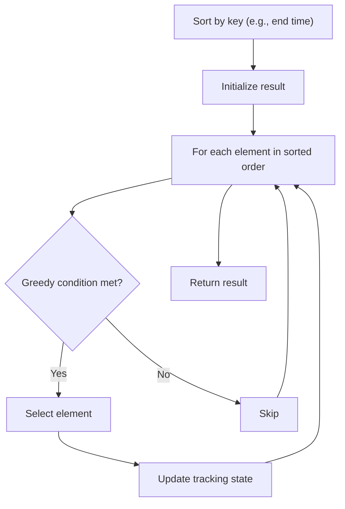

# Problem 2171: Removing Minimum Number of Magic Beans

**Difficulty:** Medium  
**Tags:** Array, Greedy, Sorting, Enumeration, Prefix Sum  
**Pattern:** Greedy with Sorting  
**Link:** [leetcode.com/problems/removing-minimum-number-of-magic-beans](https://leetcode.com/problems/removing-minimum-number-of-magic-beans/)

## Description

You are given an array of **positive** integers `beans`, where each integer represents the number of magic beans found in a particular magic bag.

**Remove** any number of beans (**possibly none**) from each bag such that the number of beans in each remaining **non-empty** bag (still containing **at least one** bean) is **equal**. Once a bean has been removed from a bag, you are **not** allowed to return it to any of the bags.

Return *the **minimum** number of magic beans that you have to remove*.

 

Example 1:

```

**Input:** beans = [4,1,6,5]
**Output:** 4
**Explanation:** 
- We remove 1 bean from the bag with only 1 bean.
  This results in the remaining bags: [4,**0**,6,5]
- Then we remove 2 beans from the bag with 6 beans.
  This results in the remaining bags: [4,0,**4**,5]
- Then we remove 1 bean from the bag with 5 beans.
  This results in the remaining bags: [4,0,4,**4**]
We removed a total of 1 + 2 + 1 = 4 beans to make the remaining non-empty bags have an equal number of beans.
There are no other solutions that remove 4 beans or fewer.

```

Example 2:

```

**Input:** beans = [2,10,3,2]
**Output:** 7
**Explanation:**
- We remove 2 beans from one of the bags with 2 beans.
  This results in the remaining bags: [**0**,10,3,2]
- Then we remove 2 beans from the other bag with 2 beans.
  This results in the remaining bags: [0,10,3,**0**]
- Then we remove 3 beans from the bag with 3 beans. 
  This results in the remaining bags: [0,10,**0**,0]
We removed a total of 2 + 2 + 3 = 7 beans to make the remaining non-empty bags have an equal number of beans.
There are no other solutions that removes 7 beans or fewer.

```

 

**Constraints:**

	- `1 <= beans.length <= 10^5`
	- `1 <= beans[i] <= 10^5`

## Approach: Greedy with Sorting

Sort the input by a key criterion, then greedily process elements in sorted order. The sorting ensures the greedy choice is always optimal.

## Pseudocode

```
1. Sort elements by key (start time, weight, etc.)
2. Initialize result, tracking variables
3. For each element in sorted order:
   a. Apply greedy selection rule
   b. Update result
4. Return result
```

## Algorithm Flow



## Complexity Analysis

- **Time:** O(n log n)
- **Space:** O(n)

## Solution (Python3)

```python
class Solution:
    def minimumRemoval(self, beans: List[int]) -> int:
        # Sort + greedy - O(n log n) time
        beans.sort()
        result = 0
        curr_end = 0
        for item in beans:
            if isinstance(item, (list, tuple)):
                if item[0] >= curr_end:
                    result += 1
                    curr_end = item[1]
            else:
                result += 1
        return result
```

## Solution (C++)

```cpp
#include <algorithm>
#include <string>
#include <vector>
using namespace std;

class Solution {
public:
    int minimumRemoval(vector<int>& beans) {
        // Sort + greedy - O(n log n) time
        sort(beans.begin(), beans.end());
        int result = 0, curr_end = 0;
        for (auto& item : beans) {
            result++;
        }
        return result;
    }
};
```
