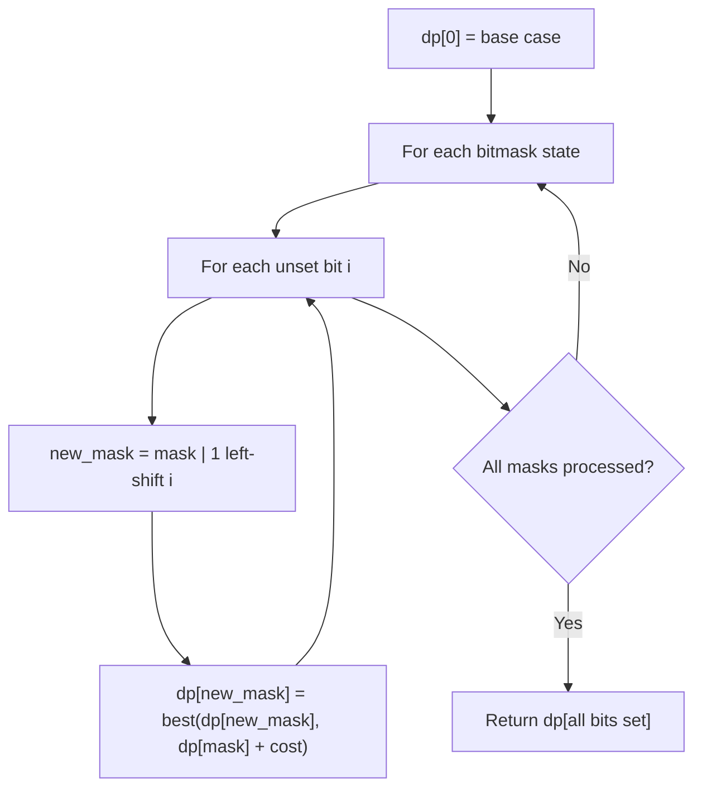

# Problem 2172: Maximum AND Sum of Array

**Difficulty:** Hard  
**Tags:** Array, Dynamic Programming, Bit Manipulation, Bitmask  
**Pattern:** Dynamic Programming (Bitmask)  
**Link:** [leetcode.com/problems/maximum-and-sum-of-array](https://leetcode.com/problems/maximum-and-sum-of-array/)

## Description

You are given an integer array `nums` of length `n` and an integer `numSlots` such that `2 * numSlots >= n`. There are `numSlots` slots numbered from `1` to `numSlots`.

You have to place all `n` integers into the slots such that each slot contains at **most** two numbers. The **AND sum** of a given placement is the sum of the **bitwise** `AND` of every number with its respective slot number.

	- For example, the **AND sum** of placing the numbers `[1, 3]` into slot `1` and `[4, 6]` into slot `2` is equal to `(1 AND 1) + (3 AND 1) + (4 AND 2) + (6 AND 2) = 1 + 1 + 0 + 2 = 4`.

Return *the maximum possible **AND sum** of *`nums`* given *`numSlots`* slots.*

 

Example 1:

```

**Input:** nums = [1,2,3,4,5,6], numSlots = 3
**Output:** 9
**Explanation:** One possible placement is [1, 4] into slot 1, [2, 6] into slot 2, and [3, 5] into slot 3. 
This gives the maximum AND sum of (1 AND 1) + (4 AND 1) + (2 AND 2) + (6 AND 2) + (3 AND 3) + (5 AND 3) = 1 + 0 + 2 + 2 + 3 + 1 = 9.

```

Example 2:

```

**Input:** nums = [1,3,10,4,7,1], numSlots = 9
**Output:** 24
**Explanation:** One possible placement is [1, 1] into slot 1, [3] into slot 3, [4] into slot 4, [7] into slot 7, and [10] into slot 9.
This gives the maximum AND sum of (1 AND 1) + (1 AND 1) + (3 AND 3) + (4 AND 4) + (7 AND 7) + (10 AND 9) = 1 + 1 + 3 + 4 + 7 + 8 = 24.
Note that slots 2, 5, 6, and 8 are empty which is permitted.

```

 

**Constraints:**

	- `n == nums.length`
	- `1 <= numSlots <= 9`
	- `1 <= n <= 2 * numSlots`
	- `1 <= nums[i] <= 15`

## Approach: Dynamic Programming (Bitmask)

Use bitmask to represent subsets of n elements. dp[mask] = optimal value when the selected subset is represented by mask. Iterate over all masks and transitions.

## Pseudocode

```
1. dp[0] = base case
2. For mask from 0 to 2^n - 1:
   a. For each bit i not set in mask:
      - new_mask = mask | (1 << i)
      - dp[new_mask] = best of dp[new_mask], dp[mask] + cost(i)
3. Return dp[(1 << n) - 1]
```

## Algorithm Flow



## Complexity Analysis

- **Time:** O(2^n * n)
- **Space:** O(2^n)

## Solution (Python3)

```python
class Solution:
    def maximumANDSum(self, nums: List[int], numSlots: int) -> int:
        # Bitmask DP - O(2^n * n) time
        n = len(nums)
        dp = [float('inf')] * (1 << n)
        dp[0] = 0
        for mask in range(1 << n):
            bits = bin(mask).count('1')
            for i in range(n):
                if mask & (1 << i):
                    continue
                new_mask = mask | (1 << i)
                dp[new_mask] = min(dp[new_mask], dp[mask] + 1)
        return dp[(1 << n) - 1]
```

## Solution (C++)

```cpp
#include <algorithm>
#include <climits>
#include <string>
#include <vector>
using namespace std;

class Solution {
public:
    int maximumANDSum(vector<int>& nums, int numSlots) {
        // Bitmask DP - O(2^n * n) time
        int n = nums.size();
        vector<int> dp(1 << n, INT_MAX);
        dp[0] = 0;
        for (int mask = 0; mask < (1 << n); mask++) {
            for (int i = 0; i < n; i++) {
                if (mask & (1 << i)) continue;
                int new_mask = mask | (1 << i);
                dp[new_mask] = min(dp[new_mask], dp[mask] + 1);
            }
        }
        return dp[(1 << n) - 1];
    }
};
```
