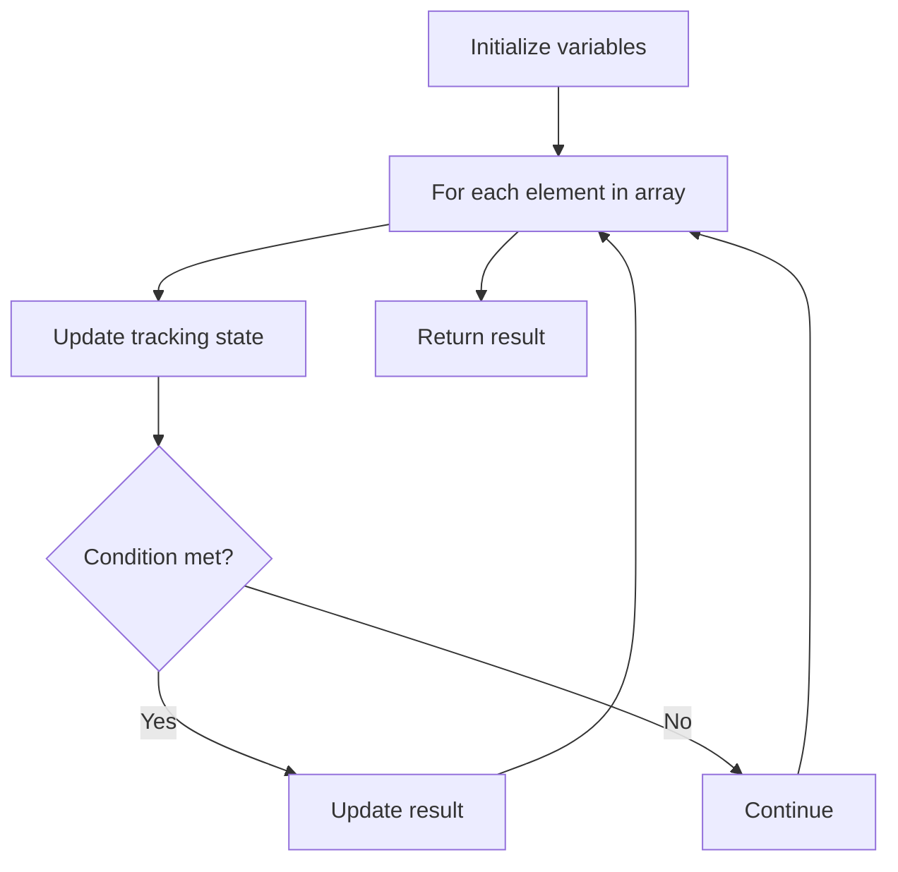

# Problem 2176: Count Equal and Divisible Pairs in an Array

**Difficulty:** Easy  
**Tags:** Array  
**Pattern:** Array Processing  
**Link:** [leetcode.com/problems/count-equal-and-divisible-pairs-in-an-array](https://leetcode.com/problems/count-equal-and-divisible-pairs-in-an-array/)

## Description

Given a **0-indexed** integer array `nums` of length `n` and an integer `k`, return *the **number of pairs*** `(i, j)` *where* `0 <= i < j < n`, *such that* `nums[i] == nums[j]` *and* `(i * j)` *is divisible by* `k`.
 

Example 1:

```

**Input:** nums = [3,1,2,2,2,1,3], k = 2
**Output:** 4
**Explanation:**
There are 4 pairs that meet all the requirements:
- nums[0] == nums[6], and 0 * 6 == 0, which is divisible by 2.
- nums[2] == nums[3], and 2 * 3 == 6, which is divisible by 2.
- nums[2] == nums[4], and 2 * 4 == 8, which is divisible by 2.
- nums[3] == nums[4], and 3 * 4 == 12, which is divisible by 2.

```

Example 2:

```

**Input:** nums = [1,2,3,4], k = 1
**Output:** 0
**Explanation:** Since no value in nums is repeated, there are no pairs (i,j) that meet all the requirements.

```

 

**Constraints:**

	- `1 <= nums.length <= 100`
	- `1 <= nums[i], k <= 100`

## Approach: Array Processing

Process the array with a linear scan, tracking state variables. Look for patterns: running maximum/minimum, counting, or transformations.

## Pseudocode

```
1. Initialize tracking variables
2. Iterate through array:
   a. Update tracking state
   b. Check conditions
   c. Update result
3. Return result
```

## Algorithm Flow



## Complexity Analysis

- **Time:** O(n)
- **Space:** O(1)

## Solution (Python3)

```python
class Solution:
    def countPairs(self, nums: List[int], k: int) -> int:
        # Array processing - O(n) time
        result = 0
        for i in range(len(nums)):
            # Process element
            pass
        return result
```

## Solution (C++)

```cpp
#include <string>
#include <vector>
using namespace std;

class Solution {
public:
    int countPairs(vector<int>& nums, int k) {
        // Array processing - O(n) time
        for (int i = 0; i < (int)nums.size(); i++) {
            // Process element
        }
        return 0;
    }
};
```
