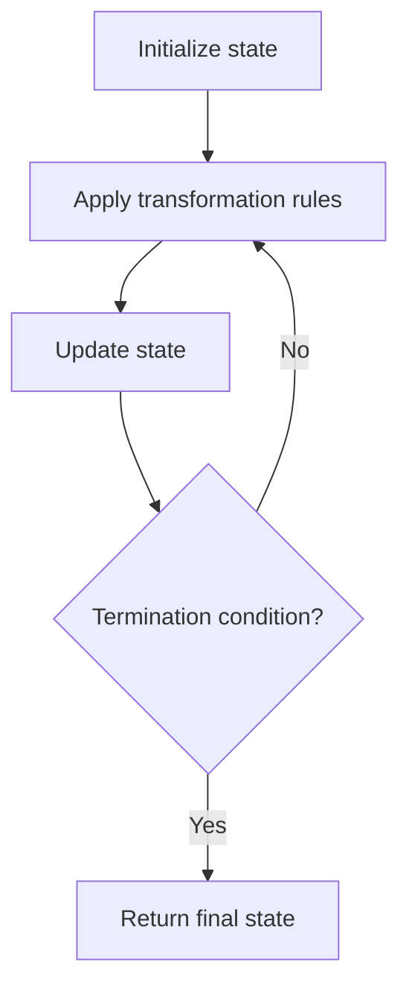

# Problem 2177: Find Three Consecutive Integers That Sum to a Given Number

**Difficulty:** Medium  
**Tags:** Math, Simulation  
**Pattern:** Simulation  
**Link:** [leetcode.com/problems/find-three-consecutive-integers-that-sum-to-a-given-number](https://leetcode.com/problems/find-three-consecutive-integers-that-sum-to-a-given-number/)

## Description

Given an integer `num`, return *three consecutive integers (as a sorted array)** that **sum** to *`num`. If `num` cannot be expressed as the sum of three consecutive integers, return* an **empty** array.*

 

Example 1:

```

**Input:** num = 33
**Output:** [10,11,12]
**Explanation:** 33 can be expressed as 10 + 11 + 12 = 33.
10, 11, 12 are 3 consecutive integers, so we return [10, 11, 12].

```

Example 2:

```

**Input:** num = 4
**Output:** []
**Explanation:** There is no way to express 4 as the sum of 3 consecutive integers.

```

 

**Constraints:**

	- `0 <= num <= 10^15`

## Approach: Simulation

Simulate the process described in the problem step by step. Follow the rules exactly, tracking state at each step.

## Pseudocode

```
1. Initialize state (grid, pointers, counters)
2. For each step / iteration:
   a. Apply the transformation rules
   b. Update state
   c. Check termination condition
3. Return final state or result
```

## Algorithm Flow



## Complexity Analysis

- **Time:** O(n) or O(n * k)
- **Space:** O(n)

## Solution (Python3)

```python
class Solution:
    def sumOfThree(self, num: int) -> List[int]:
        # Simulation approach - follow the rules step by step
        result = []
        for i in range(len(num) if isinstance(num, list) else num):
            # Simulate each step
            pass
        return result
```

## Solution (C++)

```cpp
#include <string>
#include <vector>
using namespace std;

class Solution {
public:
    vector<int> sumOfThree(int num) {
        // Simulation approach
        int n = num.size();
        for (int i = 0; i < n; i++) {
            // Simulate each step
        }
        return {};
    }
};
```
