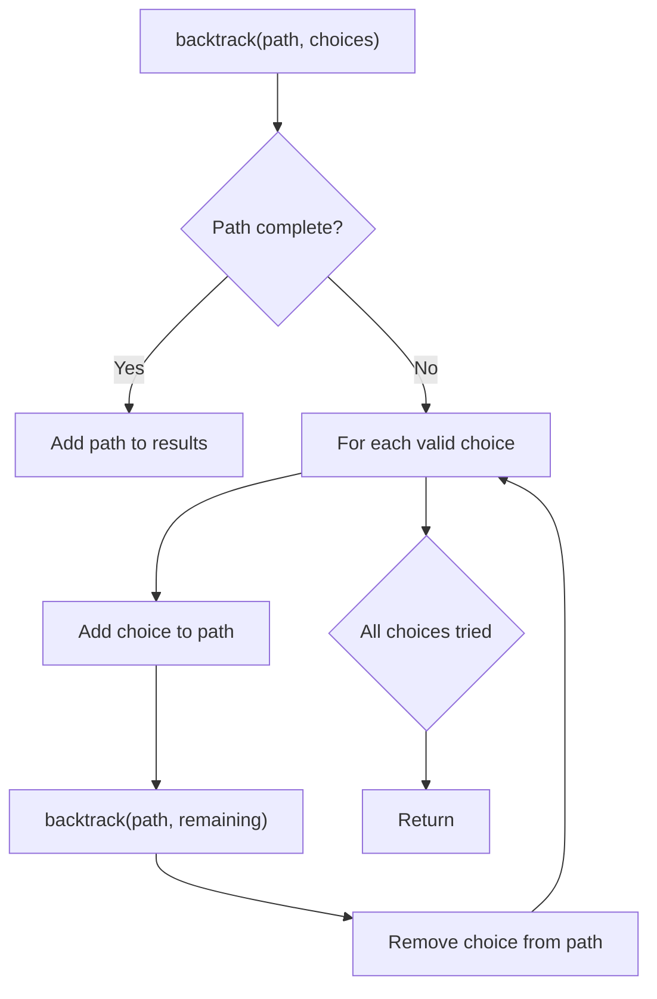
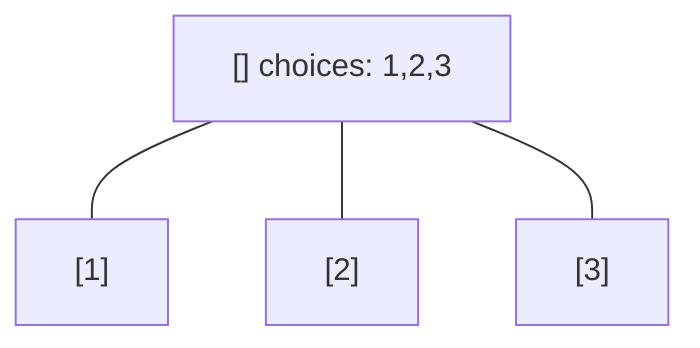
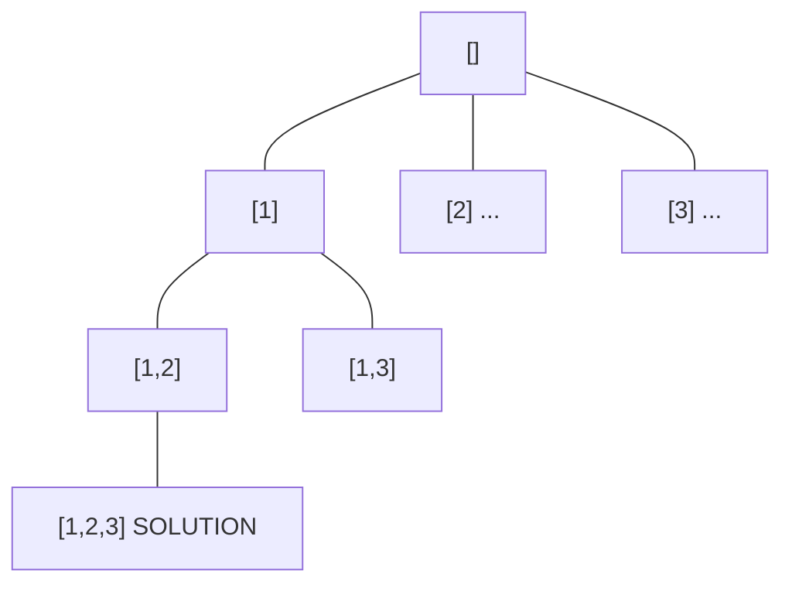
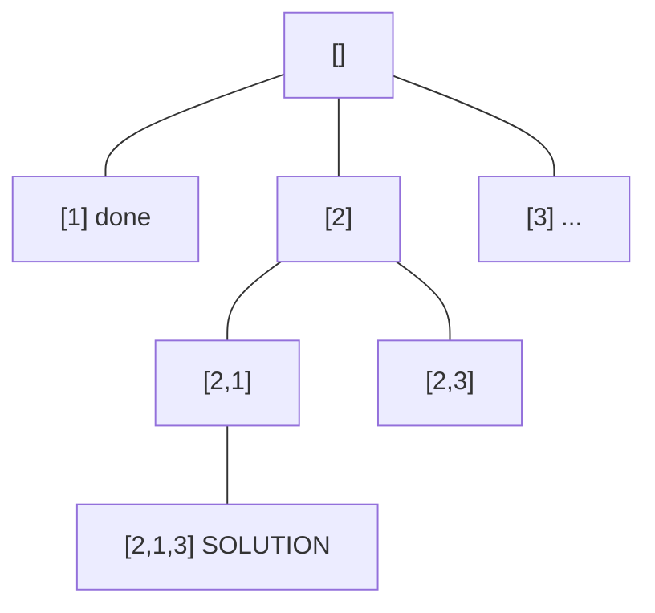
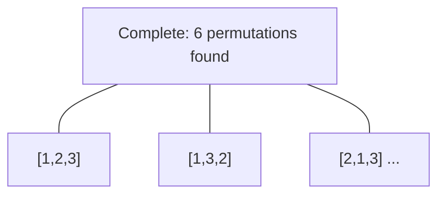

# Problem 2178: Maximum Split of Positive Even Integers

**Difficulty:** Medium  
**Tags:** Math, Backtracking, Greedy  
**Pattern:** Backtracking  
**Link:** [leetcode.com/problems/maximum-split-of-positive-even-integers](https://leetcode.com/problems/maximum-split-of-positive-even-integers/)

## Description

You are given an integer `finalSum`. Split it into a sum of a **maximum** number of **unique** positive even integers.

	- For example, given `finalSum = 12`, the following splits are **valid** (unique positive even integers summing up to `finalSum`): `(12)`, `(2 + 10)`, `(2 + 4 + 6)`, and `(4 + 8)`. Among them, `(2 + 4 + 6)` contains the maximum number of integers. Note that `finalSum` cannot be split into `(2 + 2 + 4 + 4)` as all the numbers should be unique.

Return *a list of integers that represent a valid split containing a **maximum** number of integers*. If no valid split exists for `finalSum`, return *an **empty** list*. You may return the integers in **any** order.

 

Example 1:

```

**Input:** finalSum = 12
**Output:** [2,4,6]
**Explanation:** The following are valid splits: `(12)`, `(2 + 10)`, `(2 + 4 + 6)`, and `(4 + 8)`.
(2 + 4 + 6) has the maximum number of integers, which is 3. Thus, we return [2,4,6].
Note that [2,6,4], [6,2,4], etc. are also accepted.

```

Example 2:

```

**Input:** finalSum = 7
**Output:** []
**Explanation:** There are no valid splits for the given finalSum.
Thus, we return an empty array.

```

Example 3:

```

**Input:** finalSum = 28
**Output:** [6,8,2,12]
**Explanation:** The following are valid splits: `(2 + 26)`, `(6 + 8 + 2 + 12)`, and `(4 + 24)`. 
`(6 + 8 + 2 + 12)` has the maximum number of integers, which is 4. Thus, we return [6,8,2,12].
Note that [10,2,4,12], [6,2,4,16], etc. are also accepted.

```

 

**Constraints:**

	- `1 <= finalSum <= 10^10`

## Approach: Backtracking

Explore all possible solutions by building candidates incrementally. At each step, make a choice and recurse. If the choice leads to a dead end, undo the choice (backtrack) and try the next option.

## Pseudocode

```
1. Define backtrack(path, choices):
   a. If path is a complete solution: add to results
   b. For each choice in choices:
      - If choice is valid:
        * Add choice to path
        * backtrack(path, remaining_choices)
        * Remove choice from path (backtrack)
2. Call backtrack([], all_choices)
```

## Algorithm Flow



## Visual State Transitions

**Backtracking Decision Tree:**

**Frame 1: Root - start with empty path**


**Frame 2: Explore branch [1]**


**Frame 3: Backtrack, explore [2]**


**Frame 4: All solutions found**



## Complexity Analysis

- **Time:** O(k^n) or O(n!)
- **Space:** O(n)

## Solution (Python3)

```python
class Solution:
    def maximumEvenSplit(self, finalSum: int) -> List[int]:
        # Backtracking - O(2^n) or O(n!) time
        result = []
        
        def backtrack(path, start):
            result.append(path[:])
            for i in range(start, len(finalSum)):
                path.append(finalSum[i])
                backtrack(path, i + 1)
                path.pop()
        
        backtrack([], 0)
        return result
```

## Solution (C++)

```cpp
#include <functional>
#include <string>
#include <vector>
using namespace std;

class Solution {
public:
    vector<int> maximumEvenSplit(int finalSum) {
        // Backtracking - O(2^n) or O(n!) time
        vector<vector<int>> result;
        vector<int> path;
        function<void(int)> backtrack = [&](int start) {
            result.push_back(path);
            for (int i = start; i < (int)finalSum.size(); i++) {
                path.push_back(finalSum[i]);
                backtrack(i + 1);
                path.pop_back();
            }
        };
        backtrack(0);
        return result;
    }
};
```
